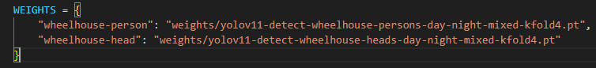
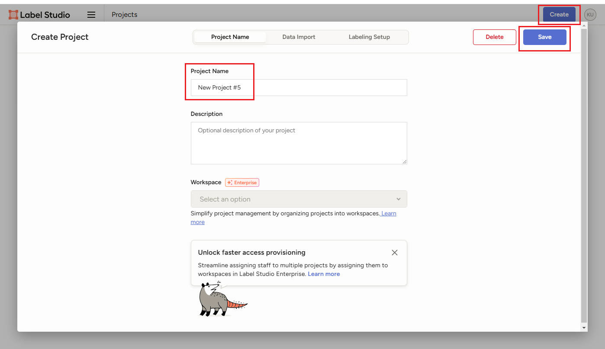
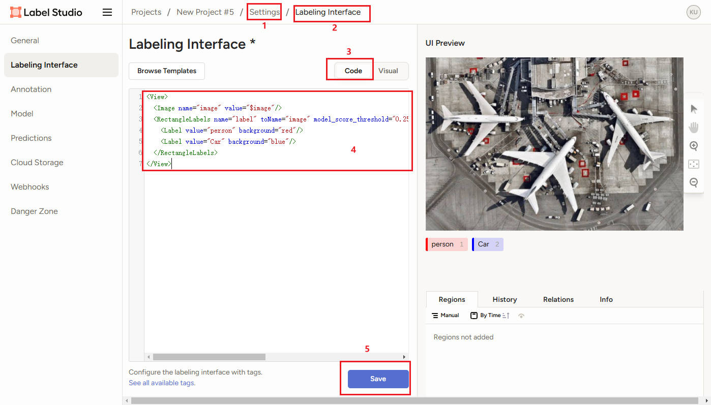
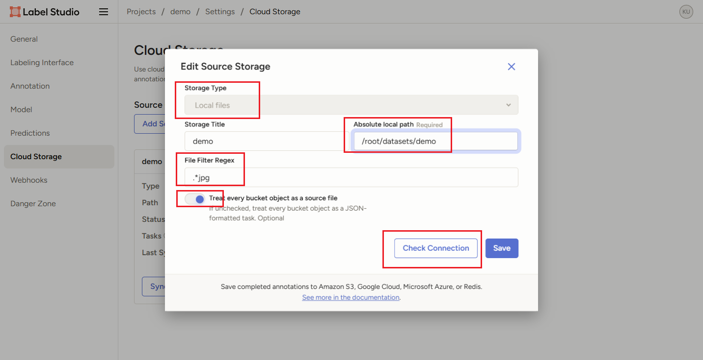
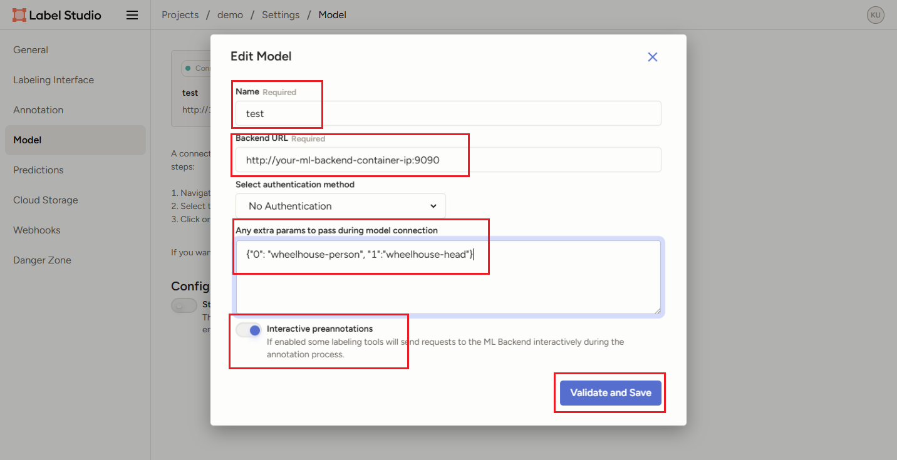
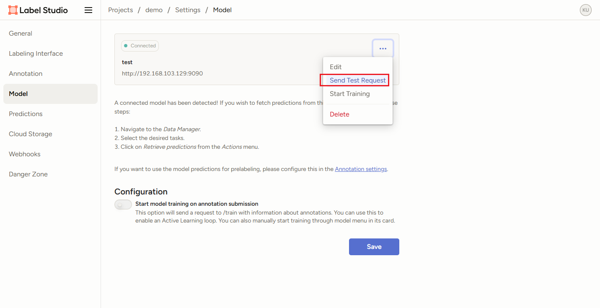
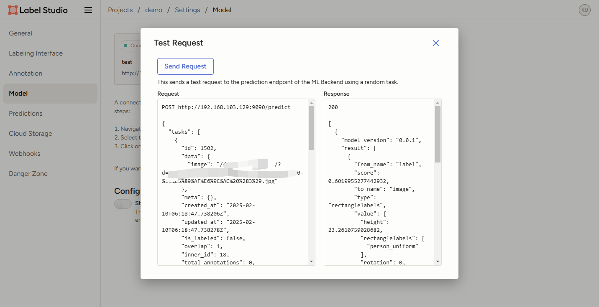

# 一. 创建并运行自定义ml-backend的docker容器

以下分三种环境, 一是宿主机环境、二是启动label-studio服务的docker容器环境（随便拉取一个linux环境的普通容器）、三是启动ml-backend的容器环境（需要自己编译， 如何编译参考后面内容）。

这三个环境的关系为，宿主机中需要启动这两个docker容器，这三者不共用IP地址，label-studio服务的docker容器用来提供label-studio的web服务，ml-backend的容器用来接受label-studio的web服务的调用请求，然后处理请求（使用模型预测结果），然后将结果返回给label-studio服务的docker容器，然后label-studio服务的docker容器接收到结果后在页面展示。

* 在label-studio的docker容器中的操作：

```bash
# 启动label-studio
pip config set global.index-url https://pypi.tuna.tsinghua.edu.cn/simple
pip install label-studio
screen -S start_label_studio label-studio start
```

* 在宿主机中的操作：

```bash
# 下载label-studio-ml-backend
git clone https://github.com/HumanSignal/label-studio-ml-backend.git

# 安装label-studio-ml-backend
cd label-studio-ml-backend
pip install setuptools
pip install -e .

# 创建自定义label-studio-ml-backend
label-studio-ml create my_ml_backend 
# 创建后产生以下文件
my_ml_backend/
├── Dockerfile
├── .dockerignore
├── docker-compose.yml
├── model.py
├── _wsgi.py
├── README.md
├── requirements-base.txt
├── requirements-test.txt
├── requirements.txt
└── test_api.py
# 文件解释
Dockerfile: 用来编译docker镜像的文件, 编译出的该镜像用来与label-studio通信
docker-compose.yml: 管理docker镜像的配置文件
model.py: 实现自定义推理代码的文件
_wsgi.py: wsgi的web服务, 无需更改
README.md: 一些要求说明
requirements.txt: 放置推理运行环境依赖的python包
requirements_base.txt和requirements_test.txt: 是label-studio-ml-backend基础运行依赖, 无需更改
test_api.py: 使用pytest进行测试模型的代码

# 修改代码
Dockerfile、 model.py、 requirements.txt
# 修改后的内容如下：
```

```dockerfile
# 1. 修改后的Dockerfile
# syntax=docker/dockerfile:1
ARG PYTHON_VERSION=3.12

FROM python:${PYTHON_VERSION} AS python-base
ARG TEST_ENV

WORKDIR /app

ENV PYTHONUNBUFFERED=1 \
    PYTHONDONTWRITEBYTECODE=1 \
    PORT=${PORT:-9090} \
    PIP_CACHE_DIR=/.cache \
    WORKERS=1 \
    THREADS=8

# Update the base OS
RUN --mount=type=cache,target="/var/cache/apt",sharing=locked \
    --mount=type=cache,target="/var/lib/apt/lists",sharing=locked \
    set -eux; \
    apt-get update; \
    apt-get upgrade -y; \
    apt install --no-install-recommends -y  \
        git; \
    apt-get install wget -y; \
    apt-get install zip -y; \
    apt-get install openssh-server -y; \
    apt-get autoremove -y

RUN pip config set global.index-url https://pypi.tuna.tsinghua.edu.cn/simple
RUN pip install setuptools ultralytics

RUN git clone https://gitee.com/bettybetter/label-studio-ml-backend.git && \
    cd label-studio-ml-backend && \
    pip install -e .

RUN apt-get update && apt-get install -y libgl1 libglib2.0-0 libxext6 libxrender1 libsm6 libx11-6

# install base requirements
COPY requirements-base.txt .
RUN --mount=type=cache,target=${PIP_CACHE_DIR},sharing=locked \
    pip install -r requirements-base.txt

# install custom requirements
COPY requirements.txt .
RUN --mount=type=cache,target=${PIP_CACHE_DIR},sharing=locked \
    pip install -r requirements.txt

# install test requirements if needed
COPY requirements-test.txt .
# build only when TEST_ENV="true"
RUN --mount=type=cache,target=${PIP_CACHE_DIR},sharing=locked \
    if [ "$TEST_ENV" = "true" ]; then \
      pip install -r requirements-test.txt; \
    fi

COPY . .

EXPOSE 9090

CMD gunicorn --preload --bind :$PORT --workers $WORKERS --threads $THREADS --timeout 0 _wsgi:app

```

```python
# 2. 修改后的model.py, 这里主要是实现了自己的predict的调用
import os
import logging
from typing import List, Dict, Optional
from label_studio_ml.model import LabelStudioMLBase
from label_studio_ml.response import ModelResponse
from label_studio_sdk._extensions.label_studio_tools.core.utils.io import get_local_path
from ultralytics import YOLO
import cv2
import torch
import numpy as np
import json


logger = logging.getLogger(__name__)
if not os.getenv("LOG_LEVEL"):
    logger.setLevel(logging.INFO)
    
# import torch
# weight = "weights/yolov11-detect-outdoordeck-persons-day-night-mixed-exp0.pt"
# state_dict = torch.load(weight, weights_only=False, map_location='cpu')
# state_dict['model'].names = {0: 'person_easy'}
# torch.save(state_dict, weight)
WEIGHTS = {
    "wheelhouse-person": "weights/yolov11-detect-wheelhouse-persons-day-night-mixed-kfold4.pt",
    "wheelhouse-head": "weights/yolov11-detect-wheelhouse-heads-day-night-mixed-kfold4.pt",
    "outdoordeck-person": "weights/yolov11-detect-outdoordeck-persons-day-night-mixed-exp0.pt",
    "outdoordeck-helmet": "weights/yolov11-detect-outdoordeck-helmets-day-night-mixed-exp0.pt"
}

global_index = 0

class NewModel(LabelStudioMLBase):
    """Custom ML Backend model"""

    def __init__(self, project_id=None, label_config=None):
        super().__init__(project_id, label_config)
        self.models = {}
        self.device = torch.device('cuda:1') if torch.cuda.is_available() else torch.device('cpu')
        for domain, weight_path in WEIGHTS.items():
            self.models[domain] = (YOLO(weight_path).eval().to(self.device))
            logger.info(f'Model load successfully from {weight_path}')
            print(f'Model load successfully from {weight_path}')

    def setup(self):
        """Configure any parameters of your model here"""
        self.set("model_version", "0.0.1")

    def convert_to_ls(self, xc, yc, width, height, original_width, original_height):
        return (xc - width / 2.0) / original_width * 100.0, (yc - height / 2.0) / original_height * 100.0, \
            width / original_width * 100.0, height / original_height * 100

    def predict(
        self, tasks: List[Dict], context: Optional[Dict] = None, **kwargs
    ) -> ModelResponse:
        """Write your inference logic here
        :param tasks: [Label Studio tasks in JSON format](https://labelstud.io/guide/task_format.html)
        :param context: [Label Studio context in JSON format](https://labelstud.io/guide/ml_create#Implement-prediction-logic)
        :return model_response
            ModelResponse(predictions=predictions) with
            predictions: [Predictions array in JSON format](https://labelstud.io/guide/export.html#Label-Studio-JSON-format-of-annotated-tasks)
        """
        # print(
        #     f"""\
        # Run prediction on {tasks}
        # Received context: {context}
        # Project ID: {self.project_id}
        # Label config: {self.label_config}
        # Parsed JSON Label config: {self.parsed_label_config}
        # Extra params: {self.extra_params}"""
        # )

        predictions = []
        domains = self.extra_params.values()
        result = []
        scores = []
        for domain, model in self.models.items():
            if domain not in domains:
                continue
            for task in tasks:
                task_path = task["data"]["image"]
                img_path = get_local_path(task_path, task_id=task.get("id"))
                pred = model.predict(img_path, conf=0.4, iou=0.4)[0]  # 一次推理一张图
                names = pred.names
                base_id = img_path.split('/')[-1].split('.')[0]
                for bi, box in enumerate(pred.boxes):
                    cls = box.cls.cpu().numpy().tolist()[0]
                    name = names[cls]
                    confidence = box.conf.cpu().numpy().tolist()[0]
                    xc, yc, w, h = box.xywh.cpu().numpy().tolist()[0]
                    orig_h, orig_w = box.orig_shape
                    left, top, w, h = self.convert_to_ls(xc, yc, w, h, orig_w, orig_h)
                    scores.append(confidence)
                    result.append(
                        {
                            "from_name": "label",
                            "to_name": "image",
                            "type": "rectanglelabels",
                            "score": confidence,
                            "value": {
                                "rectanglelabels": [name],
                                "x": left,
                                "y": top,
                                "width": w,
                                "height": h,
                                "rotation": 0,   
                            }
                        }
                    )
        avg_score = sum(scores) / max(len(scores), 1)
        prediction_one = {
            "result": result,
            "score": avg_score,
            "model_version": self.get("model_version"),
            
        }
        predictions.append(prediction_one)
        if len(predictions) == 0:
            predictions = [{"model_version": self.get("model_version"), "score": 0, "result": []}]
        
        # global global_index
        # with open(f"{global_index}.json", mode="w") as f:
        #     json.dump(predictions, f)
        # global_index += 1
                
        return ModelResponse(predictions=predictions)

    def fit(self, event, data, **kwargs):
        """
        This method is called each time an annotation is created or updated
        You can run your logic here to update the model and persist it to the cache
        It is not recommended to perform long-running operations here, as it will block the main thread
        Instead, consider running a separate process or a thread (like RQ worker) to perform the training
        :param event: event type can be ('ANNOTATION_CREATED', 'ANNOTATION_UPDATED', 'START_TRAINING')
        :param data: the payload received from the event (check [Webhook event reference](https://labelstud.io/guide/webhook_reference.html))
        """

        # use cache to retrieve the data from the previous fit() runs
        old_data = self.get("my_data")
        old_model_version = self.get("model_version")
        print(f"Old data: {old_data}")
        print(f"Old model version: {old_model_version}")

        # store new data to the cache
        self.set("my_data", "my_new_data_value")
        self.set("model_version", "my_new_model_version")
        print(f'New data: {self.get("my_data")}')
        print(f'New model version: {self.get("model_version")}')

        print("fit() completed successfully.")


if __name__ == "__main__":
    model = NewModel(label_config="<View></View>")
```

```bash
# 2. 修改后的requirements.txt
ultralytics==8.3.58
```

* 在宿主机中的操作：

```bash
# 编译出自定义label-studio-ml-backend镜像
docker build -t humansignal/my-ml-backend:v0 .

# 运行自定义label-studio-ml-backend镜像
docker run -itd --name my-ml-backend  -p 9090:9090  --gpus '"device=1"' --network vlan103 --ip 192.168.103.129 -e BASIC_AUTH_USER= -e BASIC_AUTH_PASS= -e LOG_LEVEL=DEBUG -e ANY=PARAMETER -e WORKERS=1 -e THREADS=8 -e MODEL_DIR=/data/models -e LABEL_STUDIO_URL=http://192.168.103.130:8080 -e LABEL_STUDIO_API_KEY=6acb264a4f639a309e410e85cc955de7435cace1 --privileged --shm-size=4g    humansignal/my-ml-backend:v0
# 参数解释
# name: 名称; p: 端口映射, 将yolo容器中的9090端口映射到装载yolo容器的宿主机中(在此处宿主机代表label-container容器);  BASIC_AUTH_USER: 基础认证参数(不用); BASIC_AUTH_PASS: 基础认证参数(不用); LOG_LEVEL: 日志等级(查看容器内运行日志命令: docker logs <container_name_or_id>);  WORKERS: 分配给容器的进程数; THREADS: 分配给容器的线程数; MODEL_DIR: 不知道干什么用的, 无需改变; PYTHONPATH: 不知道干什么用的, 无需改变; LABEL_STUDIO_URL: label-studio会运行在宿主机的哪个url以及端口上(默认8080端口); LABEL_STUDIO_API_KEY: 可以登录到label-studio网页版服务, 在account&setting界面查看access token即是; ALLOW_CUSTOM_MODEL_PATH: 是否允许自定义模型路径; DEBUG_PLOT: 是否展示matplotlib的调试绘图; MODEL_SCORE_THRESHOLD: 置信度过滤阈值(也可以在每个工程中单独配置); MODEL_ROOT: 模型权重文件的存储路径; 

# 查看容器是否正常运行
docker ps
docker logs <container-id>
```

# 三. 放置模型权重文件

```bash
# 将训练好的模型权重文件放入label-studio-ml-backend容器/app/weights中(此模型权重需与model.py中的WEIGHTS变量对应)
```



# 五. 创建并配置工程

## 1. 进入网页

网址为启动label-studio服务的ip地址，端口默认为8080

## 2. 创建一个空的工程



## 3. 配置工程

### 3.1 配置Labeling Interface



如上图, 点击settings, 选择Labeling Interface点击code, 然后将以下代码粘贴进去, 点击save即可

```bash
<View>
  <Image name="image" value="$image"/>
  <RectangleLabels name="label" toName="image" model_score_threshold="0.2" model_path="" opacity="0.1">
    <Label value="person" background="red"/>
    <Label value="car" background="yellow"/>
  </RectangleLabels>
</View>
```

### 3.2 配置图片数据

设置环境变量:

注意: 环境变量更改后要重启label-studio服务才能生效(最好是pkill -f label-studio), 系统级的环境变量在/etc/environment中, 编辑后要source /etc/environment才生效; 同时在terminal窗口中还要export这两个环境变量

```bash
LABEL_STUDIO_LOCAL_FILES_SERVING_ENABLED=true
LABEL_STUDIO_LOCAL_FILES_DOCUMENT_ROOT=/root/datasets # 这里替换成自己要存放数据的根路径
```

进行如下配置:



Absolute local path必须以/root/datasets开头, 也就是说图片必须存在启动label-studio服务的容器的/root/datasets文件夹下(和环境变量对应)

### 3.3 配置Model



Name: 随便填

Backend URL: 填启动ml-backend容器的ip地址加9090端口

Any extra params to pass during model connection: 此项代表想使用哪个模型, 类型为一个字典, 规则为key使用string类型的数字(带英文双引号的数字递增即可)，value为检测目标名，此项与model.py中的predict代码呼应，根据自己需要，可以修改代码不传递该参数。

```bash
{"0": "wheelhouse-person", "1":"wheelhouse-head"}
```

这里注意, 训练后的模型的state_dict['model'].names属性要改成和上面配置一样的, 例如下面:

```python
import torch
state_dict = torch.load('yolo11.pt', map_location='cpu')
state_dict['model'].names = {0: 'person'}
torch.save(state_dict, 'yolo11.pt')
```

如果说上面配置的label中没有一个在state_dict['model'].names, 那么会报错

**注意: 更改任何my-label-studio-ml-backend容器中的任何配置包括model.py中的推理代码, 更改后要重启my-label-studio-ml-backend容器才能生效!**

测试是否可正常获得预测结果：





## 4. 进入工程查看

此时点击图片应该可以看到模型预测结果，模型预测结果有的时候并不精确, 需要手动调整

