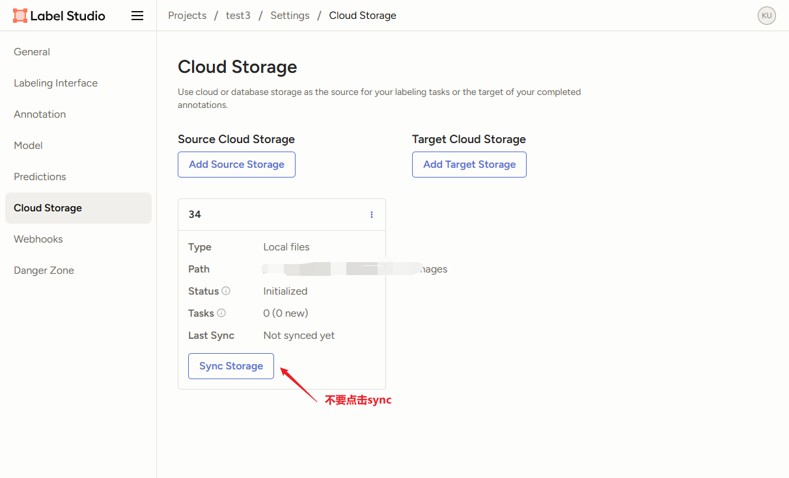
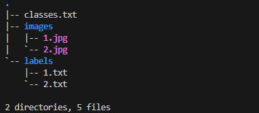
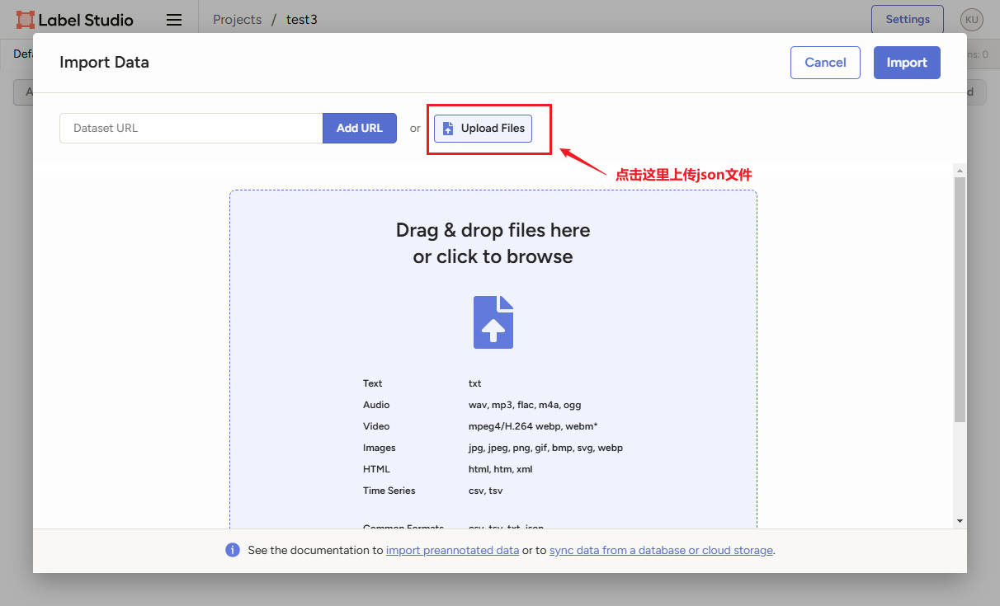

# 一. 导入已有工程

官方链接: https://labelstud.io/guide/storage#Tasks-with-local-storage-file-references

## 1. 创建一个空的工程

略，见"01. Label-Studio基础使用方法.md"

## 2. 配置工程

略，见"01. Label-Studio基础使用方法.md"

## 3. 配置图片数据

略，见"01. Label-Studio基础使用方法.md", 唯一区别就是, 配置图片后**不要点击Sync Storage**



## 4. 安装label-studio-converter

```bash
pip install -U label-studio-converter
```

将已标注好的图片以及标注文件放置在环境变量(LABEL_STUDIO_LOCAL_FILES_DOCUMENT_ROOT=/root/datasets)的子目录下，例如本例放在/root/datasets/demo下，结构如下：



执行命令：

```bash
label-studio-converter import yolo -i /root/datasets/demo -o /root/datasets/demo/ls-task.json --image-root-url "/data/local-files/?d=demo/images"
```

`image-root-url`=`/data/local-files/?d=` +`/your/absolute/local/path/for/images`-`LABEL_STUDIO_LOCAL_FILES_DOCUMENT_ROOT`

比如本例子: `image-root-url`=`/data/local-files/?d=`+ `/root/datasets/demo/images`-`/root/datesets`=`/data/local-files/?d=demo/images`

命令执行结束会产生一个ls-task.json的文件，在新建的工程里导入该文件即可。

