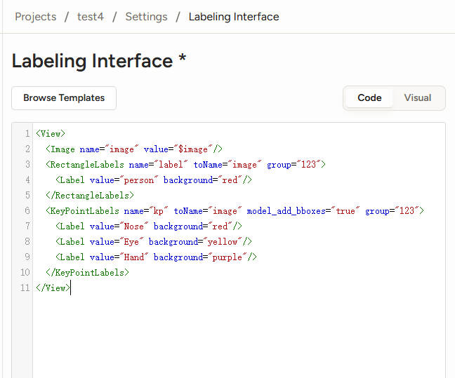
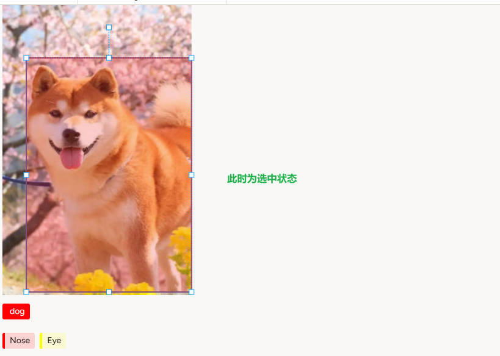
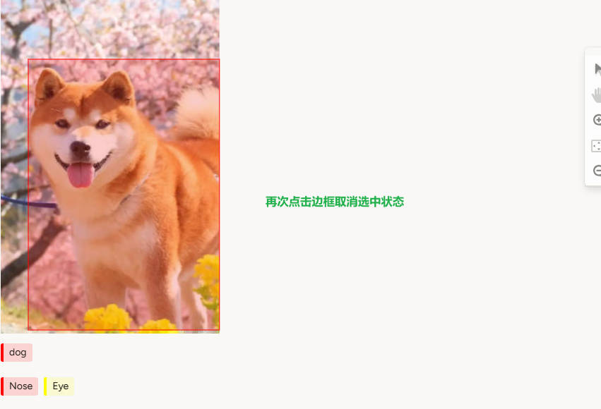
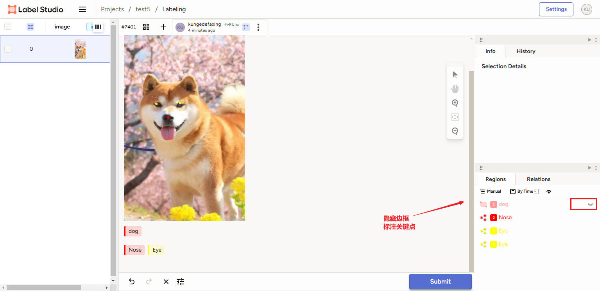
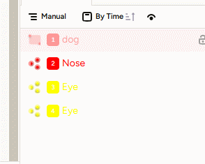

基础用法请参考"01. Label-Studio基础使用方法"

# 1. 配置Labeling Interface

填入以下代码：

```xml
<View>
  <Image name="image" value="$image"/>
  <RectangleLabels name="label" toName="image">
    <Label value="dog" background="red"/>
  </RectangleLabels>
  <KeyPointLabels name="kp" toName="image"> 
    <Label value="Nose" background="red"/> 
    <Label value="Eye" background="yellow"/> 
  </KeyPointLabels>
</View>
```



# 2. 开始标注

先标注目标检测框，再标注关键点，注意标注关键点的时候要先取消目标检测框的选中，隐藏目标检测框，才能进行标注，标注完关键点后，在右侧进行拖拽将关键点放入目标检测框的组内。





拖拽将关键点放入目标检测框的组内

