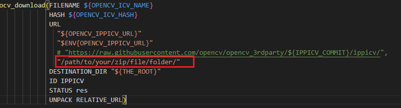

## 编译安装OpenCV

### 方式一：

```bash
# 如果是ubuntu系统，可以直接使用本仓库中release的opencv4.2, 支持对视频的处理。将opencv4.2拷贝到目标机器后, 使用ldd查看lib中的库是否都可正常链接到
```
### 方式二：


```bash
# 安装依赖: 
apt-get install build-essential libgtk2.0-dev libjpeg.dev libtiff5.dev libswscale-dev

# 如果使用ffmpeg做视频后端: 
# (1) 使用ffmpeg预编译包
sudo apt-get install ffmpeg
# (2) 或者自己编译ffmpeg
# 见本仓库下的ffmpeg文件夹

# 如果使用gstreamer做后端: 
sudo apt-get install libgstreamer1.0-dev libgstreamer-plugins-base1.0-dev gstreamer1.0-libav gstreamer1.0-plugins-bad gstreamer1.0-plugins-good gstreamer1.0-plugins-ugly

# 下载opencv-4.12: 
wget https://github.com/opencv/opencv/archive/refs/tags/4.12.0.zip
unzip opencv-4.12.0
cd opencv-4.12.0 && mkdir build && cd build

# 如果使用额外扩展模块(如果编译支持cuda加速的opencv必须使用扩展模块)
wget https://github.com/opencv/opencv_contrib/archive/refs/tags/4.12.0.zip

# 进入opencv-4.12并创建build
cd opencv-4.12.0 && mkdir build && cd build

# 开始编译
# (1) 通用选项
cmake .. \
    -D CMAKE_BUILD_TYPE=Release \
	-D CMAKE_INSTALL_PREFIX=/path/to/your/installation/dir \
# (2) 使用opencv_contrib模块选项
	-D OPENCV_EXTRA_MODULES_PATH=/path/to/opencv_contrib-4.12.0/modules \
# (3) 使用预编译ffmpeg选项
	-D WITH_FFMPEG=ON \
	-D OPENCV_FFMPEG_USE_FIND_PACKAGE=ON \
# (4) 使用自己编译的ffmpeg选项
	-D WITH_FFMPEG=ON \
	-D OPENCV_FFMPEG_USE_FIND_PACKAGE=OFF \
	-D FFMPEG_INCLUDE_DIR=/path/to/your/ffmpeg-build/include \
	-D AVCODEC_INCLUDE_DIR=/path/to/your/ffmpeg-build/include \
	-D AVCODEC_LIBRARY=/path/to/your/ffmpeg-build/lib/libavcodec.so \
	-D AVFORMAT_INCLUDE_DIR=/path/to/your/ffmpeg-build/include \
	-D AVFORMAT_LIBRARY=/path/to/your/ffmpeg-build/lib/libavformat.so \
	-D AVUTIL_INCLUDE_DIR=/path/to/your/ffmpeg-build/include \
	-D AVUTIL_LIBRARY=/path/to/your/ffmpeg-build/lib/libavutil.so \
	-D SWSCALE_INCLUDE_DIR=/path/to/your/ffmpeg-build/include \
	-D SWSCALE_LIBRARY=/path/to/your/ffmpeg-build/lib/libswscale.so \
	-D SWRESAMPLE_INCLUDE_DIR=/path/to/your/ffmpeg-build/include \
	-D SWRESAMPLE_LIBRARY=/path/to/your/ffmpeg-build/lib/libswresample.so \
	-D CMAKE_PREFIX_PATH=/path/to/your/ffmpeg-build
# (5) 使用预编译gstreamer选项
	-D WITH_GSTREAMER=ON
# (6) 使用支持cuda加速的选项
	-D WITH_CUDA=ON \
	-D WITH_CUDNN=ON \
	-D OPENCV_DNN_CUDA=ON \
	-D BUILD_opencv_cudev=ON 
	
# 编译并安装
make -j$(nproc) && make install
```

## 常见问题

下载IPPICV过慢问题:

```bash
# 手动下载压缩包: 
wget https://gitee.com/c1h2/ippicv_2020_lnx_intel64_20191018_general/blob/master/ippicv_2020_lnx_intel64_20191018_general.tgz
# 修改opencv-x.x/3rdparty/ippicv/ippicv.cmake文件, 修改方式如下:
```



使opencv动态库可被系统链接到问题:

```bash
cd /etc/ld.so.conf.d
vim OpenCV.conf 	# 写入 /path/to/your/opencv/installation/dir/lib
sudo ldconfig 		# 此时opencv的动态库可以被系统链接到
```

无法找到libswresample.so问题:


```bash
# 设置一下系统查找动态库路径
export LD_LIBRARY_PATH=/path/to/your/ffmpeg-build/lib:$LD_LIBRARY_PATH
```


