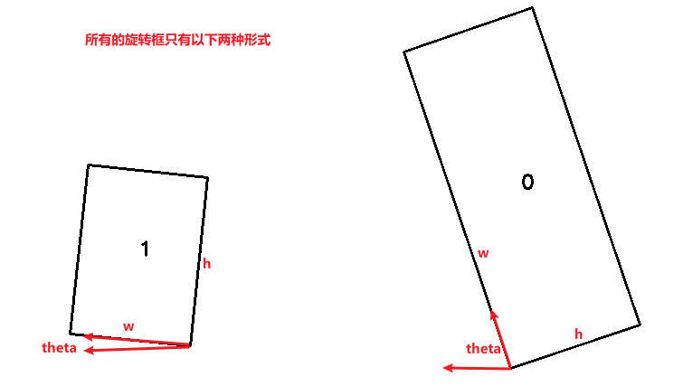
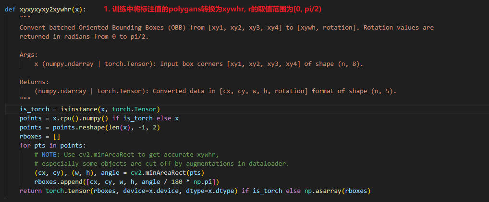
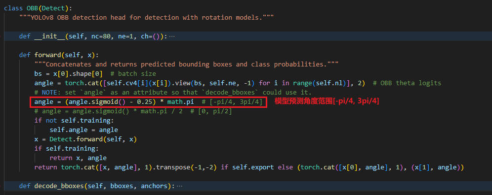
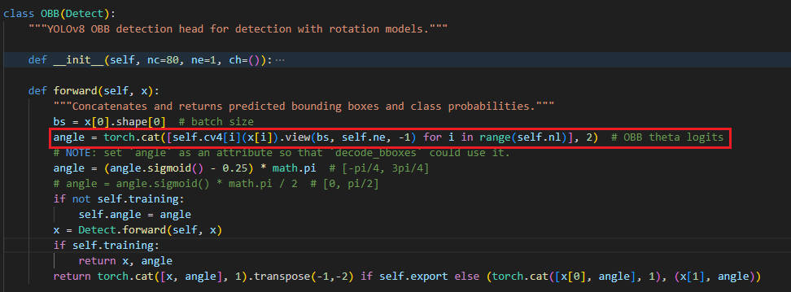

**标注数据转换见本文件夹下**                                      

**Python版推理代码见本文件夹下, C++版推理代码见'03. 推理与优化加速\05. DLNN'**

## 一. 旋转框的表示方法

给定一些polygans的点, 计算旋转框需使用opencv的minAreaRect方法, 得到的返回值为cx, cy, w, h, theta, 其中cx, cy为旋转框的中心点坐标, w、h、theta存在以下两种情况, 且theta的取值范围为[0, pi/2)(**注意opencv版本>4.5时theta的取值范围为[0, pi/2), opencv版本<4.5时theta取值范围为[-pi/2, 0))**



也就是说opencv中计算出来的theta永远是x轴与w之间的夹角。当旋转框为情况0时, w为长边, 当旋转框为情况1时, w为短边

YOLOv8训练数据的标注值是xyxyxyxy, 在代码内部就是通过以上方法将xyxyxyxy转换为xywhr的

```python
# 生成上面的图的代码
import cv2
import numpy as np
from collections import namedtuple

if __name__ == '__main__':
    Polygans = namedtuple('Rect', ['x1', 'y1', 'x2', 'y2', 'x3', 'y3', 'x4', 'y4'])
    p0 = Polygans(x1=587, y1=110, x2=735, y2=79, x3=848, y3=412, x4=715, y4=452)
    p1 = Polygans(x1=241, y1=241, x2=371, y2=249, x3=352, y3=432, x4=219, y4=422)

    polygans = [p0, p1]
    img = np.full([2000, 2000, 3], 255, dtype=np.uint8)
    for i, polygan in enumerate(polygans):
        points = np.array([[polygan.x1, polygan.y1], [polygan.x2, polygan.y2], [polygan.x3, polygan.y3], [polygan.x4, polygan.y4]], dtype=np.float32)
        rect = cv2.minAreaRect(points)
        (cx, cy), (w, h), angle = rect
        box_points = cv2.boxPoints(rect).astype(np.int32)
        cv2.drawContours(img, [box_points], 0, (0, 0, 0), 2)
        cv2.putText(img, f'{i}', (int(cx), int(cy)), cv2.FONT_HERSHEY_SIMPLEX, 0.7, (0, 0, 0), thickness=2)
        print(f'rect{i}: h={h}, w={w}, theta={angle}')
    
    while True:
        cv2.imshow('Rects', img)
        key = cv2.waitKey(0)
        if key:
            break
```

**注意, 在YOLOv8-OBB这里存在几点训练与推理不一致的地方(谜之操作, 没弄明白), 记录一下:**

[提问作者给出的解答, 打开网页后搜JasonSloan即可定位到问题](https://docs.ultralytics.com/datasets/obb/#can-i-use-my-own-dataset-with-oriented-bounding-boxes-for-yolov8-training-and-if-so-how)

1. 训练中的角度标注值采用的是opencv的minAreaRect方法, 因此取值范围为[0, pi/2)

   

2. 训练中的模型预测角度取值范围为[-pi/4, pi3/4]

   

3. 推理中的模型预测角度取值范围与训练中相同, 为[-pi/4, pi3/4]

4. 推理中的将xywhr转换为xyxyxyxy之前, 会先将模型预测的[-pi/4, pi3/4)角度映射到[0, pi)的取值范围

   

## 二. 旋转框之间的IoU计算方法

[原论文](https://arxiv.org/pdf/2106.06072v1.pdf)

思想:

将HBB(Horizontal Bounding Box)或者OBB(Oriented Bounding Box)建模为GBB(Gaussian Bouding Box) , 从而得到框在x和y方向的均值和协方差;

利用GBB的均值和协方差计算每两个框之间的[巴氏距离](https://blog.csdn.net/hy592070616/article/details/122400635?ops_request_misc=%257B%2522request%255Fid%2522%253A%25220259A412-4933-4D44-A22D-2363B013C43C%2522%252C%2522scm%2522%253A%252220140713.130102334.pc%255Fall.%2522%257D&request_id=0259A412-4933-4D44-A22D-2363B013C43C&biz_id=0&utm_medium=distribute.pc_search_result.none-task-blog-2~all~first_rank_ecpm_v1~rank_v31_ecpm-1-122400635-null-null.142^v100^pc_search_result_base4&utm_term=bhattacharyya%20distance&spm=1018.2226.3001.4187), 再通过巴氏距离计算[海林格距离](https://blog.csdn.net/hy592070616/article/details/122400635?ops_request_misc=%257B%2522request%255Fid%2522%253A%25220259A412-4933-4D44-A22D-2363B013C43C%2522%252C%2522scm%2522%253A%252220140713.130102334.pc%255Fall.%2522%257D&request_id=0259A412-4933-4D44-A22D-2363B013C43C&biz_id=0&utm_medium=distribute.pc_search_result.none-task-blog-2~all~first_rank_ecpm_v1~rank_v31_ecpm-1-122400635-null-null.142^v100^pc_search_result_base4&utm_term=bhattacharyya%20distance&spm=1018.2226.3001.4187)从而得到最终的IoU。

Note: [多维高斯分布的表示方法参考链接](https://blog.csdn.net/weixin_38468077/article/details/103508072?ops_request_misc=&request_id=&biz_id=102&utm_term=2d%E9%AB%98%E6%96%AF&utm_medium=distribute.pc_search_result.none-task-blog-2~all~sobaiduweb~default-2-103508072.142^v100^pc_search_result_base4&spm=1018.2226.3001.4187)

### 1. 将HBB转换为GBB

将一个xywh的HBB建模为一个均值为 $$\mu$$ 方差为 $$\sum$$ 的GBB, 如何通过xywh求 $$\mu$$ 和 $$\sum$$ 的方法:

 $\mu = \frac{1}{N} \int_{x \in \Omega} x$                  
 $\sum =\frac{1}{N}\int_{x\in\Omega} (x-\mu)^T(x-\mu)$

其中 $$\Omega$$ 代表HBB的区域, x是属于 $$\Omega$$ 内的任意一点, N代表共有多少个点

那么对于一个HBB矩形框来说, 以矩形框的中心点为原点(也就是 $$\mu$$ 的值为[0, 0])计算得到的 $$\sum$$ 为:


我们可以令

### 2. 将一个OBB转换为GBB

OBB在HBB的基础上需要增加一个旋转角, 它的协方差矩阵  $$\sum$$ 对应的公式如下:


其中 $$a' = {W^2} / {12}$$ , $$b' = {H^2} / {12}$$

### 3. 计算两个GBB之间的巴氏距离

计算公式如下:

$$B_D=\frac{1}{8}(\mu_1-\mu_2)^T\Sigma^{-1}(\mu_1-\mu_2)+\frac{1}{2}\ln\left(\frac{\det\Sigma}{\sqrt{\det\Sigma_1\det\Sigma_2}}\right),\Sigma=\frac{1}{2}(\Sigma_1+\Sigma_2)$$

其中det代表求行列式的意思

而上述公式可以简化为:

$B_D=B_1+B_2$ 

其中:


### 4. 计算两个GBB之间的海林格距离

巴氏距离到海林格距离的转换公式:


最终将1 - hd的结果作为IoU的值

### 5. YOLOv8-OBB中的probiou的计算代码

```python
def batch_probiou(obb1, obb2, eps=1e-7):
    """
    Calculate the prob IoU between oriented bounding boxes, https://arxiv.org/pdf/2106.06072v1.pdf.

    Args:
        obb1 (torch.Tensor | np.ndarray): A tensor of shape (N, 5) representing ground truth obbs, with xywhr format.
        obb2 (torch.Tensor | np.ndarray): A tensor of shape (M, 5) representing predicted obbs, with xywhr format.
        eps (float, optional): A small value to avoid division by zero. Defaults to 1e-7.

    Returns:
        (torch.Tensor): A tensor of shape (N, M) representing obb similarities.
    """
    obb1 = torch.from_numpy(obb1) if isinstance(obb1, np.ndarray) else obb1
    obb2 = torch.from_numpy(obb2) if isinstance(obb2, np.ndarray) else obb2

    x1, y1 = obb1[..., :2].split(1, dim=-1)     # x1,y1: [N, 1]
    x2, y2 = (x.squeeze(-1)[None] for x in obb2[..., :2].split(1, dim=-1))  # x2,y2: [1, N]
    a1, b1, c1 = _get_covariance_matrix(obb1)   # a1, b1, c1: [N, 1]
    a2, b2, c2 = (x.squeeze(-1)[None] for x in _get_covariance_matrix(obb2))    # a2, b2, c2: [1, N]

    t1 = (
        ((a1 + a2) * (y1 - y2).pow(2) + (b1 + b2) * (x1 - x2).pow(2)) / ((a1 + a2) * (b1 + b2) - (c1 + c2).pow(2) + eps)
    ) * 0.25    # t1: [N, N];   t1 + t2为公式(8)
    t2 = (((c1 + c2) * (x2 - x1) * (y1 - y2)) / ((a1 + a2) * (b1 + b2) - (c1 + c2).pow(2) + eps)) * 0.5 # t2: [N, N]    t1 + t2为公式(8)
    t3 = (
        ((a1 + a2) * (b1 + b2) - (c1 + c2).pow(2))
        / (4 * ((a1 * b1 - c1.pow(2)).clamp_(0) * (a2 * b2 - c2.pow(2)).clamp_(0)).sqrt() + eps)
        + eps
    ).log() * 0.5   # t3: [N, N]    t3为公式(9)
    bd = (t1 + t2 + t3).clamp(eps, 100.0)   # bd: [N, N]    
    hd = (1.0 - (-bd).exp() + eps).sqrt()   # hd: [N, N]
    return 1 - hd


def _get_covariance_matrix(boxes):
    """
    Generating covariance matrix from obbs.

    Args:
        boxes (torch.Tensor): A tensor of shape (N, 5) representing rotated bounding boxes, with xywhr format.

    Returns:
        (torch.Tensor): Covariance metrixs corresponding to original rotated bounding boxes.
    """
    # Gaussian bounding boxes, ignore the center points (the first two columns) because they are not needed here.(论文中的公式15)
    gbbs = torch.cat((boxes[:, 2:4].pow(2) / 12, boxes[:, 4:]), dim=-1) # 将OBB转换成GBB(guassion bounding  box):[N, 3]
    a, b, c = gbbs.split(1, dim=-1) # a: W^2/12;  b: H^2/12;  c: theta
    cos = c.cos()
    sin = c.sin()
    cos2 = cos.pow(2)
    sin2 = sin.pow(2)
    return a * cos2 + b * sin2, a * sin2 + b * cos2, (a - b) * cos * sin    # 对应于公式(1)
```

### 三. YOLOv8-OBB与YOLOv8之间的异同点

1. 标注文件不同

   YOLOv8中对真实框的标注文件中每一行为cls+xywh, 而YOLOv8-OBB中对真实框的标注文件中每一行为cls+xyxyxyxy

2. 模型结构中的head不同

   YOLOv8的head为Detect模块, 而YOLOv8-OBB的head为OBB模块。

   OBB模块继承自Detect模块, 并多了三个分支, 对应于三张特征图的角度计算

   

3. 训练中的损失不同

   YOLOv8的损失分为DFL、ClsLoss、BoxLoss这三种损失, YOLOv8-OBB的损失前两个和YOLOv8一致, 与角度无关; 最后一个BoxIoU损失从YOLOv8的CIoU替换成了上面提到的ProbIou

4. 预测中的NMS不同

   预测阶段的NMS中对框与框之间的IoU计算也采用的是ProbIou

