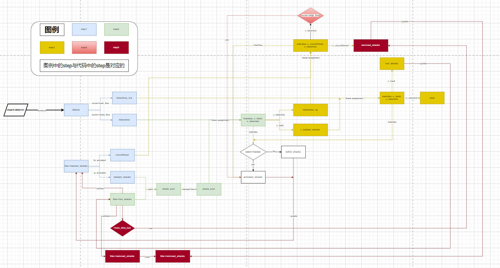

## 一. 算法理解

[源代码](https://github.com/ifzhang/ByteTrack)

已知上一帧的跟踪框 ----> T
当前帧检测 ----> 检测框Dk
按照得分将检测框分为高分检测框和低分检测框 ----> Dh, Dl
使用卡尔曼滤波预测上一帧跟踪框的新位置 ----> T
使用IoU+外观特征对高分检测框与跟踪框进行匹配（匹配算法使用匈牙利算法） ----> Dh_remain, T_remain
使用IoU对低分检测框与跟踪框进行匹配 ----> Dl_remain（直接扔掉）, T_re_remain
将上一帧中丢失的跟踪框与未匹配的高分检测框（Dh_remain）进行匹配    ----> T_lost
将T_re_remain更新到T_lost中 ----> T_lost
如果T_lost中的框丢失了30次，就将其从T_lost中去掉 ----> T_lost
将T_lost更新到T中 ----> T
将Dh_remain加入T中，更新T（认为Dh_remain是新出现的目标） ----> T
返回T

**更详细的思维导图见本文件夹， 配合代码一起食用**

