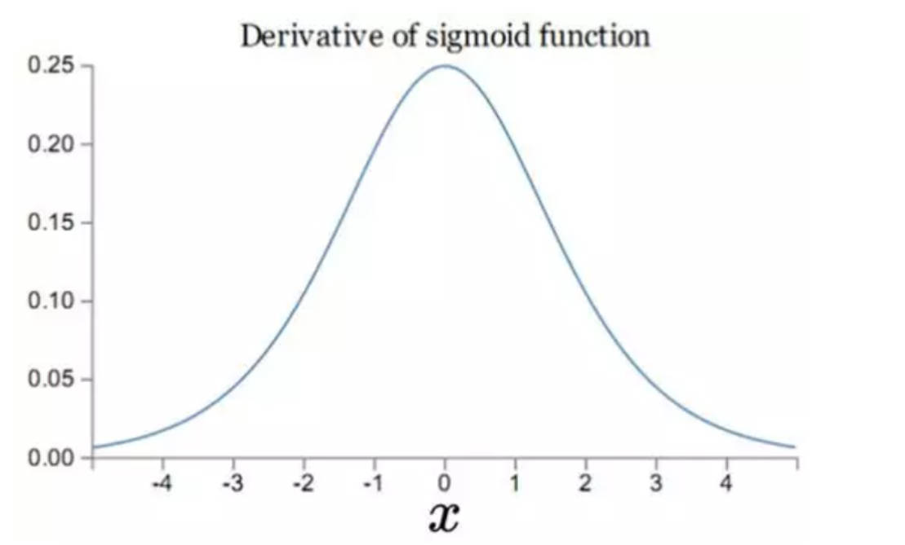
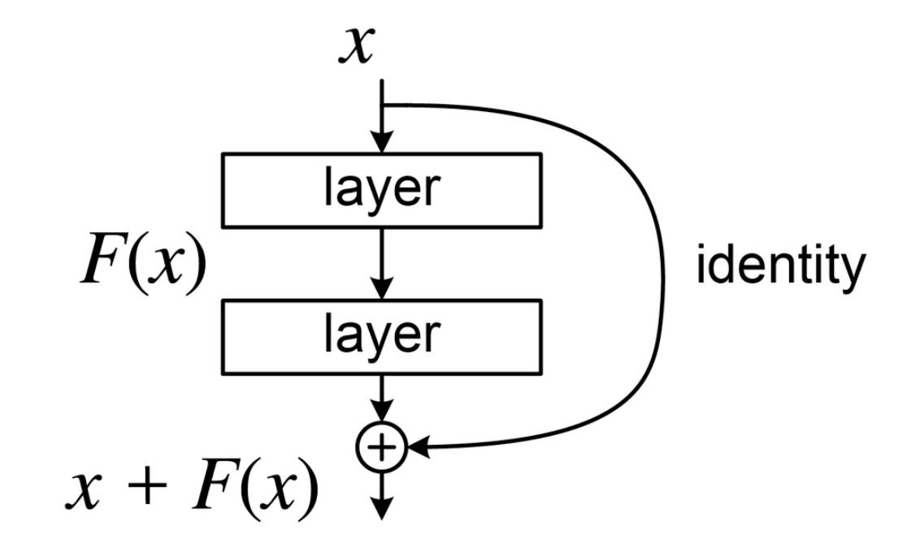
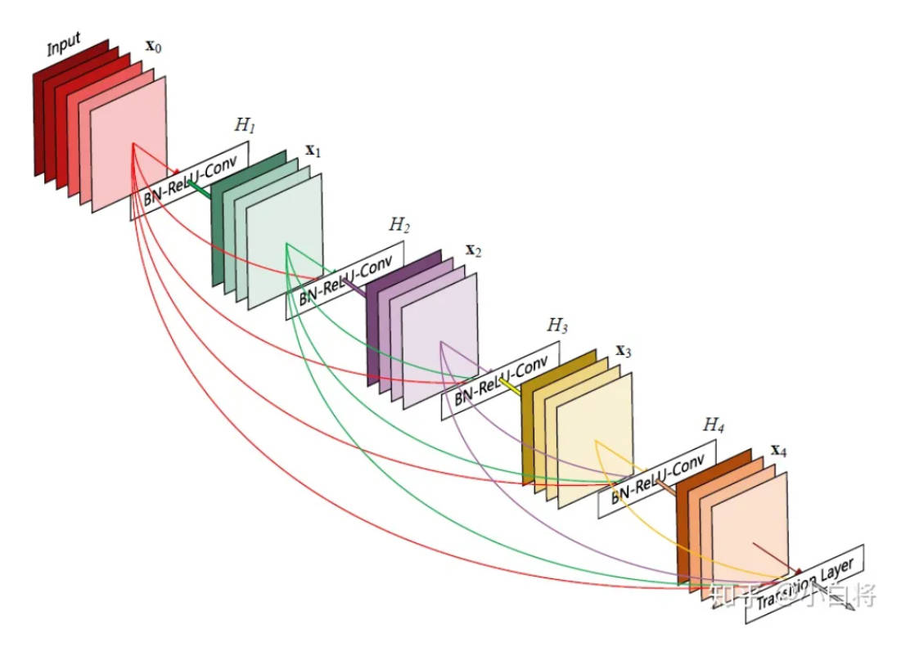
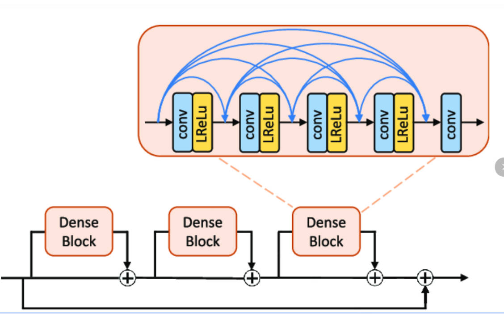
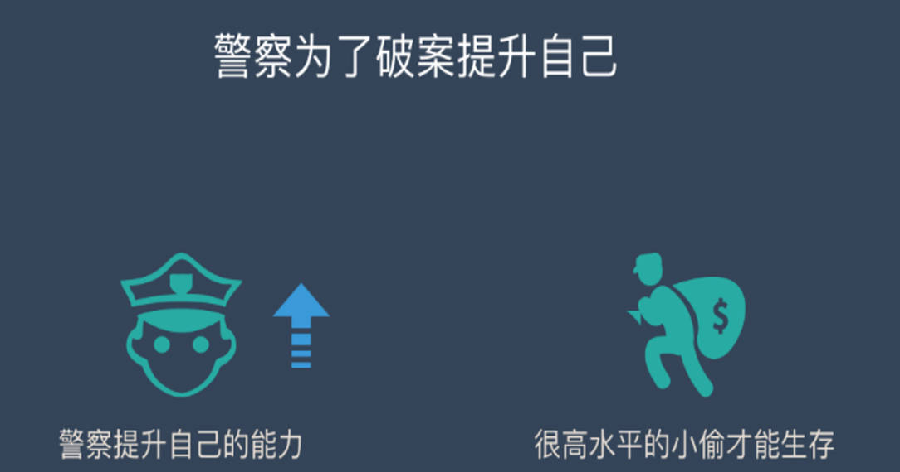
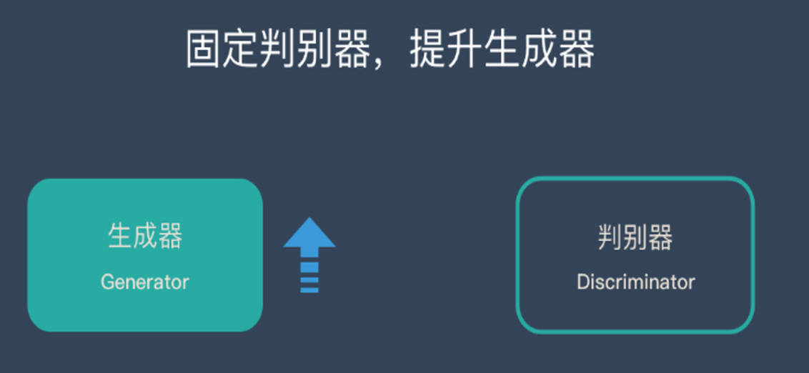
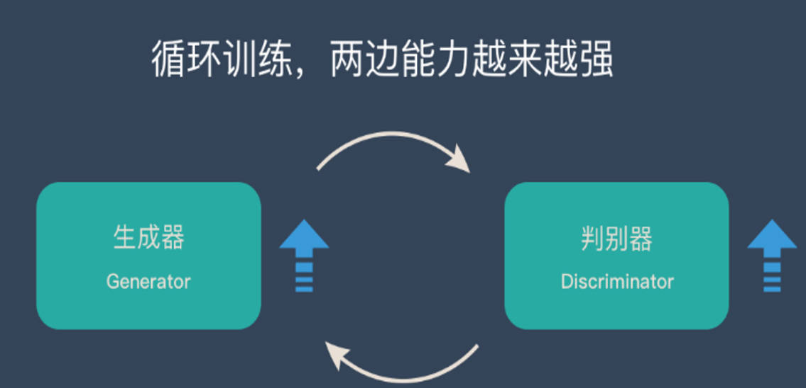
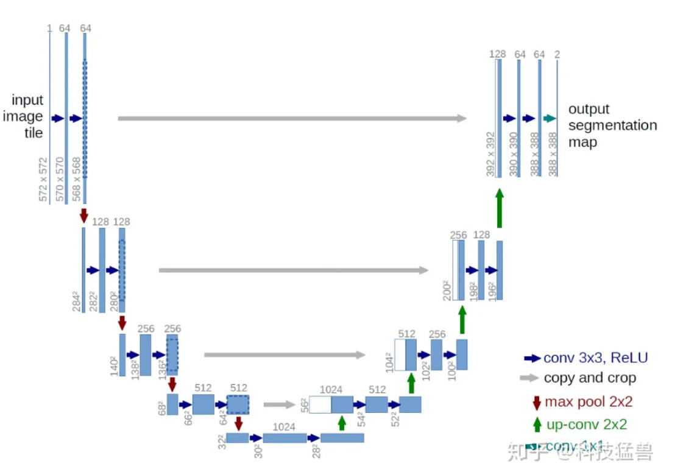
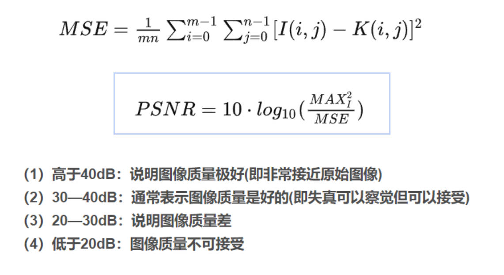

# 一、卷积神经网络与梯度消失

## 1，卷积

## 2，池化

## 3，卷积神经网络

## 4，梯度消失

隐层4比隐层1更新速度慢了2个数量级，隐层1的斜率依然比较大，隐层4斜率几乎为0

sigmoid梯度范围：sigmoid(x) = 1 / (1 + np.exp(-x))   d_sigmoid(x) = sigmoid(x) * (1 - sigmoid(x))

# 二、残差网络ResNet

 在残差块中，梯度可以更轻松地穿过跳跃连接。如果主要路径中的层出现了梯度消失，由于恒等映射的存在，梯度可以直接从跳跃连接传递回来，从而避免了在反向传播过程中的完全消失。

# 三、稠密网络DenseNet

# 四、RRDB（residual in residual dense block）

# 五、GAN

GAN的损失函数：

固定生成器，训练判别器的时候的损失：

$ \text{Loss}_D = \frac{1}{m} \sum_{i=1}^{m} [\log D(x_i) + \log(1 - D(G(z_i)))]$

固定判别器，训练生成器的时候的损失：

$ \text{Loss}_G = \frac{1}{m} \sum_{i=1}^{m} [\log(1 - D(G(z_i)))]$

其中， $D(x_i)$表示判别器在真实数据$x_i$上判断出的结果，$D(G(z_i))$表示判别器在假数据$G(z_i)$上判断出的结果

# 六、UNet

# 七、real-ESRGAN

## 1，网络结构

生成器网络：

判别器网络：

UNetSN（spectral norm UNet）

## 2，生成低分辨率图像

高分辨率图像两阶段变低分辨率：

​ 准备阶段：在高分辨率图像上截取400*400的大小的图像    

第一阶段：低通滤波-->随机缩放-->添加噪声-->JPEG压缩    

第二阶段：低通滤波-->随机缩放-->添加噪声-->sinc低通滤波-->JPEG压缩

## 3、损失函数

一个epoch训练一次生成器+一次判别器

- 生成器训练阶段，冻结判别器：   

  1，生成器重建损失（像素级）（低分辨率图片使用生成器重建（上采样）后与高分辨率求损失）L1损失    2，感知损失（特征图大小像素级）（使用VGG19分别提取gt和生成模型的输出特征，选取其中几层计算损失）L1损失。（由于网络是由生成器与vgg串联，而vgg的参数requires_grad为false，所以在感知损失反向传播的时候只会更新生成器的参数）    

  3，GAN损失（像素级）（使用UNet将生成器重建的fake图片经过UNet再次重建后（通道为1，每个像素值为0-1之间的值）与值全是1的图片（值全是1的图片和重建后图片shape相同）做损失）（BCE损失）

- 判别器训练阶段，冻结生成器：    

  1，GAN损失（像素级）（使用UNet将真实高分辨率图片经过UNet重建后（通道为1，每个像素值为0-1之间的值）与值全是1的图片（值全是1的图片和重建后图片shape相同）做L1损失）    

  2，GAN损失（像素级）（使用UNet将生成器重建的fake图片经过UNet再次重建后（通道为1，每个像素值为0-1之间的值）与值全是0的图片（值全是0的图片和重建后图片shape相同）做L1损失）

## 4、评价指标

PSNR（单位：dB）：

