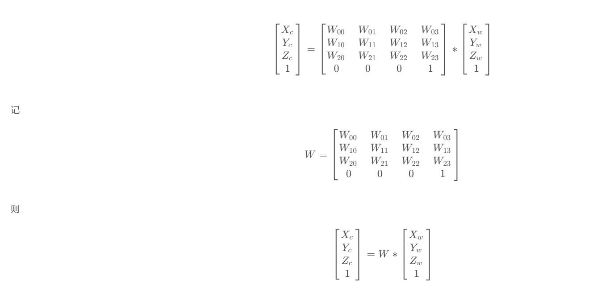
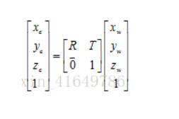

# 相机模型

## 一. 四个坐标系

1. 世界坐标系, 三维, 自定义选取世界中的坐标原点、XYZ轴, 符合右手原则。单位是米。
2. 相机坐标系，三维，以相机光心为原点，水平向右为X轴，垂直向上为Y轴，视线向前为Z轴的负方向，符合右手规则。单位是米。
3. 视平面坐标系，二维，相机靶面（即成像平面）的对称面所在的平面，靶心为原点，X轴和Y轴与相机坐标系同向。单位是米。
4. 照片坐标系，二维，照片左上角为原点，水平向右为X轴，垂直向下为Y轴。单位是像素。

## 二. 四个坐标系之间的坐标转换

1. 世界坐标系到相机坐标系的转换

   原理: 矩阵的刚性变换

   下图中Xw, Yw, Zw是某一点在世界坐标系的坐标; Xc, Xc, Zc 是该点在相机坐标系的坐标

   

   写成齐次坐标:

   

2. 相机坐标系到视平面坐标系的转换

   原理:相似三角形

   下图中Xc, Yc, Zc是某一点在相机坐标系中的坐标; x, y是该点在视平面坐标系中的坐标

   

   3. 视平面坐标系到照片坐标系的转换

      原理: 视平面坐标系和照片坐标系都在成像平面上，只是各自的原点和度量单位不一样。视平面坐标系的原点为相机光轴与成像平面的交点，通常情况下是成像平面的中点或者叫principal point。视平面坐标系的单位是m，属于物理单位，而像素坐标系的单位是pixel，我们平常描述一个像素点都是几行几列。所以这二者之间的转换如下：其中dx和dy表示每一列和每一行分别代表多少米，即**1pixel=dx m**, 注意dx与dy是不一定相等的

      下图中u0, v0是某一点在视平面坐标系中的坐标; u, v是该点在照片坐标系中的坐标; dx, dy是在行与列方向上1个像素代表多少米

      

   ## 三. 相机内参与相机外参

   

   其中相机内参是一个相机的固有参数(通过标定获得), 相机外参需要自己计算

   ## 四. 畸变

   ​