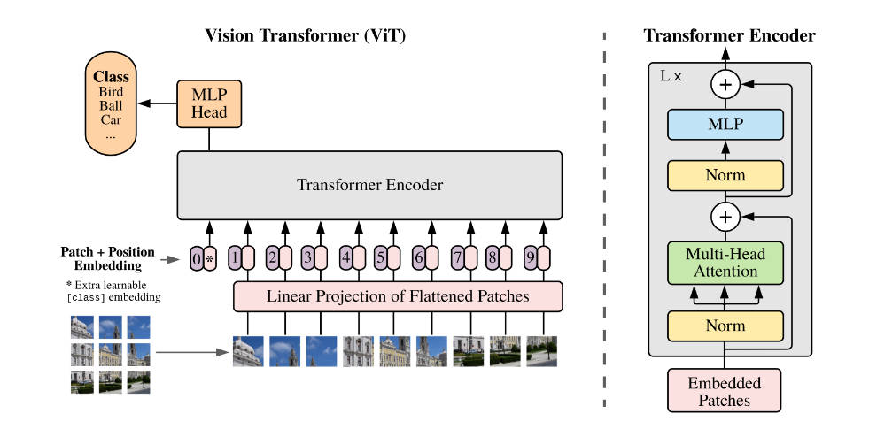

ViT本质是一个基于Transformer的图像分类模型，思想是将一张图分成nxn个patch，然后对每一个patch进行一个由图像到一维向量的转换，然后再为这nxn个patch的图像的1维向量添加一个维度相同的cls_token，然后将这nxn个patch的图像的1维向量连同添加的cls_token一起输入Transformer的Encoder结构中，然后再接一个MLP映射到num_classes维度，进行类别预测。

config.py

```python
learning_rate = 1e-4
num_classes = 10
patch_size = 4
img_size = 28
in_channels = 1
num_heads = 8
dropout = 0.001
hidden_dim = 768
adam_weight_decay = 0
adam_betas = (0.9, 0.999)
activation = "gelu"
num_encoders = 4
embed_dim = (patch_size ** 2) * in_channels
num_patches = (img_size // patch_size) **2
```

model.py

```python
import torch
import torch.nn as nn


class PatchEmbedding(nn.Module):
    def __init__(self, embed_dim, patch_size, num_patches, dropout, in_channels):
        super().__init__()
        # cout = (cint - f + 2p) / s + 1
        self.patcher = nn.Sequential(
            nn.Conv2d(in_channels, embed_dim, kernel_size=patch_size, stride=patch_size),       
            nn.Flatten(2)
        )   # 相当于一次卷积+展平操作将一张大图的所有patch做了num_patches次全连接，然后展平成一维向量
        
        # 最后只有这个cls_token负责分类
        self.cls_token = nn.Parameter(torch.randn(1, 1, embed_dim), requires_grad=True)
        self.position_embeddings = nn.Parameter(torch.randn(1, num_patches + 1, embed_dim), requires_grad=True)
        self.dropout = nn.Dropout(p=dropout)
        
    def forward(self, x):
        cls_token = self.cls_token.expand(x.shape[0], -1, -1)
        
        x = self.patcher(x).permute(0, 2, 1)        # (n, in_channels, h, w) --> (n, embed_dim, num_patches) --> (n, num_patches, embed_dim)
        x = torch.cat((cls_token, x), dim=1)        # 将cls_token添加到x的开头
        x = x + self.position_embeddings
        x = self.dropout(x)
        return x


class ViT(nn.Module):
    def __init__(self, num_patches, num_classes, patch_size, embed_dim, num_encoders, num_heads, hidden_dim, dropout, activation, in_channels):
        super().__init__()
        self.embeddings_block = PatchEmbedding(embed_dim, patch_size, num_patches, dropout, in_channels)
        
        encoder_layer = nn.TransformerEncoderLayer(d_model=embed_dim, nhead=num_heads, dropout=dropout, activation=activation)
        self.encoder_blocks = nn.TransformerEncoder(encoder_layer, num_layers=num_encoders)
        
        self.mlp_head = nn.Sequential(
            nn.LayerNorm(embed_dim),
            nn.Linear(embed_dim,  num_classes)
        )
        
    def forward(self, x):
        x = self.embeddings_block(x)        # (n, in_channels, h, w) --> (n, num_patches + 1, embed_dim)
        x = self.encoder_blocks(x)          # (n, num_patches + 1, embed_dim) --> (n, num_patches + 1, embed_dim)
        x = self.mlp_head(x[:, 0, :])       # (n, embed_dim) --> (n, num_classes)，这里只用了cls_token那个位置的向量做全连接
        return x

        
        
if __name__ == '__main__':
    from config import *
    # x = torch.randn(8, 1, 28, 28)
    # model = PatchEmbedding(embed_dim, patch_size, num_patches, dropout, in_channels)
    # out = model(x)
    # print(out.shape)
    
    x = torch.randn(8, 1, 28, 28)
    model = ViT(num_patches, num_classes, patch_size, embed_dim, num_encoders, num_heads, hidden_dim, dropout, activation, in_channels)
    out = model(x)
    print(out.shape)
```

