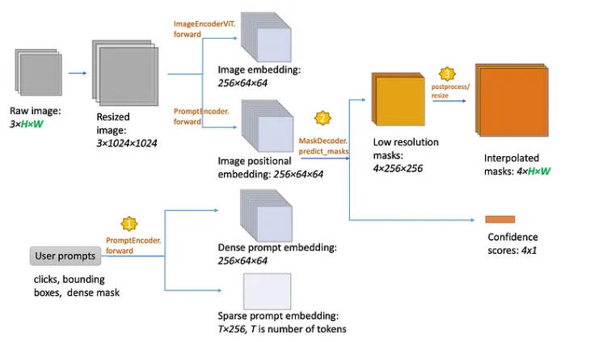
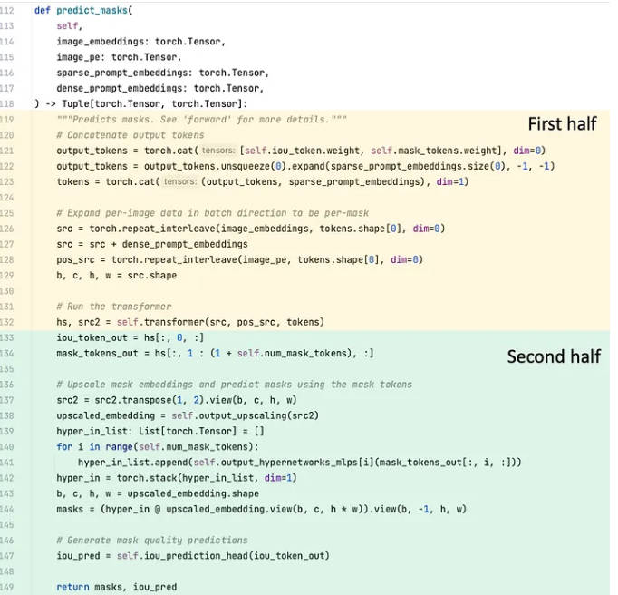
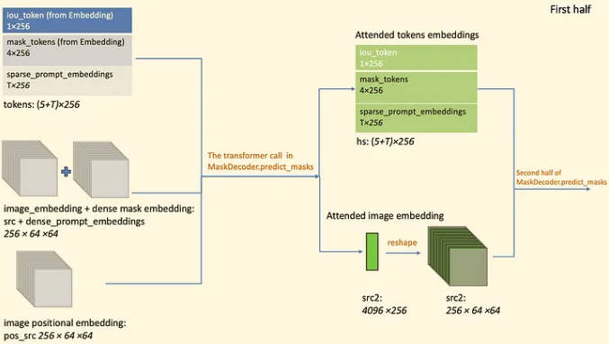

# 一. 模型结构

## 1. Encoder

### 1.1 image encoder

image encoder就是ViT, 只不过没有了多余的[cls]的embedding(上图中"0*"的位置),  然后图像在做运算的时候没有展平成[N, T, E]的维度, 而是一直保持[N, C, H, W]的维度。

image encoder输入图像维度[bs, 3, 1024, 1024] (把原图做了个letterbox), 输出维度为[bs, 256, 64, 64] (假设为ViT_b模型)

### 1.2 prompt encoder

SAM在做分割的时候, 可以接受以下几种类型的prompt:

(1) 点坐标以及点的label值(0或者1, 0代表背景, 1代表前景)

(2) 边框的四个点坐标

(3) 掩膜

prompt encoder输入为np.ndarray(维度不一定), 输出为sparse_embeddings[bs, ?, 256]、dense_embeddings[bs, 256, 64, 64]

todo: prompt encoder原理未搞明白

## 2. Decoder

### 2.1 mask decoder 

[参考链接](https://towardsdatascience.com/how-does-the-segment-anything-models-sam-s-decoder-work-0e4ab4732c37)

mask decoder接受4个输入:

**Image embedding**: 来自于image encoder, 即使用ViT将图像转成embedding, 维度[bs, 256, 64, 64]

**Image positional embedding** : 来自于prompt encoder, 维度[bs, 256, 64, 64]

**Dense prompt embedding** : 来自于prompt encoder, 维度[bs, 256, 64, 64]

**Sparse prompt embedding** : 来自于prompt encoder, 维度[bs,  T, 256], T代表不定长

mask decoder返回两个输出:

**masks** : 4种类型的掩膜, 维度[4, 256, 256]

**confidence scores** : 4种掩膜的得分

为什么是4种掩膜, 如下图, 每一个prompt点可能代表了使用者三种意图(分割出一块车玻璃、整块车玻璃、整个车), 再加上一个最有可能(得分最高)的掩膜, 一共是4种掩膜

分成两部分理解:

第一部分:

**iou_token** : 固定维度1×256, 上图中蓝色的iou_token是为了得到绿色的iou_token, 绿色的iou_token最终目的是得出置信度得分(类似于ViT中的cls_token, 通过注意力机制可以将prompt embeddings, image embedding, image positional embedding这三种信息融合进去, 从而可以预测得分)

**mask_tokens** : 固定维度4×256,  上图中淡蓝色的mask_tokens是为了得到深绿色的mask_tokens, 绿色的mask_tokens最终目的是为了得到4个level的mask

**sparse_prompt_embeddings** : 不固定维度T×256, 上图中的sparse_prompt_embeddings只是为了将信息融合进去, 得到的绿色的sparse_prompt_embeddings弃掉不用(为什么弃掉不用还要输出呢? 因为transformer结构注定了输入输出维度相同, 输入这三种, 输出也有这三种)

**image_embeddings ** : 来自于image encoder

**dense_prompt_embeddings** : 来自于prompt encoder

**image_embeddings ** 和 **dense_prompt_embeddings** 会进行element-wise相加, 相当于把两种信息融合在一起了

**pos_src image positional embedding** : 即image positional encoding, 来自于prompt encoder
**The transformer call** : 接受这三类输入, 并得到两类输出attended tokens embedding(在图中是hs)以及attended image embedding(在图中是src2)

**attended tokens embedding** : (5+T)×256

**attended image embedding** :  bs×256×64×64, 融合了各种信息后的图像特征向量

第二部分:

未完待续

