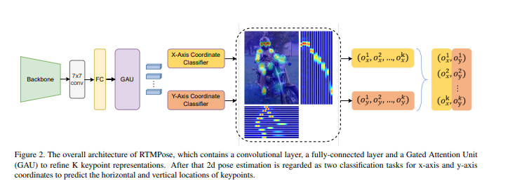

**RTMPose主要采用了SimCC的将关键点回归任务变为分类任务的思想,模型最终分别预测x坐标的`[batch_size, number_keypoints, number_bins]`以及y坐标的`[batch_size, number_keypoints, number_bins]`两个矩阵**

例如:

假如我们要做个68点关键点检测任务, 模型输入大小为`NxCx256x256`, bins数为`512`(一般bins数为输入大小的2倍),

并假设模型输入大小与原图大小一致:

**对于模型结构:**

* 骨干网络: CSPNeXt, 特征提取, 没什么特别的
* 7x7Conv: 没什么特别的, 作者试验出来发现在后面采取更大卷积核能提高mAP
* FC: 7x7卷积后, 得到的feature map数量为`[H, W, 68]`, 然后要进行flatten操作, 变为`[HxW, 68]`, 再transpose变为`[68, HxW]`, 然后做一个全连接, 变为`[68, 512]`
* GAU: Gate Attention Unit, Transformer self-attention注意力机制的变体

**对于推理阶段: **

循环遍历这68个点, 然后取这512个位置的概率最大的bin的位置为最终的预测位置, 例如, 概率最大的bin序号为50, 那么预测位置在模型输入尺寸`(256x256)`下为`50/2=25`

**对于训练阶段: **

假设模型输入大小与原图大小一致, 假如第0号关键点的真实标注坐标为`(100, 150)`, 那么100落在第`100/256x512=200`个bin处, 150落在第`150/256x512=300`个bin处, 将该真实点变为一个高斯分布的软标签, 也就是说x坐标的第`198 199 200 201 202`处均有概率, y坐标的第`298 299 300 301 302`处均有概率, 然后和预测值进行分类损失计算

**本文件夹下三个文件:**

* mmpose-inferencer.py:

  简单直接, 不需要自己下载模型权重, 安装好mmpose mmcv等即可直接运行, 安装请参考本仓库中的Frameworks文件夹下的openmmlab

  但是由于mm系列代码封装层次过多, 想挖出模型具体实现细节非常expensive

* rtmlib-inferencer.py:

  由rtmpose原作者写的推理代码, 无需依赖mmcv mmpose, 可直接运行, 可debug进入查看rtmpose实现细节

* onnx-inferencer.py:

  我自己实现的基于onnx的纯推理代码, 所有模型细节全部在一页code上, 方便理解后将其转化为C++推理实现, 需要使用mmdeploy先将pt模型编译出onnx模型, 如何编译, 进入该代码文件查看

