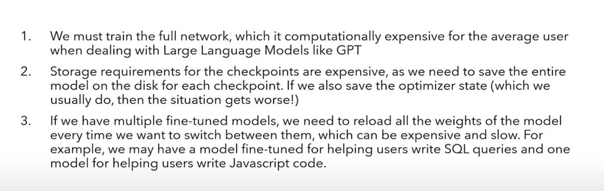
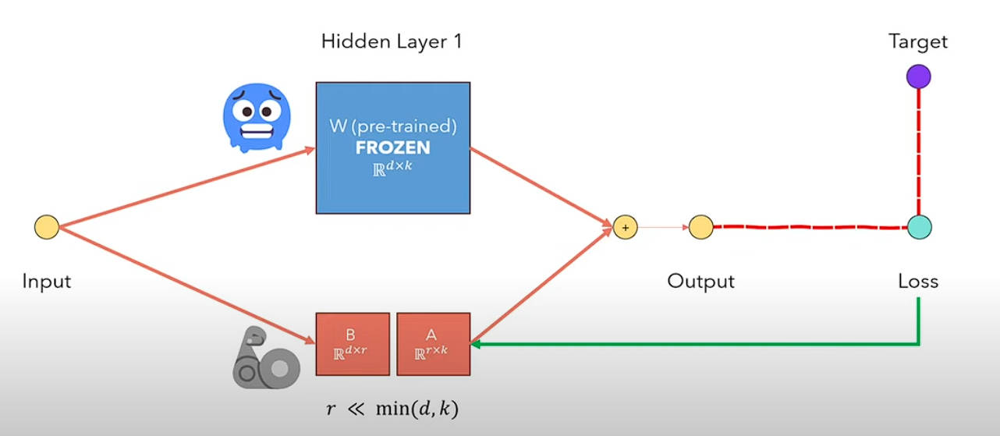
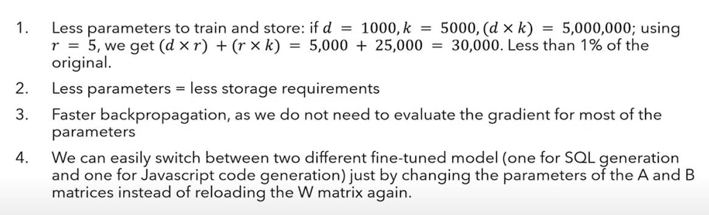

## 一. 引出

**不使用LORA进行大模型微调存在的问题:**

## 二. LORA

**LORA思路:**

冻结原始模型所有预训练权重参数W, 在每一层使用一个可输出同样维度的权重参数B和A矩阵代替, 然后每一层的输出由原始输出与新增输出进行加和, 反向传播时只更新新增权重, 不更新原始权重, 且新增权重中的`r`远小于`d`和`k`, 这样新增权重的存储以及计算都很小

**LORA优势:**

**矩阵分解示例见本文件夹下的[svd.ipynb](svd.ipynb): **

本示例模拟一个`10*10`的矩阵(秩为2)分解为`10*2和2*10`的矩阵, 并且对于同样的输入, 使用这分解前和分解后计算得到的结果一样, 但是计算量却差很多倍

**PyTorch实现LORA示例见本文件夹下[lora.ipynb](lora.ipynb):**

本示例使用mnist手写数字识别数据集, 构建三层全连接分类网络, 先正常训练得到一个预训练模型, 然后选取数字等于9的所有数据, 构建原始模型的lora版本进行微调训练, 最终结果会发现, 训练后的lora版本的模型会大大降低在数字9上的识别错误率(但是会升高在其他数字上的识别错误率)

