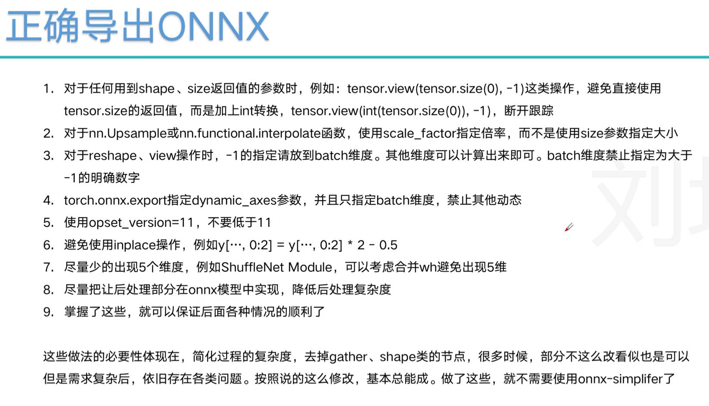

记录一下基于trtpy库使用C++版TensorRT推理超分辨率模型Real_ESRGAN的历程。

历程由前到后就是按照01-15序号进行的。

模型权重文件全部未上传

复现每个序号的历程只需要修改Makefile文件中的cuda_home、nano_home、syslib、cpp_pkg改为当前环境下的cuda(trtpy)、NanoLog、sys(trtpy)、cpp(trtpy)家目录，然后将每个序号文件夹下的inference.cpp、inference.hpp、main.cpp替换掉**完整代码**文件夹下对应的文件，make run即可执行。


----------------------------------------------------------------------------------------------------------------------------------------------------------

本文档基于real-ESRGAN超分辨率重建模型，实现了完整的基于trtpy的C++版本的TensorRT的推理，完整代码在"完整代码"文件夹中

# 一、写推理代码

在pycharm上：写一个standalone的推理代码（包括一个standalone的model和一个standalone的inference)，并将推理结果与原非standalone推理结果比较，看看自己写的推理代码是否有错

# 二、导出onnx

从这步开始以下步骤全部在vscode上操作

将本地权重文件拷贝至"完整代码"文件夹中gen_and_modify_onnx文件夹下的weights文件夹下，将standalone的model代码拷贝至"完整代码"文件夹中gen_and_modify_onnx文件夹下的gen_onnx.py文件中，按照下图（正确导出onnx)检查网络结构，并在gen_onnx.py文件下编写导出onnx的代码。示例中导出的onnx名字为rrdb.onnx

示例中gen_and_modify_onnx文件夹下的model.py就是standalone的model，inference.py就是standalone的inference

pt转成onnx不需要指定为half，只要在onnx转成engine时转成FP16类型的就行。此点存疑，但是如果指定为half，转成engine时，使用engine推理结果是不对的。



# 二. 使用trtexec进行速度测试

`trtexec` 是 NVIDIA 提供的一个命令行工具，作为 TensorRT 工具包的一部分。使用trtexec可以通过简单的命令行快速的知道使用tensorrt加速后模型的推理速度是多少。

如何使用可以直接问chatgpt。

# 三、将前处理添加到onnx中

编写并检查预处理网络：（在本示例中未实现该步骤）

先将前处理写成nn.Module格式的网络，导出为pre.onnx，然后使用netron查看是否有错。然后使用自定义的前处理网络将一张图片预处理出来保存成pickle到本地，然后在原模型代码中的预处理后正式推理前的位置插入加载本地pickle文件的代码，（也就是使原推理代码的预处理失效，直接使用本地加载的pickle文件进行推理），最后与使用原模型的推理结果进行比较，检查预处理网络编写是否有错误。

如果没错误，按照以下代码将预处理添加到网络中，生成新的onnx文件叫new.onnx

另一个option：使用onnx-modifier可视化的修改onnx网络（onnx-modifier在github中搜索可以直接下载windows exe文件）

```python
from torch import nn
import torch
import onnx
from onnx import helper
import numpy as np
model = onnx.load("yolov5s.onnx")
print(model)	# 最好先把模型打印一下，看看每个节点的结构，或者使用netron看看模型每个节点的结构


# 使用onnx将预处理代码变成网络结构添加到网络中
# step1:构建预处理网络并转成onnx
class Preprocess(nn.Module):
    def __init__(self):
        super().__init__()
        self.mean = torch.randn(1, 1, 1, 3)
        self.std = torch.rand(1, 1, 1, 3)
    def forward(self, x):
        x = x.float()
        x = (x / 255 - self.mean) / self.std
        x = x.permute(0, 3, 1, 2)  # BHWC -> BCHW
        return x
pre = Preprocess()
torch.onnx.export(
    pre, (torch.zeros((1, 640, 640, 3), dtype=torch.uint8)), "pre.onnx")
# step2:加载预处理网络，将yolov5s中的image为输入的节点，修改为pre_onnx的输出节点
pre_onnx = onnx.load("pre.onnx")
for item in pre_onnx.graph.node:
    # 修改当前节点的名字
    item.name = f"pre/{item.name}"
    # 修改当前节点的输入的名字
    for index in range(len(item.input)):
        item.input[index] = f"pre/{item.input[index]}"
    # 修改当前节点的输出的名字
    for index in range(len(item.output)):
        item.output[index] = f"pre/{item.output[index]}" 
# 修改原模型的第一层的输入节点名字改为pre_onnx的输出节点的名字
for item in model.graph.node:
    if item.name == "Conv_0":
        item.input[0] = "pre/" + pre_onnx.graph.output[0].name
# setp3: 把pre_onnx的node全部放到yolov5s的node中
for item in pre_onnx.graph.node:
    model.graph.node.append(item)    # 这里我看了model.graph.node这个转成列表后append不是在网络末尾追加吗，但是这个是将预处理加入到网络首部中，不应该是insert吗
# 答：其实model.graph.node这个列表里的元素可以使完全乱序的，因为这个列表里的每个元素都标记好了他的输入是叫啥名，输出时叫啥名，所以无论在列表中顺序怎么乱，最终都能按照名字一一对应上
# step4: 把pre_onnx的输入名称作为yolov5s的input名称
input_name = "pre/" + pre_onnx.graph.input[0].name
model.graph.input[0].CopyFrom(pre_onnx.graph.input[0])
model.graph.input[0].name = input_name
onnx.save(model, "new.onnx")
```

# 四. 将后处理添加到onnx中

编写并检查后处理网络：过程同预处理。

该步骤实现在本例中为gen_and_modify_onnx文件夹下的modify_onnx.py文件。其中，Postprocess为后处理网络（导出为onnx后使用netron查看），verify_result为验证后处理网络的正确性的函数（使用原模型不做后处理的结果保存到本地，再加载出来使用自定义的Postprocess进行后处理看结果是否正确），modify_onnx为将后处理网络添加到原网络中的函数。本例中生成新的onnx文件叫new.onnx在workspace下（使用netron查看）。

另一个option：使用onnx-modifier可视化的修改onnx网络（onnx-modifier在github中搜索可以直接下载windows exe文件

```python
from torch import nn
import torch
import onnx
from onnx import helper
import numpy as np
import cv2

model = onnx.load("rrdb.onnx")
# print(model)	# 最好先把模型打印一下，看看每个节点的结构，或者使用netron看看模型每个节点的结构


# 使用onnx将预处理和后处理代码变成网络结构添加到网络中
# step0:构建预处理和后处理网络并转成onnx
class Postprocess(nn.Module):
    def __init__(self):
        super().__init__()

    def forward(self, x):
        x = torch.clamp(x, 0, 1)[0]
        x = x.permute(1, 2, 0)
        x = x[:, :, [2, 1, 0]]
        x = x * 255.0
        return x

def modify_onnx():
    """给onnx模型增加预处理和后处理部分"""
    # =====================Part1:给原模型增加后处理部分=====================
    # step1:构建后处理网络并转成onnx
    post = Postprocess().eval()
    dummy = torch.zeros((1, 3, 64, 64), dtype=torch.float32)
    dynamic = {
        "post": {2: "height", 3: "width"},
        "output": {2: "height", 3: "width"},
    }
    # dynamic = {
    #     "post": {0: "batch"},
    #     "output": {0: "batch"},
    # }
    torch.onnx.export(
        post, 
        (dummy), 
        "post.onnx",
        input_names=["post"], 
        output_names=["output"],
        opset_version=11,
        dynamic_axes = dynamic
        )

    # step2:加载后处理网络，将模型中的以output为输出的节点，修改为post_onnx的输入节点
    post_onnx = onnx.load("post.onnx")
    # 给所有的post-onnx网络的节点名字前面加上'post/'
    for item in post_onnx.graph.node:
        # 修改当前节点的名字
        item.name = f"post/{item.name}"
        # 修改当前节点的输入的名字
        for index in range(len(item.input)):
            item.input[index] = f"post/{item.input[index]}"
        # 修改当前节点的输出的名字
        for index in range(len(item.output)):
            item.output[index] = f"post/{item.output[index]}" 
    # 修改原模型的最后一层的输出节点名字改为post-onnx的输入节点的名字
    for item in model.graph.node:
        if item.name == "/conv_last/Conv":      # 这个需要到netron上查看到底叫啥名
            item.output[0] = "post/" + post_onnx.graph.input[0].name
            print("Change original model output to post model input successfully!")

    # setp3: 把post-onnx的node全部放到原模型的node中
    for item in post_onnx.graph.node:
        model.graph.node.append(item)    # 这里我看了model.graph.node这个转成列表后append不是在网络末尾追加吗，但是这个是将预处理加入到网络首部中，不应该是insert吗
    # 答：其实model.graph.node这个列表里的元素可以使完全乱序的，因为这个列表里的每个元素都标记好了他的输入是叫啥名，输出时叫啥名，所以无论在列表中顺序怎么乱，最终都能按照名字一一对应上

    # step4: 把post-onnx的输出名称作为原模型的输出名称
    output_name = "post/" + post_onnx.graph.output[0].name
    model.graph.output[0].CopyFrom(post_onnx.graph.output[0])
    model.graph.output[0].name = output_name

    onnx.save(model, "../workspace/new.onnx")
    print("Done!")

def verify_result():
    """将原模型不做后处理推理结果使用pickle保存，然后使用自定义的后处理网络加载推理验证结果是否正确"""
    import pickle
    with open("result.pkl", mode="rb") as f:
        res = pickle.load(f)
    post = Postprocess()
    res = post(res)
    res = res.to(torch.uint8)
    res = res.cpu().numpy()
    cv2.imwrite("post_result.jpg", res);
    
if __name__ == '__main__':
    # verify_result()
    modify_onnx()
```

# 五、将onnx模型转成tensorrt模型

使用本例下上一层目录中的"01. onnx转tensorrt模型"中的main.cpp，将其放入src文件夹下，注释掉该文件中的inference函数，使用build_model函数生成tensorrt模型叫engine.trtmodel，本例中生成新的tensorrt模型叫engine.trtmodel在workspace下。

# 六. 使用tensorrt模型进行推理

将main.cpp中的inference函数取消注释，修改前处理代码，后处理代码（注意有可能前处理后处理已经集成到网络中），查看使用tensorrt推理的图片结果是否正确。

# 七. 第一次封装(封装成类)

使用本例下上一层目录中的"02. 推理（不分文件）"中的main.cpp，将其放入src文件夹下，按照上一步骤修改的代码修改对应封装的代码。

# 八. 第二次封装(分成头文件和源文件)

（非必要步骤，但有助于理解第三次封装）

使用本例下上一层目录中的"03. 分文件编写"中的inference.cpp和main.cpp放入src文件夹，inference.hpp放入include文件夹；注意此时要在Makefile中的include_paths变量中增加include文件夹（也就是Makfile所在目录下的include文件夹）

将上一步骤封装的类拆分成头文件和源文件，头文件放入include文件夹下，源文件放入src文件夹下，本例子中头文件名为inference.hpp，源文件为inference.cpp。注意第二次封装后，头文件中依然有很多像NvInfer.h这样的第三方库的包含，这样不利于使用者调用，如果将源文件编译成库文件，使用者在调用的时候还是要指定NvInfer.h的头文件路径和相应的库文件路径，所以要改成RAII接口模式。使NvInfer.h这些头文件全部隐藏在cpp文件中，头文件只留标准库中的include。

# 九. 第三次封装(RAII接口模式)

使用本例下上一层目录中的"04. 改成RAII+接口"中的inference.cpp和main.cpp放入src文件夹，inference.hpp放入include文件夹；注意此时要在Makefile中的include_paths变量中增加include文件夹（也就是Makfile所在目录下的include文件夹）

封装成RAII接口类型，什么是RAII接口可以看trtpy docs目录下的《任务37-38_生产者消费者模型理解.md》，此时第三方库基本都封装在cpp文件中了

# 十. 第四次封装(二进制图像in&out)

**此步骤废弃，对应于文件夹"05. 修改入参出参类型为vector"**

inference.cpp和main.cpp放入src文件夹，inference.hpp放入include文件夹；注意此时要在Makefile中的include_paths变量中增加include文件夹（也就是Makfile所在目录下的include文件夹）

在inference.cpp文件中增加了load_bin_image的函数，函数功能就是读取本地的二进制图像文件，重建成cv::Mat类型的图像供后续使用；增加了推理结束后将cv::Mat类型的数据转成二进制图像返回的功能。

其中load_bin_image函数可以先在一个独立的文件中验证其是否可以成功恢复：首先使用PIL生成一个二进制的image保存到本地，再用load_bin_image函数将其恢复。

# 十一. 第一阶段完整版

对应于上一层目录中的"06. 第一阶段完整版"

# 十二. 第五次封装（修改为生产者消费者模型）

使用本例下上一层目录中的"07. 修改为生产者消费者模型+多线程"中的inference.cpp和main.cpp放入src文件夹，inference.hpp放入include文件夹。

什么是生产者消费者模型，可以看trtpy docs目录下的《任务37-38_RAII+接口模式+生产者消费者模型.md》。

# 十三. 修改bug（内存开辟方式由栈变堆）

对应于"08. 修改内存开辟方式由栈改为堆"

在声明一个数组的时候，如果数组较大，应该new出来，而不是直接声明：

```c++
int vector[100000000];							// 这会让程序崩溃
int* vector = new int[100000000]; 				// 应该这么写
```

# 十四. 增加NanoLog日志

对应于"09. 增加NanoLog日志"

为代码增加日志，NanoLog用法参考本仓库中的"06. C++"文件夹下的"1. 日志/NanoLog"

# 十五. 优化代码（去掉冗余后处理）

对应于"10. 去掉冗余后处理"

# 十六. 尝试将后处理使用核函数编写

对应于"11. 后处理改为使用核函数，速度变慢，放弃"

核函数不一定会使程序速度变快，也不一定会变慢，如果想写核函数，那么可以参考此节代码。

核函数如果还是不明白，参考trt docs文件夹下的《任务13_仿射变换warpAffine.md》

**注意核函数传参的时候不能传引用！**

# 十七. 封装成动态库

 对应于"12. 封装成动态库"

inference.cpp和main.cpp放入src文件夹，inference.hpp放入include文件夹；CMakeLists.txt放在tensorrt-integrate文件夹下。

使用CMakeLists.txt编译成动态库。

编译完的动态库使用 g++ main.cpp -L../lib -linference -I../include命令将动态库与main函数编译成可执行文件，再使用./a.out执行该文件，验证动态库是否有问题。

如果执行./a.out找不到动态库，就需要执行下面这个命令，使操作系统可以链接到我生成的动态库。

export LD_LIBRARY_PATH=生成的动态库路径:$LD_LIBRARY_PATH

# 十八. 使用pybind11封装成python可调用的库

由于本项目需要写一个http接口，而C++版本的http框架极其晦涩难懂，所以改为将C++推理代码封装成一个python可调用的库，再使用python调用该库。既保证了C++的高性能，又降低了http代码的难度。

对应于"13. 使用pybind11封装成python可调用的库"，该文件夹下的Makefile有多处改动，需注意；该文件夹下的src文件夹下没有main.cpp文件了，因为是使用pybind11编译成动态库，所以多了一个pybind11.hpp以及interface.cpp。其中pybind11.hpp就是pybind11的完整实现，所以无需再安装；interface.cpp中是使用pybind11将C++接口映射为python接口的代码。

# 十九. 更改pybind11封装库的出参类型为array

对应于"14. 更改pybind11封装库的出参类型为array'

在上一部分中，C++推理代码返回的数据类型是一个std::vector标准容器，而std::vector标准容器在python中的表现形式为列表（C++中的数组也是），列表非常占用资源，在python中取值的时候非常慢。因此将出参改为numpy的ndarray数据格式，而numpy的ndarray数据格式等同于pybind11的array格式。

# 二十. 使用flask调用pybind11封装的库提供http服务

对应于"15. 使用flask调用pybind11封装的库提供http服务"

上面已经完成了对C++代码的封装编译，编译成的动态库取名为sr.so，本部分实现了flask的http服务。

# 二十一. 出参形状reshape放在C++中执行

对应于"16. 出参形状reshape放在C++中执行"

由于在返回以前需要将图像转为二进制数据，而将图像转为二进制数据以前又需要将图像使用cv::imencode编码，在编码以前又需要将被编码的array数据reshape成HxWxC的形状，将reshape这个步骤放在了C++中执行，重新编译C++成动态库即可。


