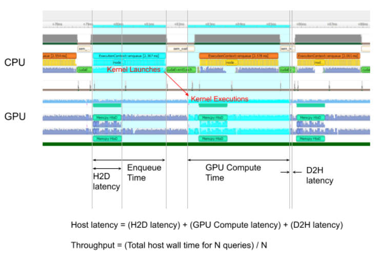

使用trtexec进行模型benchmark后的结果参数解释如下:

[官方文档](https://docs.nvidia.com/deeplearning/tensorrt/developer-guide/index.html#trtexec-benchmark)

1. Throughput

   Throughput = Total Host Walltime / number of inferences

   官方解释: The observed throughput is computed by dividing the number of inferences by the Total Host Walltime. If this is significantly lower than the reciprocal of GPU Compute Time, the GPU may be underutilized because of host-side overheads or data transfers. CUDA graphs (with --useCudaGraph) or disabling H2D/D2H transfers (with --noDataTransfer) may improve GPU utilization. The output log guides which flag to use when trtexec detects that the GPU is underutilized.

2. Latency

   Latency(Host Latency) = H2D Latency + GPU Compute Time + D2H Latency

   官方解释: The summation of H2D Latency, GPU Compute Time, and D2H Latency. This is the latency to infer a single inference.

3. End-to-End Host Latency

   Ignore, will be removed in the future version

4. Enqueue Time

   Enqueue Time: 资源等待时间, 如果有1000条数据同时并发做H2D的拷贝, 那么这1000条数据入队后, 第n+1条数据需等待第n条数据释放资源才能做H2D的拷贝, 也就是说如果并发大的话, 这个时间就会比较凸显; 如果不并发, 这个时间就可以忽略

   还有就是如果使用同步模式, 那么这个时间就会显现, 如果使用异步模式且不是高并发的情况下, 这个时间就可以忽略。

   官方解释: The host latency to enqueue an inference, including calling H2D/D2H CUDA APIs, running host-side heuristics, and launching CUDA kernels. If this is longer than the GPU Compute Time, the GPU may be underutilized, and the throughput may be dominated by host-side overhead. Using CUDA graphs (with --useCudaGraph) may reduce Enqueue Time.

5. H2D Latency

   Host到Device的数据拷贝时间

   官方解释: The latency for host-to-device data transfers for input tensors of a single inference. Add --noDataTransfer to disable H2D/D2H data transfers.

6. GPU Compute Time

   GPU计算时间

   官方解释: The GPU latency to execute the CUDA kernels for an inference.

7. D2H Latency

   Device到Host的数据拷贝时间

   官方解释: The latency for device-to-host data transfers for output tensors of a single inference. Add --noDataTransfer to disable H2D/D2H data transfers.

8. Total Host Walltime

   官方解释: The Host Walltime from when the first inference (after warm-ups) is enqueued to when the last inference was completed.

9. Total GPU Compute Time

   官方解释: The summation of the GPU Compute Time of all the inferences. If this is significantly shorter than the Total Host Walltime, the GPU may be under-utilized because of host-side overheads or data transfers.

