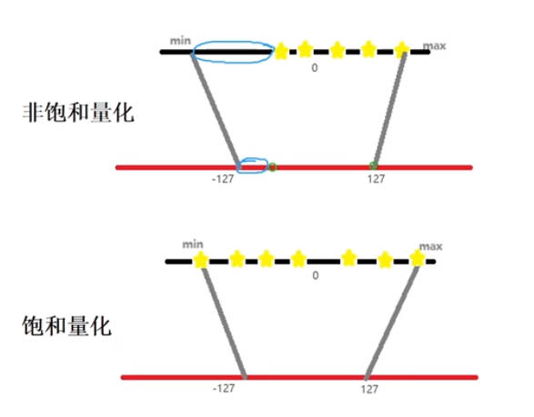

## 一. 对称量化与非对称量化

## 1. 偏移方式的非对称量化

公式推导:

对于任意一个数组, 将其归一化到0-1之间: $$\frac{Xmax-X}{Xmax-Xmin}$$ 

对于int8类型的任意数据([-128,127]之间的值), 将其归一化到0-1之间: $$\frac{Qmax-Q}{Qmax-Qmin}$$

令 $$\frac{Qmax-Q}{Qmax-Qmin} = \frac{Xmax-X}{Xmax-Xmin}$$  , 则可求得:

$$Q=Qmax- \frac{Qmax - Qmin}{ Xmax - Xmin} * (Xmax - X)$$

则可写为:

$$scale=\frac{ Xmax - Xmin}{Qmax - Qmin}$$

$$Z=Qmax-Round(\frac{Xmax}{scale})$$

量化操作: $$ Q=Round(\frac{X}{Scale}+Z)$$

反量化操作: $$Xreversed=(Q-Z)*scale$$

示例代码:

```python
import numpy as np
x = np.random.randn(7).astype("float32")
scale = (x.max() - x.min()) / (127 - (-128))
z = 127 - np.round(x.max() / scale)
q = np.round(x / scale + z)
x_ = (q - z) * scale
```

## 2. 绝对值方式的对称量化

问题引入:


因此, 可以将数组中绝对值的最大值对称到零点另一侧, 然后再量化就可以使得偏移值z为0


公式为:

$$scale = \frac{|Xmax|}{|Qmax|}$$

量化操作: $$Q = Round(\frac{X}{scale})$$

反量化操作: $$Xreversed = Q*scale$$

```python
import numpy as np
x = np.random.randn(7).astype("float32")
scale = np.abs(x.max())/ np.abs(127)
q = np.round(x / scale)
x_ = q * scale
```

绝对值方式的对称量化优缺点: 

优点是不用计算Z, 节省一些计算量;

缺点是少了一部分精度数据的表达, 精度损失比非对称量化更多

绝对值方式的为非饱和量化, 偏移方式的为饱和量化



## 二. 动态范围计算方式

问题引入:

如果有一种数据分布如下, 也就是说, 数据中存在离群点, 即数据的绝大部分会集中在一小段值域区间范围内, 其余的大部分值域并没有有效表达, 那么这样的数据量化后也会存在一样的问题


### 1. 通过直方图统计的方式确定数据的范围

思路: 将数据划分到直方图中一个一个bin中, 然后找到那个包含绝大多数数据的最小值域范围

实现方式为使用相向双指针, 每次移动后统计双指针范围内的数据数量, 如果小于要求, 则停止


```python
def histo(x, bins, reserved_ratio, use_symmetry=False):
    hist, values = np.histogram(x, bins)
    total = len(x)
    left = 0
    right = len(hist)
    curr_ratio = hist[left:right].sum() / total
    while curr_ratio > reserved_ratio:
        if hist[left] > hist[right-1]:
            right -= 1
        else:
            left += 1
        curr_ratio = hist[left:right].sum() / total
    if use_symmetry:
        x_max = np.maximum([np.abs(values[left]), np.abs(values[right])])
        scale = x_max / 127
        z = 0
    else:
        scale = (values[right] - values[left]) / (127 - (-128))
        z = 127 - np.round(x.max() / scale)
    return scale, z


if __name__ == "__main__":
    x = np.random.rand(10000)
    scale, z = histo(x, 100, 0.8)
```

### 3. 通过entropy的方式确定数据的范围

我们知道, 衡量两组数据分布差异性可以通过计算两组数据的KL散度;

放在量化中, 我们的目标就是将一组FP32的数据量化后与Int8数据的的KL散度值非常小即可;

注: KL散度计算方式: 将两组数据划分到数量相等的bins中, 然后将每个bin的数据数量除以整组数据的总量得到每个bin的概率, 然后通过以下公式计算这两组数据的KL散度即可

 $$ D_{KL} = \sum_i P(x_i) \log(\frac{P(x_i)}{Q(x_i)})$$

一个示例:

```python
import numpy as np


def quant(x):
    scale = (x.max() - x.min()) / (127 - (-128))
    z = 127 - np.round(x.max() / scale)
    q = np.round(x / scale + z)
    return q


def cal_kl(p, q):
    assert len(p) == len(q), "legth of p must be equal with length of q"
    kl_value = 0.
    for i in range(len(p)):
        kl_value += p[i] * np.log(p[i] / q[i])
    return kl_value


if __name__ == "__main__":
    size = 2560
    bins = 256
    x = np.random.rand(size)
    q = quant(x)    # 量化
    x_hist, _ = np.histogram(x, bins)
    q_hist, _  = np.histogram(q, bins)
    x_prob= x_hist / bins   # 获得每个bin的概率
    q_prob = q_hist / bins
    kl_value = cal_kl(x_prob, q_prob)   # 计算KL散度
    print(kl_value)
```

但是, 从上面的代码中可以很明显的看出这样的方式存在一个问题, 那就是x_prob和q_prob的bins数必须相等, 但是受制于q_prob均分布在(-128, 127]之间, 且为整数, 那么最多也就能划分为256个bin, 但实际上由于x是float类型的数据, 它可以被划分到更多的bins中;


所以英伟达提出了一种可以将x划分到更多的bins中, q划分到更少的bins中, 且能计算两者KL散度的方法:

假如, 一组float数据为[0.1, 0.2, 0.1, 0.3, 0.5, 0.5, 0.5, 0.5, 0.2, 0.8, 0.6]共10个数, 需要将它划分到8个bins中, 那么划分后每个位置的bin中的数据的数量为[2, 2, 1, 0, 4, 1, 0, 1]

假设, 量化后的数据最多只能被划分到4个bins, 那么怎么衡量这两组数据之间分布的差异性呢?

做法是, 先将已被划分的8个bins(float类型数据的bins)等分为4个bins, 然后将这4个bins求平均, 反映射回8个bins, 再计算原8个bins的数据分布与反映射回去的数据分布之间的KL散度, 即认为是量化后数据与量化前数据之间的KL散度

具体做法: 将[2, 2, 1, 0, 4, 1, 0, 1]再次划分到4个bins中, 为[[2, 2], [1, 0], [4, 1], [0, 1]]

然后, 标记每个bins中非0元素的数量, 由[[2, 2], [1, 0], [4, 1], [0, 1]]得到[2, 1, 2, 1]

然后, 每个bins再求和, 由[[2, 2], [1, 0], [4, 1], [0, 1]]得到[4, 1, 5, 1]

然后, 求每个bins中的平均值, 由[4, 1, 5, 1]中每个元素除以[2, 1, 2, 1]中每个元素得到[2, 1, 2.5, 1]

然后, 反映射, 由[2, 1, 2.5, 1]按照非零处使用平均值填充, 零处使用0填充的规则, 结合[[2, 2], [1, 0], [4, 1], [0, 1]], 可以得到反映射回去的数组为[[2, 2], [1, 0], [2.5, 2.5], [0, 1]], 也就是[2, 2, 1, 0, 2.5, 2.5, 0, 1]

这样只要计算原8个bins的数组[2, 2, 1, 0, 4, 1, 0, 1]与反映射回8个bins的数组[2, 2, 1, 0, 2.5, 2.5, 0, 1]的KL散度即可

```python
import numpy as np


def cal_kl(p, q):
    assert len(p) == len(q), "legth of p must be equal with length of q"
    kl_value = 0.
    for i in range(len(p)):
        kl_value += p[i] * np.log(p[i] / q[i])
    return kl_value


if __name__ == "__main__":
    x = np.random.rand(20000)
    x_bins = 2560
    x_hist, _ = np.histogram(x, x_bins) # 将x划分到2560个bins中
    q_bins = 256
    x_hist_splits = np.array_split(x_hist, q_bins)   # 将x_hist等分成256份
    x_hist_reversed = []    # x_hist_reversed为反映射回2560个bins的x_hist
    for x_hist_split in x_hist_splits:  # 遍历每一份
        avg = np.sum(x_hist_split) / np.count_nonzero(x_hist_split) # 计算每一份的的平均值(值为0的排除在外)
        for item in x_hist_split:
            if item != 0:
                x_hist_reversed.append(item)    # 值不为0的添加平均数
                continue
            x_hist_reversed.append(0)   # 值为0的依然添加0
    x_prob = x_hist / np.sum(x_hist)    # 将bins的频数转换为概率
    x_reversed_prob = x_hist_reversed / np.sum(x_hist_reversed) 
    kl_value = cal_kl(x_prob, x_reversed_prob)  # 计算KL散度
    print(kl_value)
```

上面这种计算方式还有个问题, 那就是, 根据KL散度的计算公式, $${Q(x_i)}$$作为分母, 值却很可能为0, 这样计算出的KL散度值很有可能出现nan

 $$ D_{KL} = \sum_i P(x_i) \log(\frac{P(x_i)}{Q(x_i)})$$


