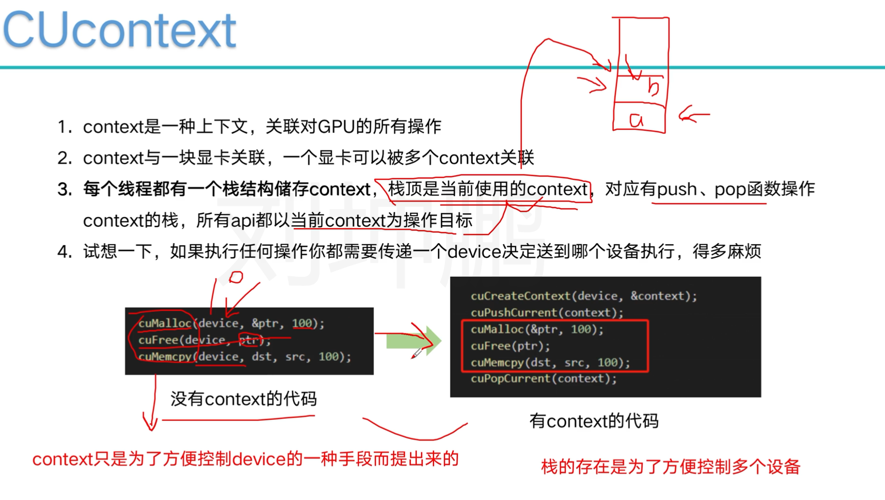
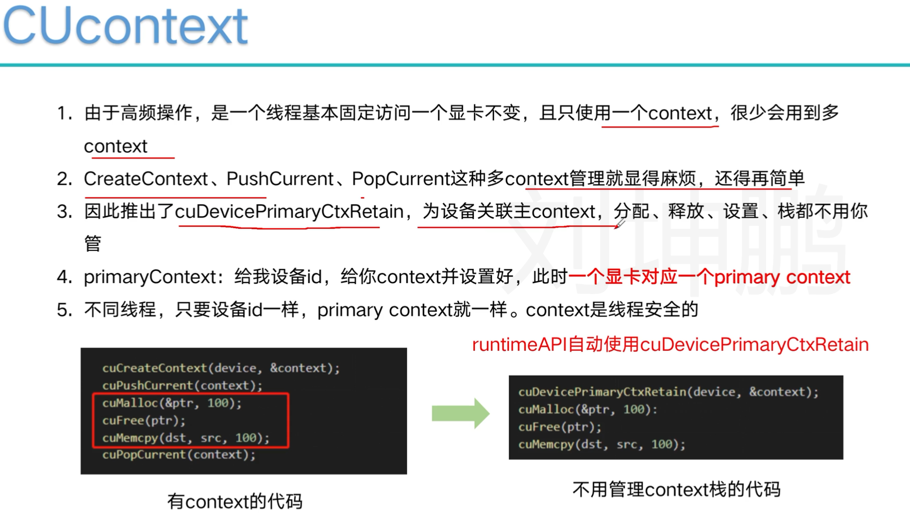

# cuda-driver-api

[课程地址](http://aipr.aijdjy.com/)

## 一. 环境

* 头文件（任务4）

  ```c++
  // 头文件所在目录："/root/miniconda3/envs/yolov8/lib/python3.7/site-packages/trtpy/trt8cuda112cudnn8/include/**"
  #include <cuda.h>
  ```

## 二. API 

* 初始化驱动（任务4）

  ```C++
  // cuInit(int flags)，这里的flags目前必须给0； 对于cuda的所有函数，必须先调用cuInit，否则其他API都会返回CUDA_ERROR_NOT_INITIALIZED
  CUresult code=cuInit(0);  // cuInit返回CUresult类型的数据
  ```


* 获得驱动版本（任务4）

  ```C++
  int driver_version = 0;
  code = cuDriverGetVersion(&driver_version);  // 获取驱动版本
  ```

* 获得设备名称（任务4）

  ```C++
  char device_name[100]; // char 数组
  CUdevice device = 0;
  code = cuDeviceGetName(device_name, sizeof(device_name), device);  
  ```

* 返回值检查（任务4）

  ```C++
  // 用法是：所有的API操作均使用checkDriver来包裹
  #define checkDriver来包裹(op)  __check_cuda_driver((op), #op, __FILE__, __LINE__)

  bool __check_cuda_driver(CUresult code, const char* op, const char* file, int line){

      if(code != CUresult::CUDA_SUCCESS){    
          const char* err_name = nullptr;    
          const char* err_message = nullptr;  
          cuGetErrorName(code, &err_name);    
          cuGetErrorString(code, &err_message);   
          printf("%s:%d  %s failed. \n  code = %s, message = %s\n", file, line, op, err_name, err_message);   
          return false;
      }
      return true;
  }
  ```

* CUcontext上下文管理（任务5）==了解即可，实际上不需要自己写==

  为什么要有CUcontext？简单理解就是，如果有多块gpu，每一次在某个gpu上malloc或者free内存都需要指定device是哪一块gpu，这样代码看起来很臃肿，所以就有了CUcontext来管理，CUcontext实现的API就是cuDevicePrimaryCtxRetain，它是一个栈结构，当给其绑定设备时，后续的所有的对cuda的操作默认都是针对该设备的，如果要换设备，就要为其绑定一个新的设备。还有一个作用类似于智能指针，主动帮你释放显存。

  ```C++
  int main(){

      // 检查cuda driver的初始化
      checkDriver(cuInit(0));

      // 为设备创建上下文
      CUcontext ctxA = nullptr;                                   // CUcontext 其实是 struct CUctx_st*（是一个指向结构体CUctx_st的指针）
      CUcontext ctxB = nullptr;
      CUdevice device = 0;
      checkDriver(cuCtxCreate(&ctxA, CU_CTX_SCHED_AUTO, device)); // 这一步相当于告知要某一块设备上的某块地方创建 ctxA 管理数据。输入参数 参考 https://www.cs.cmu.edu/afs/cs/academic/class/15668-s11/www/cuda-doc/html/group__CUDA__CTX_g65dc0012348bc84810e2103a40d8e2cf.html
      checkDriver(cuCtxCreate(&ctxB, CU_CTX_SCHED_AUTO, device)); // 参考 1.ctx-stack.jpg
      printf("ctxA = %p\n", ctxA);
      printf("ctxB = %p\n", ctxB);
      /* 
          contexts 栈：
              ctxB -- top <--- current_context
              ctxA 
              ...
       */

      // 获取当前上下文信息
      CUcontext current_context = nullptr;
      checkDriver(cuCtxGetCurrent(&current_context));             // 这个时候current_context 就是上面创建的context
      printf("current_context = %p\n", current_context);

      // 可以使用上下文堆栈对设备管理多个上下文
      // 压入当前context
      checkDriver(cuCtxPushCurrent(ctxA));                        // 将这个 ctxA 压入CPU调用的thread上。专门用一个thread以栈的方式来管理多个contexts的切换
      checkDriver(cuCtxGetCurrent(&current_context));             // 获取current_context (即栈顶的context)
      printf("after pushing, current_context = %p\n", current_context);
      /* 
          contexts 栈：
              ctxA -- top <--- current_context
              ctxB
              ...
      */
      

      // 弹出当前context
      CUcontext popped_ctx = nullptr;
      checkDriver(cuCtxPopCurrent(&popped_ctx));                   // 将当前的context pop掉，并用popped_ctx承接它pop出来的context
      checkDriver(cuCtxGetCurrent(&current_context));              // 获取current_context(栈顶的)
      printf("after poping, popped_ctx = %p\n", popped_ctx);       // 弹出的是ctxA
      printf("after poping, current_context = %p\n", current_context); // current_context是ctxB

      checkDriver(cuCtxDestroy(ctxA));
      checkDriver(cuCtxDestroy(ctxB));

      // 更推荐使用cuDevicePrimaryCtxRetain获取与设备关联的context
      // 注意这个重点，以后的runtime也是基于此, 自动为设备只关联一个context
      checkDriver(cuDevicePrimaryCtxRetain(&ctxA, device));       // 在 device 上指定一个新地址对ctxA进行管理
      printf("ctxA = %p\n", ctxA);
      checkDriver(cuDevicePrimaryCtxRelease(device));
      return 0;
  }
  ```

  ​

  

  

  ​

  ​

