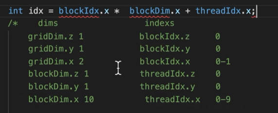

# cuda-runtime-api

[课程地址](http://aipr.aijdjy.com/)

## 一. 环境

- 头文件（任务8）

  ```c++
  // 头文件所在目录："/root/miniconda3/envs/yolov8/lib/python3.7/site-packages/trtpy/trt8cuda112cudnn8/include/**"
  #include <cuda_runtime.h>
  ```

## 二. API

* 获得显卡数量（任务8）

  ```C++
  int device_count = 0;
  cudaGetDeviceCount(&device_count);
  printf("device_count = %d\n", device_count);
  ```

* 设置当前使用的device（任务8）

  ```C++
  int device_id = 0;
  checkRuntime(cudaSetDevice(device_id));
  ```

* 获取当前使用的device（任务8）

  ```C++
  int current_device = 0;
  checkRuntime(cudaGetDevice(&current_device));
  printf("current_device = %d\n", current_device);
  ```

* 分配gpu的global memory（任务9）

  ```C++
  // 分配gpu的global memory
  float* memory_device = nullptr;
  checkRuntime(cudaMalloc(&memory_device, 100 * sizeof(float))); // pointer to device
  ```

* 分配cpu的pageble memory（任务9）

  ```C++
  // 分配cpu的pageble memory
  float* memory_host = new float[100];
  memory_host[2] = 520.25;
  ```

* 分配cpu的pinned memory（任务9）

  ```C++
  // 分配cpu的pinned memory，并将gpu的global memory的值拷贝到cpu的pinned memory
  float* memory_page_locked = nullptr;
  checkRuntime(cudaMallocHost(&memory_page_locked, 100 * sizeof(float))); // 返回的地址是被开辟的pin memory的地址，存放在memory_page_locked

  ```

* 将cpu的pageble memory的值拷贝到gpu的global memory（任务9）

  ```C++
  checkRuntime(cudaMemcpy(memory_device, memory_host, sizeof(float) * 100, cudaMemcpyHostToDevice)); // 返回的地址是开辟的device地址，存放在memory_device
  ```

* 将gpu的global memory的值拷贝到cpu的pinned memory（任务9）

  ```C++
  checkRuntime(cudaMemcpy(memory_page_locked, memory_device, sizeof(float) * 100, cudaMemcpyDeviceToHost)); 
  ```

* 释放cpu的pinned memory和pageble memory（任务9）

  ```C++
  checkRuntime(cudaFreeHost(memory_page_locked));  // 释放cpu的pinned memory
  delete [] memory_host;   // 释放cpu的pageble memory
  ```

* 释放gpu的global memory（任务9）

  ```C++
  checkRuntime(cudaFree(memory_device)); 
  ```

* 创建流，为了后面开启异步操作（任务10）

  ```C++
  cudaStream_t stream = nullptr;
  checkRuntime(cudaStreamCreate(&stream));
  ```

* 异步将cpu的pageble memory的值拷贝到gpu的global memory（任务10）

  ```C++
  checkRuntime(cudaMemcpyAsync(memory_device, memory_host, sizeof(float) * 100, cudaMemcpyHostToDevice, stream)); // 异步复制操作，主线程不需要等待复制结束才继续
  ```

* 异步将gpu的global memory的值拷贝到cpu的pinned memory（任务10）

  ```C++
  checkRuntime(cudaMemcpyAsync(memory_page_locked, memory_device, sizeof(float) * 100, cudaMemcpyDeviceToHost, stream));
  ```

* 等待所有异步指令结果返回（任务10）

  ```C++
  checkRuntime(cudaStreamSynchronize(stream));
  ```


* 获得gpu上共享内存的大小，通常为48k（任务11）

  ```C++
  cudaDeviceProp prop;
  checkRuntime(cudaGetDeviceProperties(&prop, 0));
  printf("prop.sharedMemPerBlock = %.2f KB\n", prop.sharedMemPerBlock / 1024.0f);
  ```

* 创建静态共享内存（任务11）

  ```C++
  const size_t static_shared_memory_num_element = 6 * 1024; // 6KB
  __shared__ char static_shared_memory[static_shared_memory_num_element]; // 类似于数组的创建方式，只不过要加__shared__
  ```

* 创建动态共享内存（在核函数中创建，此时调用核函数的时候要指定动态共享内存的大小）（任务11）

  ```C++
  extern __shared__ char dynamic_shared_memory[]; 
  ```

  ​

## 三. 内存模型（任务9）

1. 内存模型

   * 主机内存（CPU内存）
     * pinned memory/ page locked memory：内存条上不被共享的内存（类比酒店VIP房间）
     * pageble memory：内存条上可以被共享的内存（类比酒店普通房间），如果数据在pageble memory上长时间不用，就会被转移到硬盘上
   * 设备内存（GPU显存）
      * global memory：gpu上的计算片周围的内存
      * shared memory：gpu上的计算片上的内存

2. 内存分配、释放、转移API

   * 由new、malloc分配的是pageble memory，由cudaMallocHost分配的是PinnedMemory，由cudaMalloc分配的是GlobalMemory


   * 通过cudaMalloc分配GPU内存（此时分配的是global memory），分配到setDevice指定的当前设备上
   * 通过cudaMallocHost分配page locked memory，即pinned memory，页锁定内存
      * 页锁定内存可以被CPU、GPU直接访问
   * cudaMemcpy
     - 如果host不是页锁定内存，则：
       - Device To Host的过程，等价于
         - pinned = cudaMallocHost
         - copy Device to pinned
         - copy pinned to Host
         - free pinned
       - Host To Device的过程，等价于
         - pinned = cudaMallocHost
         - copy Host to pinned
         - copy pinned to Device
         - free pinned
     - 如果host是页锁定内存，则：
       - Device To Host的过程，等价于
         - copy Device to Host
       - Host To Device的过程，等价于
         - copy Host to Device


## 四. 流（异步）(任务10)

例子：女朋友让男朋友买西瓜、买苹果、买奶茶：同步情况下，女朋友每一次发出一个指令后，都需等待男朋友的返回结果，然后才能发出下一条指令；异步情况下，女朋友发出指令后不等男朋友返回结果，直接向下执行发出下一条指令，每一条指令都不等男朋友返回结果，然后全部指令发出后，一起等待男朋友返回结果，男朋友这边有一个任务队列（买西瓜、买苹果、买奶茶），男朋友这边按照任务队列顺序执行指令，全部执行结束后返回结果给女朋友。

## 五. 核函数（任务11）

```C++
编译核函数需要用到nvcc，nvcc是英伟达的制作的专门用来编译核函数的编译器，编译器位置：
/root/miniconda3/envs/yolov8/lib/python3.7/site-packages/trtpy/trt8cuda112cudnn8/bin/nvcc
编写核函数的时候，核函数的名字要以.cu结尾
使用.cu文件中的函数时，比如在main.cpp中使用，只需要声明一下就行，无需#include导入。
```

* \_\_device\__表示为gpu设备函数，由device也就是gpu设备调用。

* \_\_global\__ 表示为核函数，由host也就是cpu调用。

* \_\_host\__ 表示为主机函数由host也就是cpu调用。

* \_\_shared__表示变量为共享变量.

* host也就是cpu调用核函数方式: function<<<gridDim, blockDim, sharedMemorySize, stream>>>(args);，其中gridDim为要启动多少个计算格， blockDim为每个格要启动多少个线程， sharedMemorySize表示共享内存大小，stream就是流（是否异步）。

* 只有\_\_global\__ 修饰的函数才可以用<<<>>>的方式调用。

* 调用核函数是传值的，不能传引用，可以传递类、结构体等，核函数可以是模板。

* 核函数的执行，是异步的，也就是立即返回的。

* 线程layout主要用到blockDim、gridDim。

* 核函数内访问线程索引主要用到threadldx、blockldx、blockDim、gridDim这些内置变量。

* 线程索引计算方式（参看视频：http://aipr.aijdjy.com/       任务11）

  **假如调用核函数的时候指定的参数如下：**

  2代表dim3(2)也就是dim3(2, 1, 1)即gridx为2，gridy和gridz默认为1 ----> 也就意味着blockIdx.x的取值范围为0-1(grid的大小对应着block的索引）；

  10代表dim3(10)也就是dim3(10, 1, 1)即blockx为10，blocky和blockz默认为1 ----> 也就意味着threadIdx.x的取值范围为0-9(block的大小对应着grid的索引）；

  0代表shared memory为0，nullptr代表使用默认流

  

  按照上面的调用方式，一个核函数的索引计算如下（取值可能不为0的要保留，取值为0的就可以不保留），从blockIdx.z开始计算，舍去gridDim.z，计算方式依次左乘右加直到threadIdx.x

  

  万能的计算方式（但是看起来太冗余）：

  ```C++
      int idx = ((((blockIdx.z*gridDim.y+blockIdx.y)*gridDim.x+blockIdx.x)*blockDim.z+threadIdx.z)*blockDim.y+threadIdx.y)*blockDim.x+threadIdx.x;

  ```

  ​

* 例子：

  main.cpp

  ```C++
  #include <cuda_runtime.h>
  #include <stdio.h>

  #define checkRuntime(op)  __check_cuda_runtime((op), #op, __FILE__, __LINE__)

  bool __check_cuda_runtime(cudaError_t code, const char* op, const char* file, int line){
      if(code != cudaSuccess){    
          const char* err_name = cudaGetErrorName(code);    
          const char* err_message = cudaGetErrorString(code);  
          printf("runtime error %s:%d  %s failed. \n  code = %s, message = %s\n", file, line, op, err_name, err_message);   
          return false;
      }
      return true;
  }

  // 核函数的调用方式：
  // 在.cu文件中定义一个正常的函数，该正常的函数直接调用核函数
  // 在.cpp文件中声明该正常函数，在主函数中调用
  // 在本例子中，launch函数就是这个正常的函数（桥梁），launch在.cu文件中定义，在main.cpp文件中声明名使用
  void launch(int* grids, int* blocks);

  int main(){

      cudaDeviceProp prop;
      checkRuntime(cudaGetDeviceProperties(&prop, 0));

      // 通过查询maxGridSize和maxThreadsDim参数，得知能够设计的gridDims、blockDims的最大值
      // warpSize则是线程束的线程数量
      // maxThreadsPerBlock则是一个block中能够容纳的最大线程数，也就是说blockDims[0] * blockDims[1] * blockDims[2] <= maxThreadsPerBlock
      printf("prop.maxGridSize = %d, %d, %d\n", prop.maxGridSize[0], prop.maxGridSize[1], prop.maxGridSize[2]);
      printf("prop.maxThreadsDim = %d, %d, %d\n", prop.maxThreadsDim[0], prop.maxThreadsDim[1], prop.maxThreadsDim[2]);
      printf("prop.warpSize = %d\n", prop.warpSize);
      printf("prop.maxThreadsPerBlock = %d\n", prop.maxThreadsPerBlock);

      // {1, 2, 3}代表着每个grid中有1*2*3个block，所以blockIdx.x, blockIdx.y, blockIdx.z三个维度上的索引范围为[0], [0, 1], [0, 2]
      // {1024, 1, 1}代表着每个block有1024*181个线程，所以threadIdx.x, threadIdx.y, threadIdx.z三个维度上的索引范围为[0, 1023], [0], [0]
      int grids[] = {1, 2, 3};     // gridDim.x  gridDim.y  gridDim.z 
      int blocks[] = {1024, 1, 1}; // blockDim.x blockDim.y blockDim.z 
      launch(grids, blocks);       // grids表示的是有几个大格子，blocks表示的是每个大格子里面有多少个小格子
      checkRuntime(cudaPeekAtLastError());   // 获取错误 code 但不清楚error
      checkRuntime(cudaDeviceSynchronize()); // 进行同步，这句话以上的代码全部可以异步操作
      printf("done\n");
      return 0;
  }
  ```

  limit-test.cu（这个核函数文件的名字取什么都无所谓，因为在main.cpp中不是通过#include导入核函数的，而是通过在main.cpp中声明的方式导入的）

  ```C++
  #include <cuda_runtime.h>
  #include <stdio.h>

  __global__ void demo_kernel(){
      // int grids[] = {1, 2, 3};     
      // int blocks[] = {1024, 1, 1}; 
      // {1, 2, 3}代表着每个grid中有1*2*3个block，所以blockIdx.x, blockIdx.y, blockIdx.z三个维度上的索引范围为[0], [0, 1], [0, 2]
      // {1024, 1, 1}代表着每个block有1024*181个线程，所以threadIdx.x, threadIdx.y, threadIdx.z三个维度上的索引范围为[0, 1023], [0], [0]
      // 所以grid中的6个block的blockIdx.x都为0，block中的threadIdx.x只有一个为0，所以总共打印6*1次
      if(blockIdx.x == 0 && threadIdx.x == 0)
          printf("Run kernel. blockIdx = %d,%d,%d  threadIdx = %d,%d,%d\n",
              blockIdx.x, blockIdx.y, blockIdx.z,
              threadIdx.x, threadIdx.y, threadIdx.z
          );
  }

  void launch(int* grids, int* blocks){

      dim3 grid_dims(grids[0], grids[1], grids[2]);
      dim3 block_dims(blocks[0], blocks[1], blocks[2]);
      demo_kernel<<<grid_dims, block_dims, 0, nullptr>>>();
  }
  ```


## 六. 共享内存

* ==看视频和代码可以更清楚==

* 共享内存由\_\_shared\_\_修饰

* 共享内存因为更靠近计算单元，所以访问速度更快

* 使用方式，通常是threadIdx.x为0的时候从global memory取值，然后syncthreads，然后再供block内的所有其他线程使用

* 共享内存通常可以作为访问全局内存（global memory）的缓存使用

* 可以利用共享内存实现线程间的通信（一个block内的所有线程都可以访问一块共享内存）

* 通常与\_syncthreads同时出现，这个函数是等待block内的所有线程全部执行到\_syncthreads这一行命令，才往下走

  ​