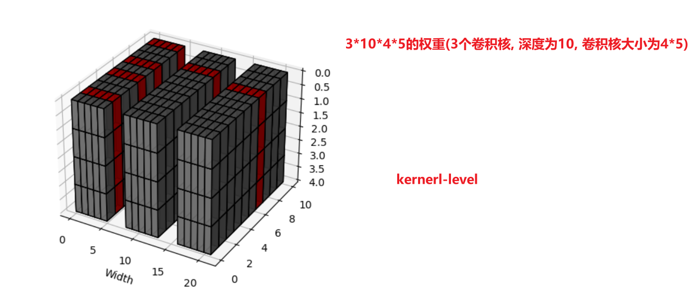
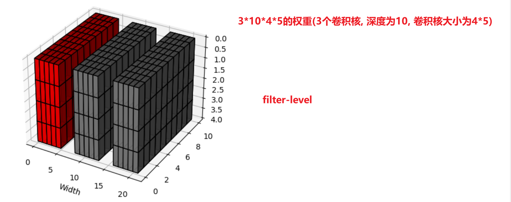
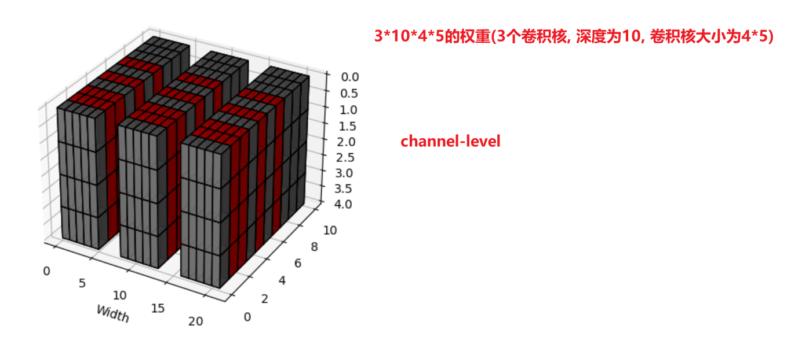

# 一. 细粒度剪枝

实现思路:

获得卷积层的权重---->将权重展开成一维---->将权重按大小排序---->计算按照剪枝率需要剪枝的阈值---->将小于阈值的权重置为0---->将剪枝后的权重重新赋值给卷积层

实现代码:fine_grained_pruning.py

# 二. 向量剪枝

实现思路:

pass

# 三. 滤波器剪枝 

实现思路:

获得卷积层的权重---->计算每一个卷积核的L2范数(卷积核维度[Cout, Cin, k, k], 合并(2,3,4)维度, 保留1维度)---->按L2范数大小排序---->将剪枝比率内较小的卷积核所有权重置为0---->将剪枝后的权重重新赋值给卷积层

# 四. 剪枝可视化

代码:viz_pruning.py

