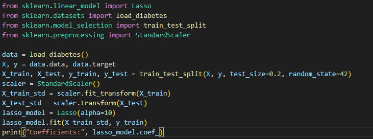
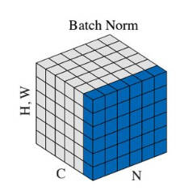
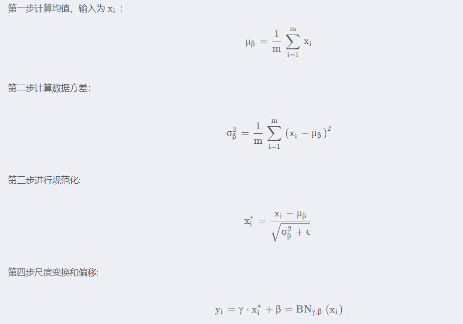

# 一. 正则化

从均方误差损失(MSE)函数入手，神经网络学习的过程就是最小化损失函数，如下:


f(x) 可以是二次曲线、三次曲线，甚至n次曲线，不管是几次，从高等数学的泰勒展开原理可以得知， f ( x )可以表示 为多项式的趋近: 


​    网络为什么出现过拟合? 就是因为特征分得太细。

 举例，根据 头发 长短”、“繁殖器官”这两个特征基本就可以很好的区分“男”、女”，虽然会将"女装大佬”分错，但是“女装大佬"毕竟是少数。 而如果特征分得更细化，“胡子长短”、“喉结大小”、“指甲长短”，这样虽然可以区分出“女装大佬”，但是这就过拟合了，网络很可能会 将“小喉结的男人"都区分成女人了，错误率就提高，反而过拟合。
 
 所以一个网络过拟合，可能就是特征过多，那减少特征不就可以减轻过拟合了吗? 即减少 w 的个数。问题就转化为求 0 范数（向量中非 0 元素的个数) 了。将这一项加入损失函数中:


# 二. L1、L2正则

 1.L1是将模型各参数绝对值之和添加到损失函数中；L2是将模型各参数平方和的开方值之和添加到损失函数中。
 2.L1会趋向于产生少量的特征，而其他的特征都是0；L2会选择更多的特征，这些特征都会接近于0。（一个是产生0，一个趋向0）

**为什么L1与L2为什么对于特征选择有着不同方式？**

​    L1正则项解空间为菱形。最优解必定是有且仅有一个交点。除非目标函数具有特殊的形状，否则和菱形的唯一交点大概率出现在坐标轴上，这样就会导致某一维的权重为0 ，产生稀疏权重矩阵。
 
 而对于L2圆形的解空间，总存在一个切点，切点通常不会位于坐标轴上，因此每一维的参数都不会是0，当最小化||w||时，就会使每一项趋近于0。
 
 L1 “棱角分明”的约束空间更容易与解空间在角点碰撞，且 L1 中参数值倾向于一个较大另一个为 0，L2 中参数倾向于均为非零的较小数（使用 L2 正则项时，只有当解空间的中心与 L2 约束空间的中心垂直或平行时才能得到一个参数为 0，另一个参数较大，而 L1 的约束空间则不然）。所以就有 L1 稀疏，L2 平滑的效果。


一个小例子:



打印结果:


# 三. BN



 BN是在batch上，对N、H、W做归一化，而保留通道 C 的维度。



# 四. 基于BN层的剪枝

论文：<https://arxiv.org/pdf/1708.06519.pdf>

BN层中缩放因子γ与卷积层中的每个通道关联起来。在训练过程中对这些比例因子进行稀疏正则化，以自动识别不重要的通道。缩放因子值较小的通道(橙色)将被修剪(左侧)。剪枝后，获得了紧凑的模型(右侧)，然后对其进行微调，以达到与正常训练的全网络相当(甚至更高)的精度。


# 五. YOLOv5基于BN层的剪枝

完整代码: https://github.com/midasklr/yolov5prune

## 1. 整体思路

正常训练---->

使用正常训练的权重进行稀疏训练---->基于稀疏训练的权重剪枝---->将剪枝后的权重进行finetune---->

将finetune后的权重进行稀疏训练---->基于稀疏训练的权重剪枝---->将剪枝后的权重进行finetune---->

将finetune后的权重进行稀疏训练---->基于稀疏训练的权重剪枝---->将剪枝后的权重进行finetune---->

......


## 2. 稀疏训练思路

在loss.backward()之后, optimizer.step()之前加上一段给BN层参数增加L1正则项梯度的代码

注意:所有的Res Unit模块的BN层不进行稀疏化训练, 所以也不增加L1正则项梯度

```python
srtmp = opt.sr * (1 - 0.9 * epoch / epochs)  # 线性衰减的L1正则化系数
if opt.st:
    ignore_bn_list = []
    for k, m in model.named_modules():
        if isinstance(m, Bottleneck):
             # 只有Bottleneck模块(对应于网络结构图中的Res Unit)中才做add操作, 所以不能剪
            if m.add:       
                # C3模块中的BottleNeck模块中的第一个卷积层
                ignore_bn_list.append(k + '.cv1.bn')   
                # C3模块中的BottleNeck模块中的第二个卷积层
                ignore_bn_list.append(k + '.cv2.bn')                    
                if isinstance(m, nn.BatchNorm2d) and (k not in ignore_bn_list):
                    m.weight.grad.data.add_(srtmp * torch.sign(m.weight.data))  # L1
```

## 3. 剪枝思路

取出所有增加L1正则梯度项的BN层---->将这些BN层的所有.weight.data(也就是gamma的值)取出来放在一个tensor中---->将tensor按照大小排序---->为了避免剪枝的时候将某一整个BN层全部剪掉, 需要计算可剪枝的最大阈值, 计算方法为计算每一个BN层的weight的最大值, 然后在所有BN层的weight的最大值中选一个最小的值, 剪枝的阈值不能超过该值即可保证不会将某一层全部剪掉---->计算按照上一步方式计算的阈值剪枝的话最大能剪枝的比例---->计算按照指定比例剪枝的话剪枝的阈值(指定比例不能超过最大比例)---->遍历模型的每一层, 获得BN层, 按照上一步计算的阈值计算BN层的掩码---->将掩码与BN层的weight(gamma值)想乘, 与BN层的weight(beta值)想乘---->重新搭建网络, 此时的网络结构每一层的输入通道数与输出通道数应该与剪枝后的输入通道数输出通道数相同(比如原来是搭建一个cin=16, cout=32的卷积, 现在要搭建一个cin=14, cout=20的卷积)---->遍历搭建好的网络, 将稀疏训练中训练好的参数填入网络

## 4. 注意事项

 所有的Res Unit模块的BN层不进行稀疏化训练(因为有add操作, 所以要保证Res Unit前后的特征图的通道数相等)