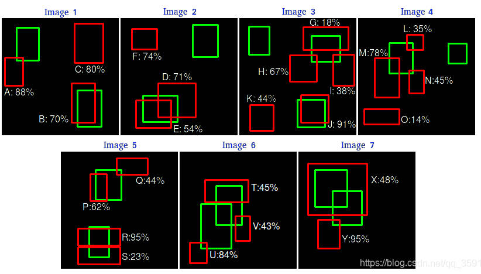
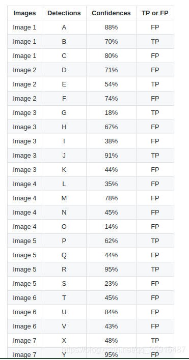
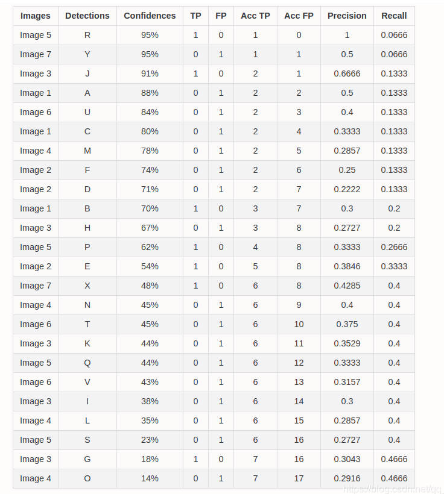

## 目标检测中的评估指标

## 一. AP(以下指标假设都只针对一个类别)

### 1. 名词释义

**TP** :  与gt之间IoU大于IoU_threshold的bounding_box。

如果有多个bounding_box与同一个gt之间的IoU都大于IoU_threshold, 那么IoU最大的那个为TP, 其余的FP	( **Figure1** )

**FP** :  与gt之间IoU小于IoU_threshold的bounding_box(包括完全无交集的)

**FN** : 漏检的gt框

$Precision=\frac{TP}{TP+FP} = \frac{TP}{alldetections}$

$Recall=\frac{TP}{TP+FN}=\frac{TP}{all\ ground\ truths}$

 **Figure1** : 虽然bb1和bb2与gt的交并比都大于0.5(假设IoU_threshold为0.5), 但是bb1为TP, bb2为FP


### 2. AP计算方法

对于同一个类别, 首先取一个IoU阈值比如0.5, 计算AP@.5, 计算方法如下:

①对于所有的预测框bounding_box使用置信度阈值进行过滤, 去掉低置信度的框;

②根据IoU阈值, 如果一个bounding_box与gt框的IoU大于该阈值, 那么给它赋予TP标签, 小于则赋予FP标签, 多个bounding_box与一个gt的IoU都大于IoU阈值, 那么取最大的那个为TP, 剩余的为FP(这里没有FN, 因为FN是针对gt而言的)

③将这些bounding_box按照置信度从高到低进行排序

④从置信度最高的框开始, 依次包含下一个bounding_box, 计算涵盖的bounding_box的Precision、Recall

⑤使用11点插值法或者全点插值法进行插值计算最终的AP@.5的值

### 3. AP计算例子

一个目标检测算法检测后的结果如下, 百分数代表的是bounding_box的置信度

所有的bounding_box已经使用置信度阈值0.1过滤了



首先, 为每个bounding_box赋予一个标签, 是TP还是FP



然后, 将这些bounding_box按照置信度从高到低进行排序。

从置信度最高的框开始, 依次包含下一个bounding_box, 计算涵盖的bounding_box的Precision、Recall

$Precision=\frac{TP}{TP+FP} = \frac{TP}{alldetections}$

$Recall=\frac{TP}{TP+FN}=\frac{TP}{all\ ground\ truths}$

简单提下看最前面的两个框。取到第一个框的时候我们的all detections就是1正好我们这个框就是TP，所以我们这里的precision就是1，然后再取一个框，但是这个框是FP，所有我们的TP数目还是1，但是我们的all detections就变成2了所以我们的precision这个时候变成了0.5, 以此类推



接着, 如果使用11点插值法计算AP, 那么如下:

我们取出来所有的recall在0到0.1这个区间内的所有的recall以及对应的那些precision，然后我们从这些precision中找到最大值作为这个区间内precision的代表，然后我们在剩下的10个区间内也分别找到最大的precision，最后把这11个数求均值就作为我们的AP


如果使用全点插值法计算AP, 那么如下:

11点插值法是在0-1之间每隔0.1取一个recall值, 全点插值是将bounding_box的所有存在的recall值全取一遍

首先将表中的数据按照recall降序排列


然后,  假如我们取到了第n种recall的取值，我们再往后看直到发现出现了不同的recall，然后我们在这个区间里找到最大的precision，然后用这个最大的precision和这个区间长度相乘作为这段区间的AP，然后我们遍历所有的区间然后把每段的AP加起来就得到了最后的AP

代码如下:

```python
def voc_ap(rec, prec, use_07_metric=False):
  """ ap = voc_ap(rec, prec, [use_07_metric])
  Compute VOC AP given precision and recall.
  If use_07_metric is true, uses the
  VOC 07 11 point method (default:False).
  """
  if use_07_metric:
    # 11 point metric
    ap = 0.
    for t in np.arange(0., 1.1, 0.1):
      if np.sum(rec >= t) == 0:
        p = 0
      else:
        p = np.max(prec[rec >= t])
      ap = ap + p / 11.
  else:
    # correct AP calculation
    # first append sentinel values at the end
    mrec = np.concatenate(([0.], rec, [1.]))
    mpre = np.concatenate(([0.], prec, [0.]))
    print(mpre)
    # compute the precision envelope
    for i in range(mpre.size - 1, 0, -1):
      mpre[i - 1] = np.maximum(mpre[i - 1], mpre[i])
 
    # to calculate area under PR curve, look for points
    # where X axis (recall) changes value
    i = np.where(mrec[1:] != mrec[:-1])[0]
 
    ap = np.sum((mrec[i + 1] - mrec[i]) * mpre[i + 1])
    print(mpre)
  return ap
"""rec:[0.0666,0.0666,0.1333,0.1333,0.1333,0.1333,0.1333,0.1333,0.1333,0.2,0.2,0.2666,0.3333 ,0.4,0.4,0.4,0.4,0.4,0.4,0.4,0.4,0.4,0.4666,0.4666]
pre:[1,0.5,0.6666,0.5,0.4,0.3333,0.2857,0.25,0.2222,0.3,0.2727,0.3333,0.3846,0.4285,0.4,0.375,0.3529, 0.3333,0.3157,0.3,0.2857,0.2727,0.3043,0.2916]"""
```

