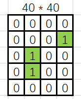
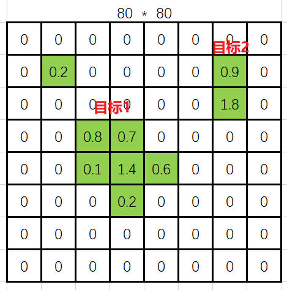
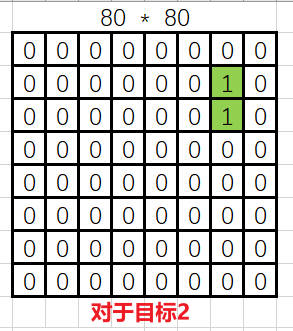

[知乎大神的博客](https://zhuanlan.zhihu.com/p/633094573)

**整体思想：**

原来YOLOv1-v5都是中心点落在哪个单元格，哪个单元格负责预测。现在变为真实框范围内的单元格都可以预测，最终哪个或者哪几个负责就看谁能力强，谁能力强谁负责， 所以不一定是中心单元格了。

分类损失： 每个负责预测的单元格预测的nc(number of classes)长度的向量不是让他在真实类别索引处预测值接近于1，而是让他接近于该单元格的得分

比如，一个4分类的目标检测，某单元格预测的4个类别概率为[0.1, 0.2, 0.1, 0.4]，真实类别索引为3，对该单元格的得分评估，它的得分向量为[0, 0, 0, 0.46]， 那么在做损失的时候是让预测为0.4处的位置接近0.46，让其他位置接近0，而不是传统的让预测为0.4处的位置接近1，其他位置接近0

回归损失： 预测框与真实框的IoU损失以及DFL损失（见上一层文件夹中的"损失函数"章节）

# 一. get_pos_mask

## 1. preprocess 

获得第一种mask（mask_gt：维度为[bs, num_max_objs]）:  第一种mask要求，负责检测的图必须有该类别的目标

比如一个batch-size为3的3张图真实框类别如下（为了保持长度一致， 不够长的拿0填充）

```bash
							[person, bicycle, 0]

							[plane,    0,   , 0]

							[person, chair  ,cup]
```


那么下面的三张图对应的mask_gt为（有目标就为1）：

```bash
								[1, 1, 0]

								[1, 0, 0]

								[1, 1, 1]
```


## 2. select_candidates_in_gts

获得第二种mask（mask_in_gts: 维度为[bs, num_max_objs, 8400]）: 第二种mask要求，负责检测单元格必须在目标框以内



上图中代表最后一层的三张特征图，绿色为真实框在特征图上的位置，真实框内的单元格值为1

## 3. get_box_metrics

计算每个单元格得分align_metric（维度为[bs, num_max_objs, 8400]):

得分计算公式如下，其中`s`是标注类别对应的预测分值，`u` 是预测框和 gt 框的 iou，alpha和beta是系数

$$t=s^{\alpha}+u^{\beta}$$

例如某单元格预测出来的80个类别的概率为[0.1, 0.4, 0.3, 0.1, 0, ......, 0.1]，它的真实类别索引为1，该单元格预测出来的边框的四个坐标经计算与真实框的IoU为0.5， 那么该单元格得分为：$$t=0.4^{\alpha}+0.5^{\beta}$$

接着步骤二（2. select_candidates_in_gts）再比如单元格得分图可能结果如下：注意，这个得分没有将单元格限制在真实框内，所以真实框外的单元格也有可能有得分



## 4. select_topk_candidates 

获得第三种mask（mask_topk: 维度为[bs, num_max_objs, 8400]）: 第三种mask要求对于每张图的每个gt目标， 获得topk个得分最高的单元格

接着步骤三（3. get_box_metrics）再比如取top2得到的mask:



**最终合并将三个mask相乘得到合并的mask_pos**

```python
mask_pos = mask_topk * mask_in_gts * mask_gt
```

# 二. select_highest_overlaps

经过第一大步的筛选得到的mask_pos存在一种情况就是，某个单元格可能同时需要负责预测多个目标，select_highest_overlaps就是为了将这种情况，当该单元格需要负责多个目标时，变为它只负责一个与它交并比（它的预测框与真实框）最大的目标， 最终得到如下三个参数

```python
# target_gt_idx: [bs, 8400]记录着每一张图每一个单元格负责哪个真实框(索引)
# fg_mask: [bs, 8400]记录着每一张图每一个单元格是否有前景物体
# mask_pos: [bs, n_max_boxes, 8400]记录着每一张图每一个单元格是否需要负责预测真实框
```

# 三. get_targets

前面两步已经把每张图片每个单元格是否负责预测，以及负责真实框的哪个类别确定好了。这一步是将真实框的内容分配给每个单元格，包括真实框的类别值，真实框的边框值，最终得到如下三个：

```python
# target_labels：[bs, 8400]记录着每张图每个单元格负责预测的目标的类别索引（没有与前景mask做"与"操作，所以记录的是不准的），最终没有用上
# target_bboxes: [bs, 8400, 4]记录着每张图每个单元格负责预测的目标的边框坐标（没有与前景mask做"与"操作，所以记录的是不准的），在计算损失前又使用前景mask对其进行了过滤
# target_scores：[bs, 8400, nc]记录着每张图每个单元格对应于nc个类别的one-hot值(真实值)（与前景mask做了"与"操作，所以记录是准的）
```

# 四. Normalize

由于在第三步得到的target_scores是硬标签，值非0即1，为了让模型自己选择自己用哪个单元格进行预测，将target_scores变成软标签，做法是将target_score乘以align_metric（第一步中的第3部分），这样target_scores中的0的值还为0，但是1的值变为了小于1的软值

# 五. 分类损失与回归损失

最终分类损失由pred_scores和target_scores做BCE损失

回归损失有两个：pred_bboxes和target_bboxes产生的IoU损失  和   预测的16个位置的概率产生的dfl损失


