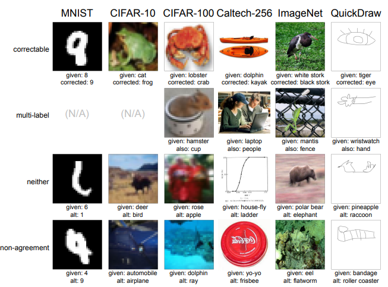

**官方教程: https://docs.cleanlab.ai/stable/tutorials/object_detection.html**

**代码见本文件夹下的main.py: 使用cleanlab结合YOLO模型筛选错标或者难例样本**


**REFERENCE: 以下内容从[此处](https://mp.weixin.qq.com/s/E5-J9KkQoKhaRB-S7bsw-w)拷贝**

大家好，我是张大刀。

昨天想着总结下最近在做的实验，一看已经一个月没有更新了，只能说时间过得真快啊。

今天给大家推荐下最近使用的一个涨点神器，**cleanLabel**，用于数据预处理环节，而且是即插即用。

**1. 场景**

个人实验验证cleanLabel一般会用于以下两种场景：**一是筛选带噪声数据；二是筛选难例样本。**

在日常AI工作中，数据会是算法模型的天花板，吴恩达大佬说人工智能是20%的算法+80%的数据决定的。所以我们在日常工作中会尽量保证数据的干净，去除噪音数据。做为算法工程师，会在分析完项目需求，初步选定算法场景后，定义好标注规范，请标注人员依据规范对数据标注。在实际操作中，因为人员的标注误差，人员理解等不可控因素，标注数据很难有一致性，会默认算法工程师拿到的数据是带噪声的数据。带噪声的数据清洗可以通过两种方式：一是手动数据清洗，对标注完的数据，人为的再过一遍。二是自动数据清洗，可以参考[大规模图像数据校验工具fastdup,](http://mp.weixin.qq.com/s?__biz=MzU3ODk2Njc5Mg==&mid=2247496329&idx=1&sn=2cf054cfe10ad4ba0c9d43bc770a1248&chksm=fd6ff6eeca187ff8513b76f8c75faee9a92d899beeaf94303a176940ba4f1585f87cbd332d34&scene=21#wechat_redirect)  还有就是cleanLabel，cleanLabel 不仅对图像类任务适用，也适用于文本、语音等各类分类任务。

第二种场景是处理难例数据，因为人所认为的难例数据与模型所认为的hard sample 虽然大部分情况下一致，但是也有些hard sample 不一致，而hard sample 在很多情况下虽然会对算法训练有提升效果，另一方面在训练过程中也会对容易样本的学习有偏移，如果能筛选出hard sample, 选择性的去使用hard sample,会对训练效果有提升。

**2. cleanLabel **

cleanLabel 则可以完成上述的任务，即从整批数据整筛选出噪声数据或者难例数据，首先他是通过模型筛选数据的，模型从哪儿来，基于数据集去训练的，训练后的模型来反过来筛选数据。再将筛选后的数据进行后续模型的训练。先看下cleanLabel的github: 

**\*https://github.com/cleanlab/cleanlab***

**\****


star 3.8k，说明效果是被一定认可的，来自MIT、亚马逊的研究员开发了cleanlabel工具，同时发表论文NeurlPS 2021 <Pervasive Label Errors in Test Sets Destabilize Machine Learning Benchmarks>

论文链接：https://arxiv.org/pdf/2103.14749.pdf

他们对主流的数据集如图像类的cifar-10, imagenet等通过cleanLabel清洗，发现如imagenet数据集的验证集中至少存在2916个错误，错误率达到6%；



那cleanlabel 是怎么解决这个问题的吗？

论文中写到：

「Cleanlab 背后的算法理论受到了量子信息理论的启发，当时我们的 CEO 正在麻省理工学院进行博士研究。我们的一些用户认为 Cleanlab 是黑魔法，但它大部分是发表在顶级 ML/AI 会议和期刊上的数学和科学研究。」

**3. 使用**

cleanLabel 的使用很简单，示例见本文件夹下的main.py文件：

```
from cleanlab.dataset import overall_label_health_scorehealth = overall_label_health_score(labels, pred_probs)
```

如查找数据集中哪些数据存在问题：

```
from cleanlab.classification import CleanLearningissues = CleanLearning(yourFavoriteModel).find_label_issues(data, labels)
```

从代码中看，它是根据训练的模型对图片的预测结果进行排序的，具体的细节可以参见cleanlab中的find_label_issues函数使用的。具体到我们自己的项目中应该怎么使用呢，参见example。

如我们有15w张的标注数据集，如果算法人员自己去对数据做质量筛查的话，很耗费时间。则可以通过cleanlabel来大致筛选。具体步骤如下：

①**将数据集预处理成k折交叉验证数据集**（K>=5）；

②选择其中k-1份为训练集，1份为验证集，选择模型进行**训练**，训练成k个模型；

③选择其中最好的一个模型，通过上述代码，筛选出它认为issue label的索引。（这里建议是将k个模型都通过上述代码生成issue label的索引后，通过投票等方式筛选，效果应该更好）

上述考虑用k折交叉验证的原因个人理解是，因为对整个数据集做清洗，同时要对数据集训练，有训练的话会划分训练集和验证集，如果只使用做一次训练，则对训练集会过拟合，且对验证集不公平。选用k折交叉验证则能尽可能避免这个问题。

下面我们则可以对issue label 单独拎出来做质量筛查分析，对清洗后的数据重新训练等。

在自己15w的数据集上尝试了下，通过cleanlabel, 筛选出3000来张它认为的噪声数据， 其中2400来张人工核验了下确实是噪声数据，600来张算是困难样本；

实验发现，如果将3000来张数据全部扔掉，**precison和recall在原来的基础上能上升至少5个点**（之前precision:0.724, recall:0.845）；

如果将600张难例数据放回数据集中，precision和recall比没放进去的结果还掉点，这块可能和任务场景有关，大家可以在自己的场景中尝试。所以这里建议可以将issue label的样本从原数据集中clean掉后，再去做后面的训练。

**4. 拓展**

cleanLabel 不仅可以使用在图像分类任务下，也可以用于文本分类、语音分类等分类任务下，因为cleanlabel本质上是使用的置信学习，如果任务场景最后通过置信度对其分类的话，应该都可以使用。同个人也试过在目标检测任务中使用，可以通过将数据集中目标裁剪下来，去筛选该图片，再对清洗后的数据做训练等操作。各位可以尝试。

> **结语**

以上为cleanlabel的使用，希望对大家有帮助。同时文中如果有bug,欢迎一起讨论。