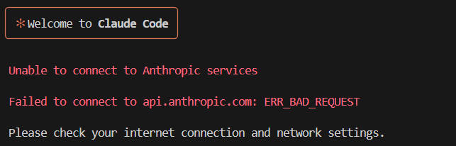
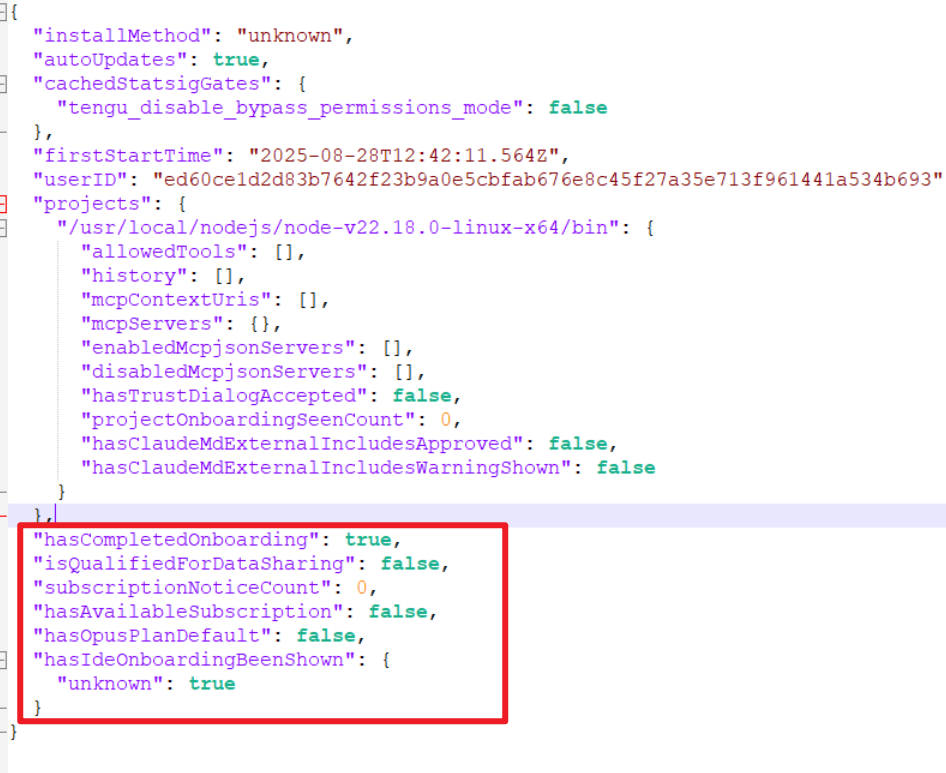
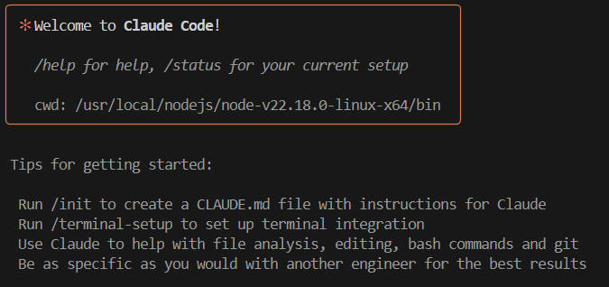
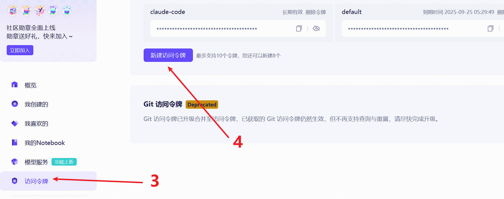
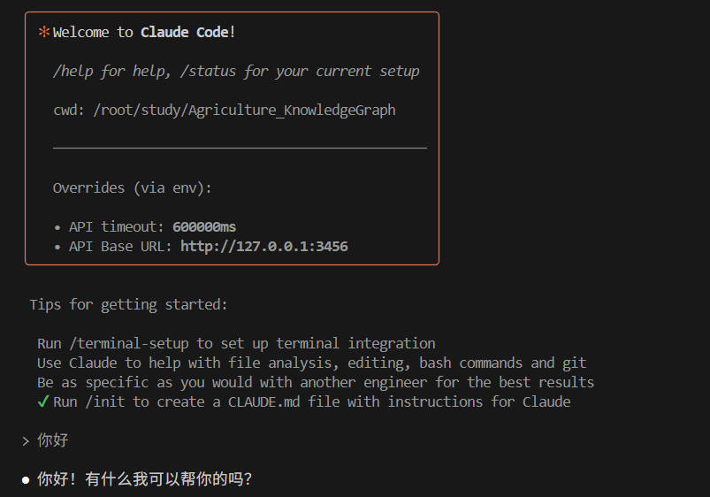
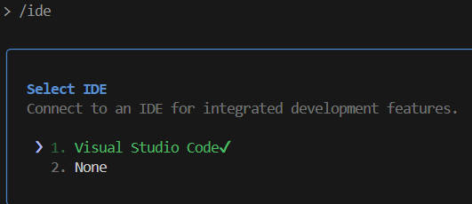
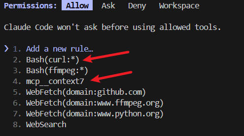

## 1. 安装nodejs

下载nodejs预编译包：[地址](https://nodejs.org/en/download)

将预编译包放在`/usr/local`下：

```bash
tar -xf node-v22.18.0-linux-x64.tar.xz 
mkdir /usr/local/nodejs
mv node-v22.18.0-linux-x64 /usr/local/nodejs
echo 'export PATH=/usr/local/nodejs/node-v22.18.0-linux-x64/bin:$PATH' >> ~/.bashrc
source ~/.bashrc
node -v # 验证是否好用
```

## 2. 安装claude-code

```bash
npm install -g @anthropic-ai/claude-code --registry=https://registry.npmmirror.com
```

在命令行中敲入：

```bash
claude
```

会出现如下：



找到`.claude.json`配置文件，一般在家目录下，并打开添加如下几行配置：



```bash
  "hasCompletedOnboarding": true,
  "isQualifiedForDataSharing": false,
  "subscriptionNoticeCount": 0,
  "hasAvailableSubscription": false,
  "hasOpusPlanDefault": false,
  "hasIdeOnboardingBeenShown": {
    "unknown": true
  }
```

再次输入`claude`：



## 3. 申请qwen的api key

打开[魔塔社区](https://modelscope.cn/my/overview)

注册账号并绑定阿里云


点击访问令牌，新建访问令牌



## 4. 安装claude code router

[github仓库地址](https://github.com/musistudio/claude-code-router)

```bash
npm install -g @musistudio/claude-code-router --registry=https://registry.npmmirror.com
```

创建配置文件：

```bash
mkdir -p ~/.claude-code-router
vim ~/.claude-code-router/config.json
```

粘贴如下内容， 其中api_key填写刚刚申请的：

```bash
{
  "Providers": [
    {
      "name": "modelscope",
      "api_base_url": "https://api-inference.modelscope.cn/v1/chat/completions",
      "api_key": "your/api/key",
      "models": ["Qwen/Qwen3-Coder-480B-A35B-Instruct", "Qwen/Qwen3-235B-A22B-Thinking-2507"],
      "transformer": {
        "use": [
          [
            "maxtoken",
            {
              "max_tokens": 65536
            }
          ],
          "enhancetool"
        ],
        "Qwen/Qwen3-235B-A22B-Thinking-2507": {
          "use": ["reasoning"]
        }
      }
    }
  ],
  "Router": {
    "default": "modelscope,Qwen/Qwen3-Coder-480B-A35B-Instruct",
  }
}
```

**NOTE:** 更多模型配置方法见clade code router [github仓库地址](https://github.com/musistudio/claude-code-router)

## 5. 开始使用

在你需要使用的工程中输入如下命令, 打开对话框后， 输入你好测试一下是否好用：

```bash
ccr code
```



接入vscode, 输入:

```bash
/ide
```



初始化，让claude code对工程有个初步学习, 执行如下会生成CLAUDE.md为对当前工程的总结：

```bash
/init
```

然后就可以开始对话了。

## 6. 开始使用

几种模式切换：

```bash
# 切换成命令行格式(输入以下符号)
!
# 切换成记忆模式（记忆模式会将用户输入作为永久记忆保存到本地）(输入以下符号)
#
```

常用命令：

```bash
# 绑定ide（需要在插件市场安装claude code for vscode插件）
/ide
# 初始化，生成CLAUDE.md对当前工程的总结
/init
# 压缩前述对话，节省token消耗
/compact
# 清除前述上下文，开启新对话
/clear
# 长思考模式(在对话前加上以下几个单词中的一个)
think thinkhard thinkharder ultrathink
# 查看当前已安装的mcp
/mcp
```

## 7. 安装MCP

1. 安装context7

   ```bash
   claude mcp add context7 --scope user -- npx @upstash/context7-mcp
   ```

   [context7项目](https://github.com/upstash/context7)： 直接从源头获取最新的、特定版本的文档和代码示例 — 并将它们直接放入你的提示中。

   对话方式：

   ```text
   帮我查找最新版本的python，使用context7
   ```

2. 删除context7

   ```bash
   claude mcp remove context7
   ```

3. 安装github mcp server

   参考[github mcp server](https://github.com/github/github-mcp-server/blob/main/docs/installation-guides/install-claude.md)

   对话方式：

   ```text
   帮我查找最新版本的python，使用github
   ```

## 8. 为某些命令赋予权限

```bash
/permissions
```

对于一些命令或者mcp server赋予权限的写法如下，赋予权限的命令或者mcp在后续执行后，就不需要征求你同意了：

