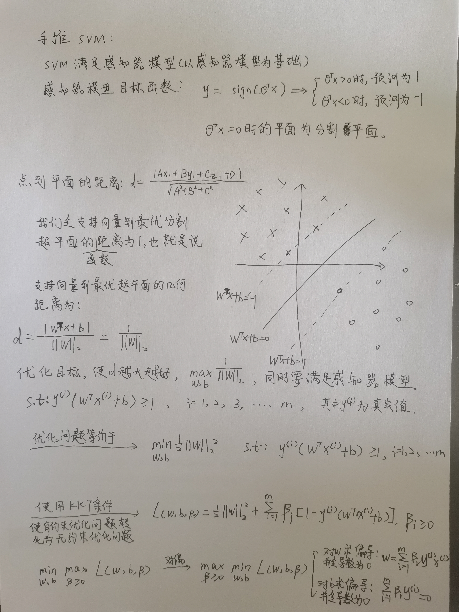

强烈推荐CSDN**啥都生**《人工智能算法面试大总结》专栏：https://blog.csdn.net/zzh516451964zzh/article/details/126857351?spm=1001.2014.3001.5502


# 面试真题（一）

```C++
1.Kmeans，Kmeans++, RandomForest, SVM, KNN会问到

2.有一万条数据，每条数据是128维向量，用传统的方法提供一个将新数据进行分类划归，如果不属于任何类，则设置为新类，怎么做？

3.Linux中查看进程，查看内存使用情况的指令要了解一下

4.Python的多线程了解吗

5.Python的装饰器的作用是什么，为什么要这么做

6.Python中的魔术方法有哪些

7.Python的解释器有哪些

8.Python中编程规范是怎样的

9.Python2.0了解吗

10.Python用的什么版本？

11.Python怎么实现两个对象相加？

12.Python的常用数据结构有哪些？

13.C++用的什么版本的

14.C++11， 17， 19都有什么特性

15.C++早期版本会不会

16.C++多线程了解吗

17.C++多线程中的锁有哪些

18.C++中的智能指针工作原理是怎样的，有几种

19.C++中的引用和指针有什么区别，可以用引用代替指针吗，用哪种好一些

20.C++中的move会使用吗

21.C++智能指针会出现无限循环吗（好像是这么问的）

22.C++中的内存形式有哪些，内存是以什么形式存储的

23.struct和class的区别是怎样的，为什么一些情况要用class而不用struct

24.C++的编程规范是怎样的
```

# 面试真题（二）

```C++
1.说说IoU、GIoU、DIoU、CIoU区别

2.YOLOv5中增加正样本匹配的trick
 
3.OpenCV中的滤波知道哪些

4.滤波的核为什么是奇数

5.手推线性回归

6.卷积计算量如何计算

7.说说ResNet和DenseNet

8.抽烟检测思路

9.Python中的多进程和多线程

10.OpenCV中的模板匹配

11.yolo的输入输出是什么

12.怎么做的模型轻量化

13.轻量化之后 大小降低了多少，效率降低了多少

14.YOLOv5s和5m的区别
	
15.如何判断yolo的效果
	
16.SVM 
	
17.决策树 决策树加速方法
	
18.随机森林 属于bagging还是boosting
	
19.Kmeans的距离度量方式 
	
20.知道高斯距离吗

21.ResNet与其他经典分类网络的区别 
	
22.yolov5比v3好在哪里 
	
23.如何量化模型是否需要轻量化：模型参数多少
```

# 手推算法



