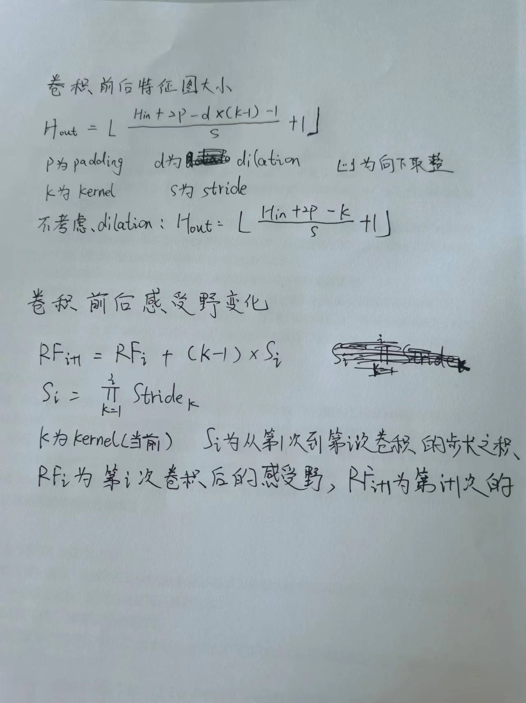
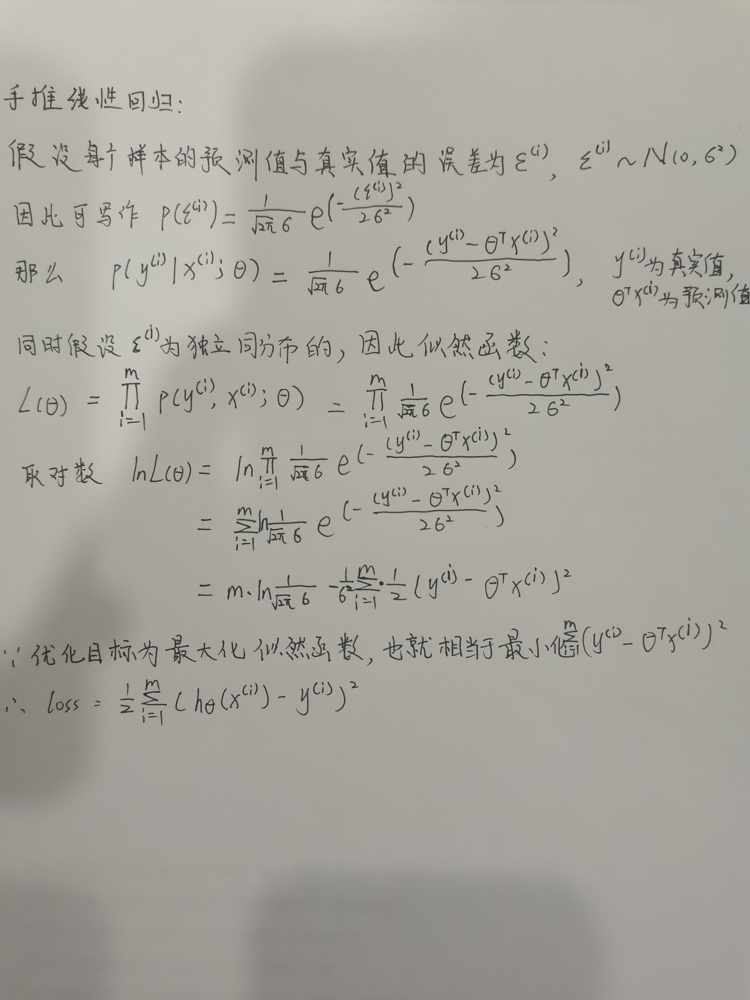

强烈推荐CSDN**啥都生**《人工智能算法面试大总结》专栏：https://blog.csdn.net/zzh516451964zzh/article/details/126857351?spm=1001.2014.3001.5502


# 面试真题（一）

```C++
1.Kmeans，Kmeans++, RandomForest, SVM, KNN会问到

2.有一万条数据，每条数据是128维向量，用传统的方法提供一个将新数据进行分类划归，如果不属于任何类，则设置为新类，怎么做？

3.Linux中查看进程，查看内存使用情况的指令要了解一下

4.Python的多线程了解吗

5.Python的装饰器的作用是什么，为什么要这么做

6.Python中的魔术方法有哪些

7.Python的解释器有哪些

8.Python中编程规范是怎样的

9.Python2.0了解吗

10.Python用的什么版本？

11.Python怎么实现两个对象相加？

12.Python的常用数据结构有哪些？

13.C++用的什么版本的

14.C++11， 17， 19都有什么特性

15.C++早期版本会不会

16.C++多线程了解吗

17.C++多线程中的锁有哪些

18.C++中的智能指针工作原理是怎样的，有几种

19.C++中的引用和指针有什么区别，可以用引用代替指针吗，用哪种好一些

20.C++中的move会使用吗

21.C++智能指针会出现无限循环吗（好像是这么问的）

22.C++中的内存形式有哪些，内存是以什么形式存储的

23.struct和class的区别是怎样的，为什么一些情况要用class而不用struct

24.C++的编程规范是怎样的
```

# 面试真题（二）

```C++
1.说说IoU、GIoU、DIoU、CIoU区别

2.YOLOv5中增加正样本匹配的trick
 
3.OpenCV中的滤波知道哪些

4.滤波的核为什么是奇数

5.手推线性回归

6.卷积计算量如何计算

7.说说ResNet和DenseNet

8.抽烟检测思路

9.Python中的多进程和多线程

10.OpenCV中的模板匹配

11.yolo的输入输出是什么

12.怎么做的模型轻量化

13.轻量化之后 大小降低了多少，效率降低了多少

14.YOLOv5s和5m的区别
	
15.如何判断yolo的效果
	
16.SVM 
	
17.决策树 决策树加速方法
	
18.随机森林 属于bagging还是boosting
	
19.Kmeans的距离度量方式 
	
20.知道高斯距离吗

21.ResNet与其他经典分类网络的区别 
	
22.yolov5比v3好在哪里 
	
23.如何量化模型是否需要轻量化：模型参数多少
```

# 面试真题(三)

[reference](https://mp.weixin.qq.com/s?__biz=MzI3MzY1NzIxMA==&mid=2247484550&idx=1&sn=2cdec7791b933a9021e4d61627bdcf1c&chksm=eb1eb893dc69318581b0c70912f113613c253638cc305d4d9122add7869e136865e373966213&token=519809635&lang=zh_CN#rd)

```python
1. cv高频code:
  1. iou
  2. nms
  3. Conv2d, bchw-conv
  4. k-means
  5. mean_filter, gauss_filter  (刁钻)
  6. bp, SGD  (刁钻+1)
  7. 数组相关, 二分, 排序算法(快排, 归并等)
  8. 矩阵求幂   
  
2. 关于HR面: 
  1. 一般技术岗三轮技术+1轮hr, 可先询问: 技术面各轮次的评价如何, 基于此谈涨幅. (也会有hr表示评价是保密的不告知..)
  2. 周末加班情况, 上下班打卡否, 上下班时间range
  3. 吃饭 打车 房补等福利
  4. 公积金,社保基数, 交的系数
  5. 每年的晋升机会, 调薪次数  

3. 面试准备
  1. 基础扎实, 八股文也好, 代码语法细节也好.
  2. 可根据前几轮的考察内容去准备后面的面试(但不排除出现被交叉面, 前后考察内容完全不同方向,的情况)

4. 关于自己的优缺点:  (实事求是!)
  优点: 喜欢钻研技术, 执行力比较强, 对工作很有责任心 
       养成了主动汇报, 必要时积极寻求资源和帮助的习惯. 
  缺点: xxxxx. 沟通技巧上还需要提升, 去主动做一些跨部门分享,交流. 

5. 面试记录
  1. 百度ai与数据平台组(paddle组)
    面前准备:  
      侧重code基础吧(python c++ pytorch语法等), 训模型的一些技巧(过拟合欠拟合 bn ln hpo估计也会问)
      类似工具链要求.
    一面问题: (跪)
      1. 问了很多C++ 内存管理, 怎么发现内存泄漏等... 优化卷积计算.
      感觉岗位不match, 项目中的算法基本没问. 这个组为啥总莫名其妙的捞我(因为我的项目有俩c++???)
    反思: 
      确实需要多补充些模型部署加速的知识, 剪枝, 量化, 知识蒸馏, 矩阵/卷积加速等.

  2. 蘑菇车联:
  猎头给的面经:  
    一面: 最大正方形, leetcode221
    二面: 有序链表合并, 二分查找   冒泡排序, 快排 
  我实际的一面:  
    问了yolo 问了c++智能指针, 多态, cuda优化写过吗? c++优化啥的.
    code: 无
    面完也完全无通知, 感觉很不靠谱..

  3. 黑芝麻:  
  JD: 1. 智能驾驶领域视觉算法研究， 包括但不限于检测、分割、建图、定位、 标定等；
    2. 算法设计训练、调优、量化、调试等工作；
    3. 协助软件人员在嵌入式平台上 CPU/NPU 实现算法移植；
    4. 算法在平台上改进，针对实际场景持续优化。
  问题:
  1. 仿射变换6个参数的意义:
    X=ax+by+c, Y=dx+ey+f
    乘法系数是缩放概念, +c,+f是偏移概念.
  2. tensorRT了解吗, 怎么起到加速的：
    1. onnx包含的参数, 模型结构, 这两个东西给到trt
    2. 完成低精度saveEngine加速. 包含下面几个操作: 
      1. 算子融合 （层间融合, 层与算子, 算子与算子融合等.）
      2. 量化(低fp设置int8)
      3. 内核自动调整: trt源码写好的一些, 根据所用硬件,核数等, 选择最优的计算方式
      4. 动态张量显存: 一些调整策略, 减少模型的显存开辟释放, 优化时间
      5. 多流执行: CUDA的并行操作 
  跪了..
      
  4. 拼多多: 风控图像算法 
  一面:  
    自我介绍完直接两个code题: 1. 实现nchw卷积, 2. 左下角到右上角最短距离  其他啥都没问 
  二面:  
    二面大概率是后面的leader, 人很斯文说话儒雅, 简单聊项目问题, 没考八股文
    code是: 快速实现幂函数~  
    问了下工作中会不会用SQL, : 没这个需求, 补了句后面可以学😂..
  三面:  
    问题: 图像算法可以给多多带来什么.
      1. gan, 扩散模型, 生成商品图片
      2. 网络安全, 涉政, 暴, 赌, 黄, 欺骗样品(图文不符, 标签党)
      3. 做海量图像数据的维护, 分类目, 多标签维护 (设计特征提取, 计算相似度做图像关联)
      4. 结合推荐算法一起, 给到最能吸引客户的商品展示图
    基本纯聊天  <做的网络安全, 电商里的涉黄政暴/对抗> 11.11.6强度大..
  hr面: 就很常规, 问职业方向, 过往离职原因, 薪资水平和期望涨幅. call后立马要了现在的薪资流水, 流程走的很快. 
  (attention: 接了多多offer不去会被拉黑, hr严明"警告"的~)

  5. 百度-阿波罗-自动驾驶: 
  JD: 1. 负责计算机视觉或深度学习相关算法, 系统及产品落地工作  
      2. 方向: 视觉物体检测识别，分割, 多目标跟踪，车道线检测
      3. 负言相关视觉算法系统优化, 实现产品快速选代, 满足业务产品需求
    一面:  [面试体验不错, 面官给人感觉是喜欢讲技术不装13的人]
    问题:  
      1. 八股文没问, 问了工程优化思路, 模型/工程层面均可
      2. 知识蒸馏好点,还是稀疏化好点?  我掰扯了下知识蒸馏可能更好, 更稳定些(大模型可以训的非常好,去教小的, 教的过程中也可以精细的调)
        但是稀疏化, 感觉就很不稳定, 换批数据, 也许又不适合稀疏化来做. 
      3. c++和code: 智能指针, 左右值,  
        1. class A {
        public:
          std::shared_pointer<B> b_;
        };
        class B {
        public:
          std::shared_pointer<A> a_;
        };
        auto a = std::make_shared<A>();
        auto b = std::make_shared<B>();
        a->b_ = b;
        b->a_ = a; 引用计数会a+1 b+=1 然后又交叉指向了, 就ab又都+1, 
        so就算析构来了引用计数都-1, 还是剩下a=b=1 就一致delete不掉!
        2. class B : public A;
        A* p = new B(xxx);
        p->print();     # 父子间的构造析构顺序: 构造a, 构造b, 析构b, 析构a 
        磕磕巴巴应该也算是答出来了. 
        3. code: 旋转数组找最小, 二分做, 磕磕巴巴撕出来了, 一开始理解错了题目意思.
    二面:  跪.. [应该是已经招到了人, 全程过简历问的也不深, 刷个面试kpi?]
      问题: dbscan和k-means的区别 (项目用了dbscan), 都建立相关的浅浅的问题.
      反问: 进去后做哪个方向?  A: 也许部署,也许模型, 看具体哪块需要人力... emmm...
    二面体验一般, 没开摄像头也没解释为啥不开. 检测的一个也没问, 分割倒是问了点

  6. Momenta (目标检测2d, 会迁移到3d场景)  (base深圳,半年出差苏州)
    一面:
    code: 快排找数组k个最小 [没写出最优的, 快排写法说对了思路, 咩时间了咩让写完]
    paper: repvgg [面官给的信息, 让可去看看]
    其他行人检测方法: 匈牙利+卡尔曼后.  简单问了下 [答不太懂..]
    二面:   (二面hr说过了但职级没定,得让老大决定是否继续. 说是想招对标ali的P7及以上,以下的除非面评非常好.)
    1. 3d检测算法问了下: 简单说了fcos3d, DETR3d 
    2. bev和fcos3d的优势, 简单扯了下 
    3. 点云数据了解吗? 答了8个点, 很稀疏, 稀疏卷积去做特征提取, 回答的一般..
    4. 数据闭环 (2亿base数据, 2w hard case, 怎么做实现检出hard case)
    hr通知: 经验较浅, 要看后续有无更合适的人.. g了..
 
  7. 得物  分类分割检测+模型部署 
     一面: 
       1. 过简历, hrnet和u-net的区别  u-net head很重,参数大.
       2. 冒泡排序怎么优化(设置标记位, 设置结束边界, 双向冒泡排序), 堆排序(处理海量数据的topk)
     二面: 
         方向介绍: 商品质检, 和鉴别真假 两个方向. 数据海量, 类别大(多至几百类) 
     可能针对数据的处理设计方案会很多, dl模型感觉不会玩的太花, attention啥的估计也用不上..
     <是在好好招人的感觉, 两轮面试体验都还好~>
     三面: 因后面做的方向原因, 拒了面试.
 
  8. 云鲸:   
     JD: 机器学习算法工程师: 
        1. instance-语义分割, 特征点检测&匹配, 以图搜图 
        2. 算法落地: 低精度量化部署, nas, onnx转paddle,trt等  (嵌入式部署, 属于是完全没搞过了..)
        3. TFLite, trt 了解下. 
     一面: 
       问题: 面官提问很有逻辑条理(应该m级的),让介绍了一个做的最深的项目, 提问也比较能抓住重点.
          无code. 反问环节对团队的几个方向介绍的非常清晰, 感觉有很多事情可做, 面试体验不错~  
     二面: (总监面)
       问题: 聊天, 职业规划, 为什么加入之前的公司, 哪里人对象情况等.. 简单问了下双目视觉是否了解, 为啥视差能算出深度(答: 要结合些相机参数,焦距之类的.)
     hr面: 优缺点, 现在的薪资, 期望涨幅, 目前工作状态举栗啥的<比较看重候选人稳定性,的感觉..>
     
  9. 斑马智行  
     一面: 问的很浅就过项目, 提的问题我都忘了.. 具体做模型还是做部署,也是按需安排..
     猎头推荐的, 说一面过了但二面的时间还没定, 面官很忙.. 
     二面: 约在周六下午, 面官是任小枫(大佬大佬怪不得难约上面试..)
          巨佬确实carry感很强, 30分钟短平快面试不扯废话. 
          反问: 斑马现在主打L几的产品啊?  l2~3 
```

# 一些和卷积有关的计算



# 手推算法





