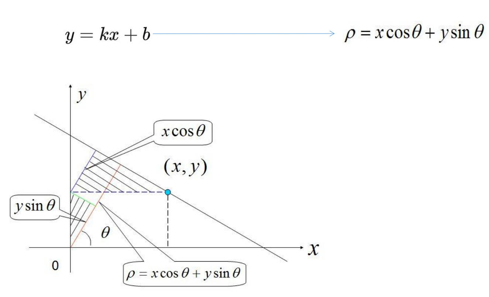
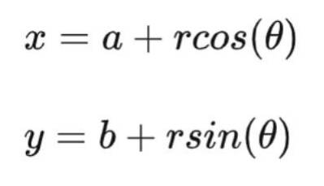
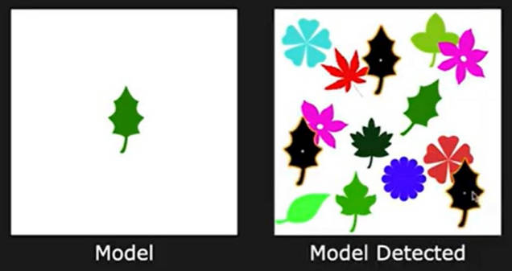
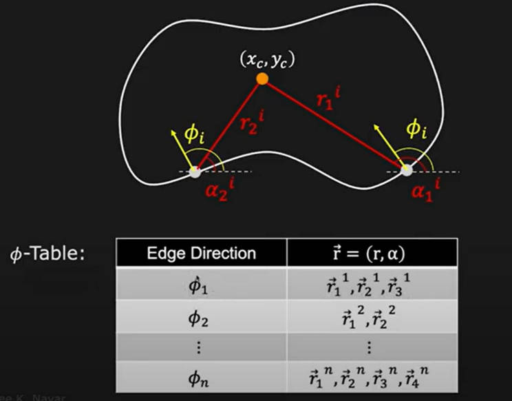
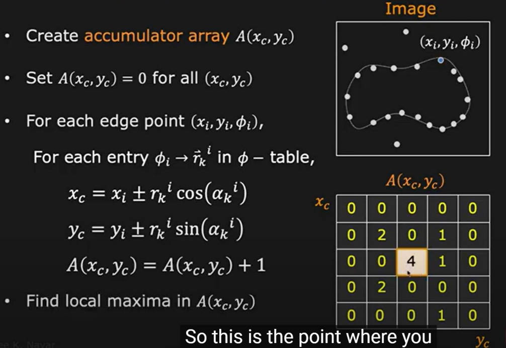
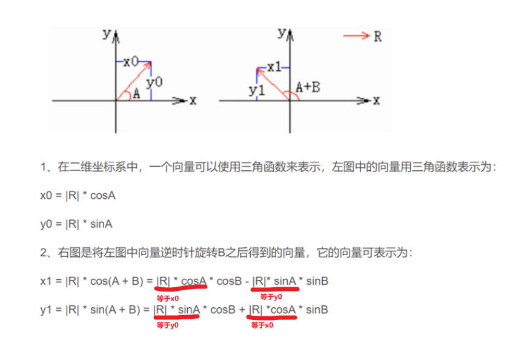

## 一. 直角坐标系转极坐标系



## 二. 霍夫变换求直线

将笛卡尔坐标系XoY转换为笛卡尔坐标系koq，经过x1y1的点在笛卡尔坐标系kq下是一条直线，经过x2y2的点在笛卡尔坐标系koq也是一条直线，那么我们的目标求kq的话就是求两条直线的交点。


进一步的，下图中三点共线，如果将笛卡尔坐标系XoY转换为极坐标系$\rho o \theta$ ，那么我们的目标求kq的话就是求三条曲线的交点。


**广义霍夫变换求直线算法步骤如下：**

（1）取直线上的第一个点(x,y)，将其带入直线在极坐标中的公式中，然后遍历θ的取值： 0, 1, 2, ..., 180，分别求出对应的$\rho$值，如果这个数值在上述累加器中存在相应的位置，则在该位置上加上加1

（2）取直线上的第二个点，重复上述步骤，更新累加器中的值。对图像中的直线上的每个点都执行上步，每次更新累加器中的值。

（3）搜索累加器中的最大值，并找到其对应的(ρ,θ)，就可将图像中的直线表示出来。

代码见：hough-line.py

## 三. 霍夫变换求圆

笛卡尔坐标系的圆：


极坐标系的圆：



所以在abr组成的三维坐标系中，一个点可以唯一确定一个圆。
而在笛卡尔的xy坐标系中经过某一点的所有圆映射到abr坐标系中就是一条三维
的曲线：


经过xy坐标系中所有的非零像素点的所有圆就构成了abr坐标系中很多条三维的曲线。在xy坐标系中同一个圆上的所有点的圆方程是一样的，它们映射到abr坐标系中的是同一个点，所以在abr坐标系中该点就应该有圆的总像素N0个曲线相交。通过判断abr中每一点的相交（累积）数量，大于一定阈值的点就认为是圆

**广义霍夫变换求圆算法步骤如下：**

（1）首先对图像应用边缘检测，比如用canny边缘检测

（2）使用sobel算子计算所有像素的梯度

（3）遍历canny之后的所有非0的像素点，沿着梯度方向画线，每个点有是一个累加器，有一个线经过该点，累加器加1，对所有累加器进行排序，根据阈值找到所有可能的圆心

（4）计算canny图像中所有的非0像素点距离圆心的距离，距离从小到大排序，选取合适的半径

（5）对选取的半径设置累加器，对于满足半径r的累加器+

代码可调用opencv的API

## 四 . 霍夫变换模版匹配

**广义霍夫变换模板匹配算法步骤如下：**

步骤一：使用模板图像构建R表

读取模板图像并灰度化----> 对图像进行边缘检测得到一张二值图(True的位置是边缘，False的位置不是边缘)----> 使用sobel算子计算这个二值图每个像素位置的x方向梯度以及y方向梯度----> 计算每个像素位置梯度与x轴之间的夹角(梯度方向)---->  构建R表(以梯度方向为key，以相对于参考点的向量为[value1, value2, value3...])

步骤二：对待检测图像进行模板匹配

读取待检图像并灰度化----> 对图像进行边缘检测得到一张二值图(True的位置是边缘，False的位置不是边缘)----> 使用sobel算子计算这个二值图每个像素位置的x方向梯度以及y方向梯度----> 计算每个像素位置梯度与x轴之间的夹角(梯度方向)---->  遍历旋转角 ----> 通过R表构建当前旋转角下的rotate-R表 ----> 遍历缩放尺度 ----> 通过rotate-R构建scale-rotate-R表 ----> 查找scale-rotate-R表----> 按照scale-rotate-R表对参考点投票

------

下图中第一幅是模板图, 第二幅图是带检测图, 第二幅图中的三个黑色树叶是不带旋转的模板匹配, 绿色树叶是带旋转的模板匹配



------

**例子(不带旋转和缩放的模板匹配):**

下图中为模板图像中的一个复杂曲线，xc、yc为该曲线的参考点（自定义），$\phi_i$ 是边缘上某一点梯度与x轴之间的夹角，$r_1^i$ 是该点相对于参考点的向量。


下图中的$\phi$-Table就相当于R表，key值为边缘某点的梯度夹角(或者是梯度夹角所在的bin的序号, 比如把360°分成36个bin, 每个bin代表10°, 那么梯度夹角落在第几个bin, key值就是几)，value值为该点相对于参考点xc、yc的向量，注意边缘上可能存在多个点的梯度方向的夹角是一样的，比如下图中的$\phi_i$



下图中为对待检图像进行模板匹配的过程，先初始化一个全是0的表A(xc, yc)，表的大小和待检图片大小一样，然后对待检图片进行边缘检测，然后求每个边缘的梯度夹角$\phi_i$，然后根据$\phi_i$ 去查上一步建立的R表，得到多个向量r，然后计算当前点在这些r下的参考点坐标，然后对得到的参考点坐标在表A上对应的位置+1，最终表A中数值最大的坐标即为投票胜出的参考点，如果该参考点的投票数大于一定阈值，我们认为我们模板匹配成功。



------

对于待检测图片中的目标是**有旋转角度**的, R表构建方式:

遍历旋转角(比如遍历0-180°), 根据已有的R表计算当前每个旋转角下的rotate-R表:

for angle in (min_rotate, max_rotate):

​	

​	那么对于当前angle下的r1, r2等如何变换成r1', r2'呢?

​	下图中向量原坐标为(x0, y0)与x轴夹角为A, 向量长度为R; 旋转角度B后, 向量新坐标变为(x1, y1)与x轴夹角为A+B, 从(x0, y0)到(x1, y1)的转换公式如下:

​	

对于待检测图片中的目标是**有缩放尺寸**的, 遍历时缩放系数后, R表对应向量直接乘以当前缩放系数即可

**代码**见python文件夹下的template-match.py(不带旋转和缩放)  ;  cpp文件夹内代码(带旋转和缩放)

调用opencv的API:

```python
import cv2
import numpy as np

# Load the template and the image
template = cv2.imread('images/tpl.jpg', cv2.IMREAD_GRAYSCALE)
image = cv2.imread('images/target.jpg', cv2.IMREAD_GRAYSCALE)

# Create a Generalized Hough Transform object
ght = cv2.GeneralizedHoughGuil()

# Set the template
ght.setTemplate(template)

# Adjust parameters
ght.setAngleStep(1)  # 1 degree angle step
ght.setScaleStep(0.5)  # 0.5% scale step

positions, votes = ght.detect(image)

for position in positions:
    x, y, scale, orientation = position

cv2.imwrite("result.jpg", image)
```


**霍夫变换模板匹配的优缺点：**
1.哪怕模板有些不连续的边缘，霍夫变换也是work的；因为我们无需固定的参数方式对其进行表达；

2.对于遮挡和噪声有很强的容忍性；

3.对于简单的形状是非常高效的（比如直线，圆等等，因为参数空间的参数量小）

4.对于复杂的形状我们可以用广义霍夫变换，但是参数空间比较多的时候，效率会很低；（除非我们可以根据先验缩小参数空间的搜索范围）