原始视频: bilibili西湖大学赵世钰<<强化学习>>

# 一. 基本概念

## 1. grid-world example


网格分为: 可达、禁止、目标单元格，边界

## 2. State和State space

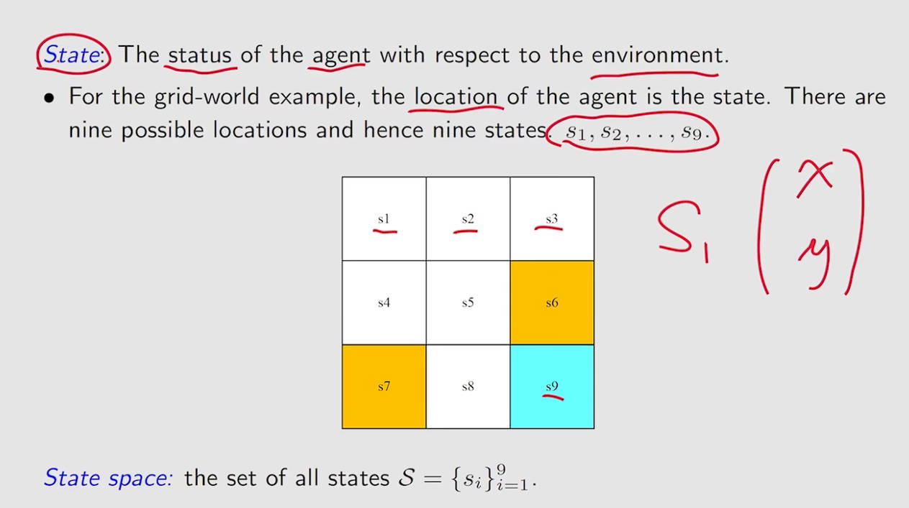

## 3. Action

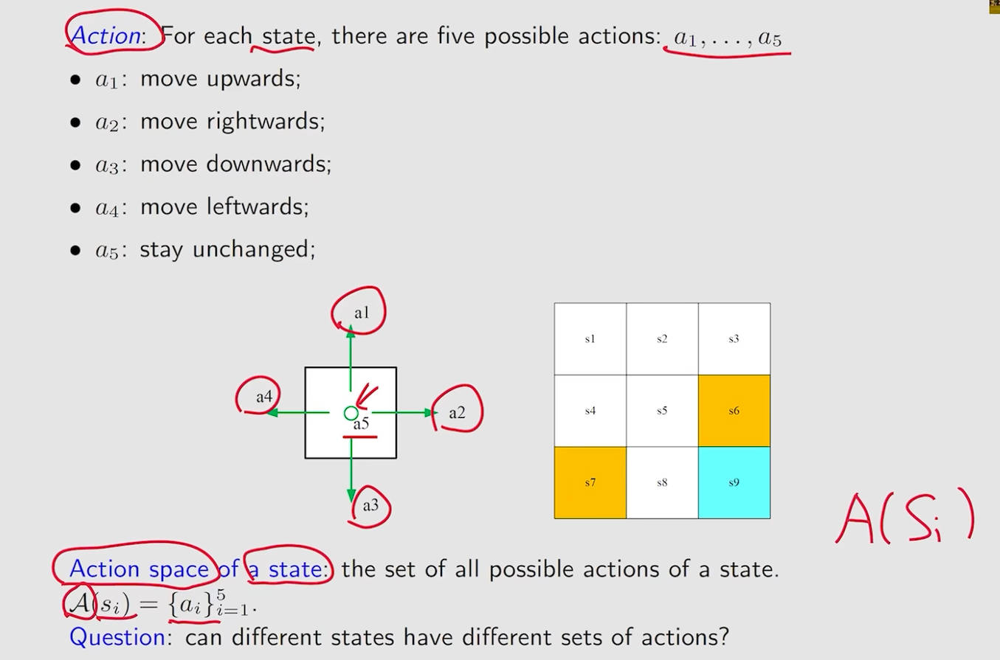

Action space是和state有关的， 不同的state会有不同的Action space， 写作 $A(S_i)$

## 4. State transition


## 5. Forbidden area

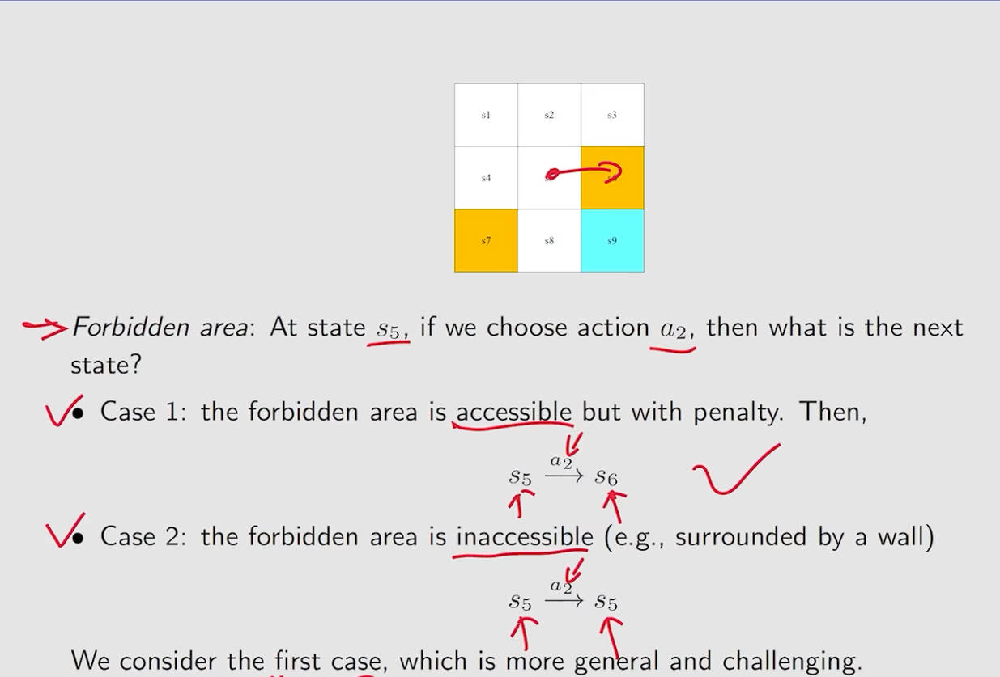

## 6. Tabular respresentation


这种表示方式只能表示确定性（deterministic）的例子，一般不用

## 7. State transition probability


使用条件概率来表示状态转移： 

当前在s1状态，采取a2动作，下一步在s2状态的概率为1；

当前在s1状态，采取a2动作，下一步在si(i不等于2)状态的概率为0；

## 8. Policy


**在强化学习中，我们使用 $\pi$ 来表示策略。在从一个状态转移到另一个状态的时候，采取不同的动作的概率之和应为1。**

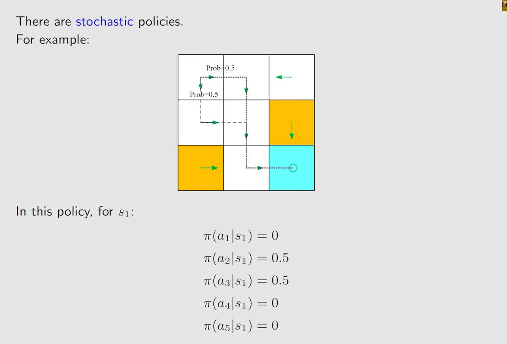

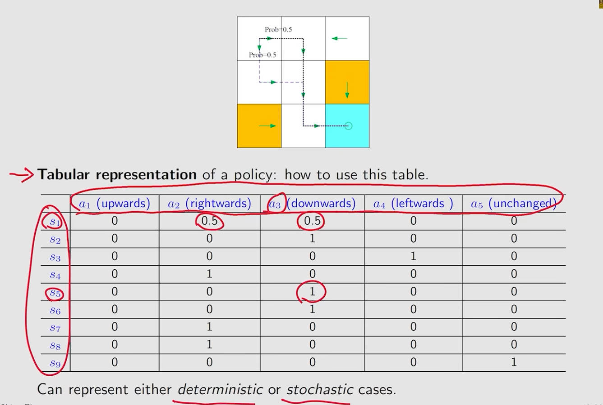

## 9. Reward


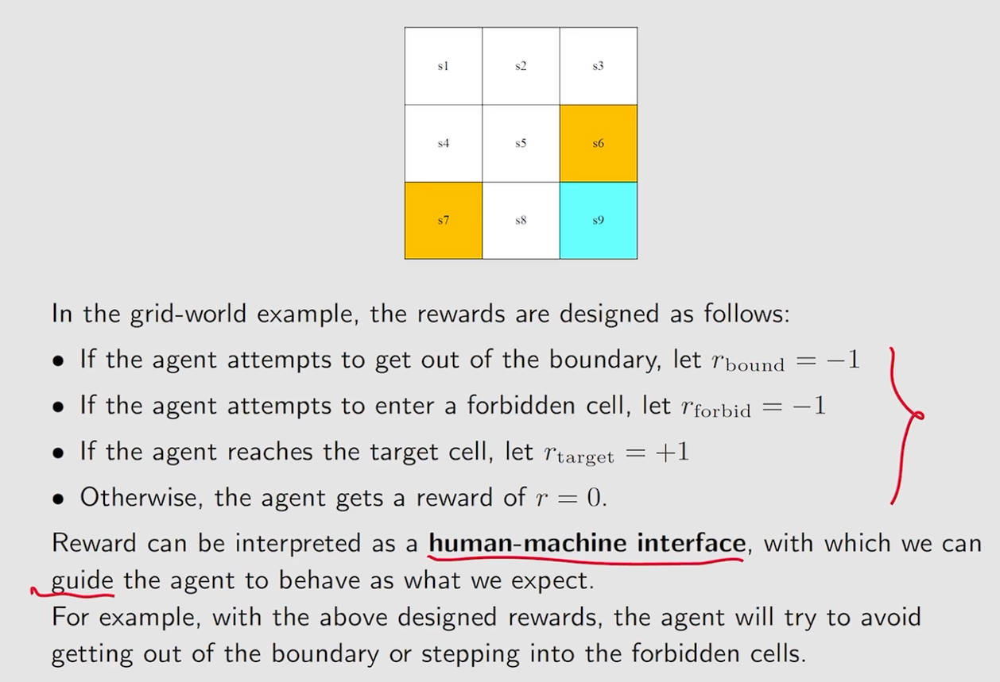


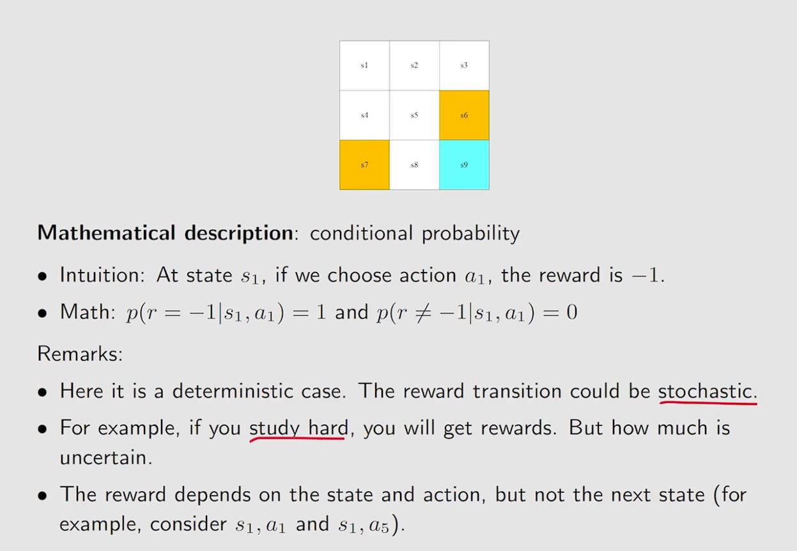

reward只依赖于当前状态和采取的动作，不取决于它下一刻处于什么状态

## 10. Trajectory and return


## 11. Discounted return

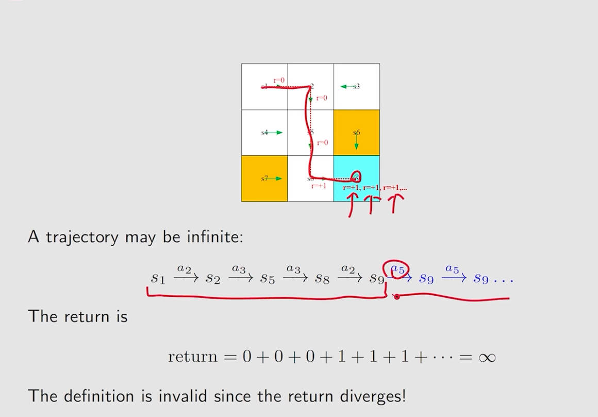


## 12. Episode


# 二. Markov decision process(MDP)

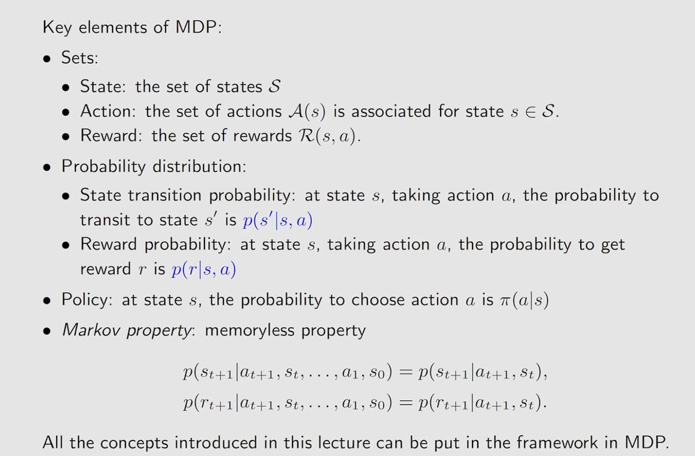


# 三. 贝尔曼公式

## 1. 引出


在上面的公式中， r已知、$\gamma$ 已知、P已知，则v可求

## 2. 公式推导


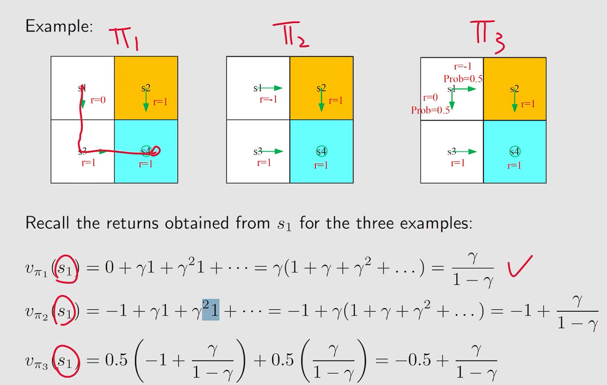


**注意： 这里的$\pi(a|s)$指的是当前状态为是s，采取动作a的概率**


**贝尔曼公式解释：** 在状态s时，对于一个给定的策略$\pi$，所能获得的state value值为两部分，第一部分是即时奖励，第二部分是未来奖励。

其中，$ \pi ( a | s )$含义为当前状态为s, 采取动作a的概率， $\sum _ { a }$含义为遍历所有可能得动作a；

$p(r|s, a)$含义为当前所在状态为s, 且采取的动作为a，获得的reward值为r的概率为$p(r|s, a)$，$\sum _ { r }$含义为遍历所有可能获得的reward值r；

$p(s'|s, a)$含义为当前所在状态为s采取动作a下一时刻跳转到状态s'的概率为$p(s'|s, a)$。$\sum _ { s' }$含义为遍历所有下一时刻可能到达的状态s', $v_\pi(s')$含义为下一时刻到达s'时的state value值。

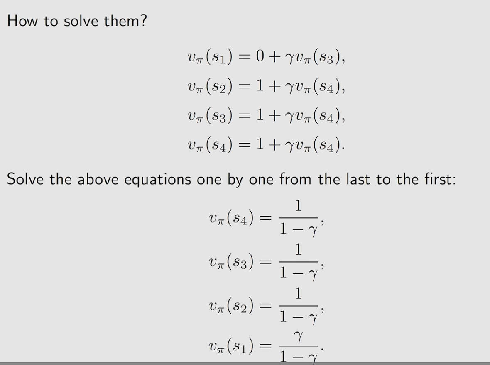

这里求解的步骤略过

## 3. 公式的向量形式


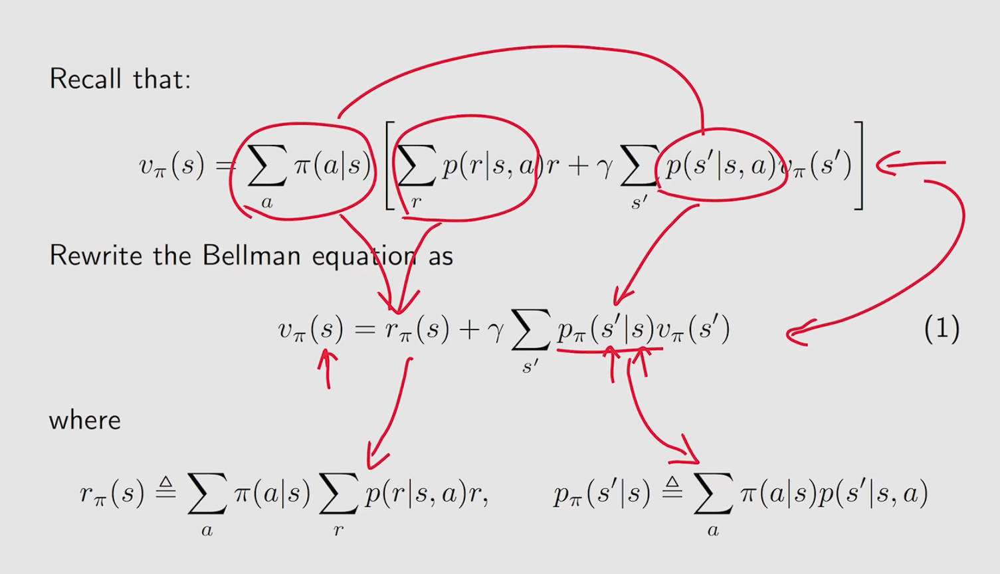

≜符号在数学上的含义为“等价于”


$p_{\pi}(s_j|s_i)$的含义为从状态$s_i$跳到状态$s_j$的概率，看下面的例子更清晰


## （插入）Policy evaluation概念


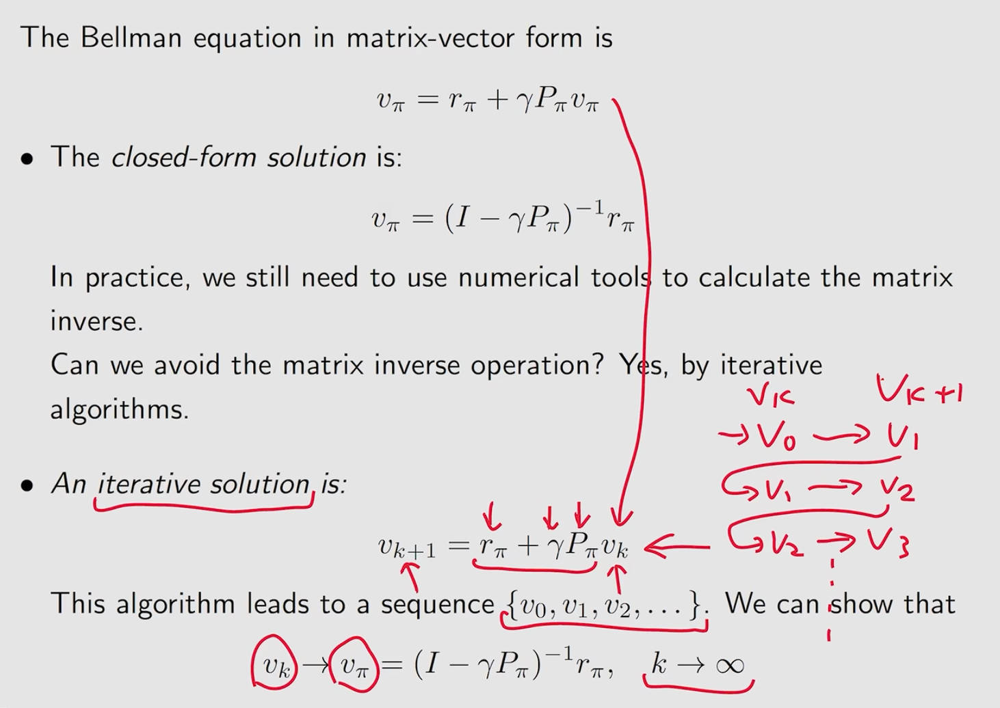

注意这里的$v_k$是向量，先假设一个$v_0$向量值，然后可以一直递归的求解$v_2 v_3 v_4$......，当k趋近于无穷大的时候，求得的序列$\{v_k\}$向量就等价于原始的$v_\pi$（证明略）

自己写的例子：

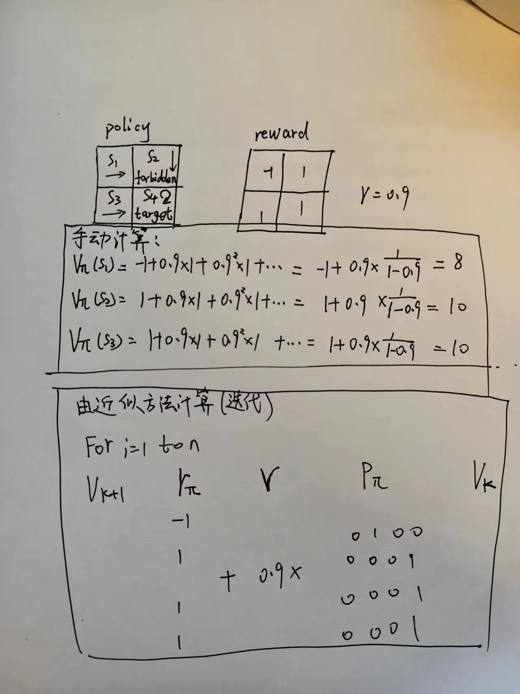

对应的求解代码：

```python
import numpy as np

gamma = 0.9
iters = 100000

v_pi = np.array(
    [0, 0, 0, 0], dtype=np.float32
)

r_pi = np.array(
    [-1, 1, 1, 1], dtype=np.float32
)

p_pi = np.array(
    [
        [0, 1, 0, 0],
        [0, 0, 0, 1],
        [0, 0, 0, 1],
        [0, 0, 0, 1],
    ], dtype=np.float32
)

for i in range(iters):
    v_pi = r_pi + gamma * (p_pi @ v_pi)
    
print(v_pi)
>>> [7.9999933 9.999993  9.999993  9.999993 ]
```


## 4. action value


**已知$q_\pi(s, a)$(action value)求解$v_\pi(s)$(state value)公式解释：**在某个状态s处的state value值$v_\pi(s)$等于在该状态对可能采取的动作a的概率乘以在该状态采取动作a后得到的action value之积的和，也就是所有action value的期望值。


**已知$v_\pi(s)$(state value)求解$q_\pi(s, a)$(action value)公式解释：**

公式第一项：$p(r|s, a)$含义为当前所在状态为s, 且采取的动作为a，获得的reward值为r的概率为$p(r|s, a)$。因此第一项含义为当前在状态s采取动作a后能获得的即时reward的期望值。

公式第二项： $p(s'|s, a)$当前所在状态为s采取动作a下一时刻跳转到状态s'的概率为$p(s'|s, a)$。因此第二项含义为当前在状态s采取动作a后能到达的所有状态s'的state value的期望值。

由上图中的公式（3）和公式（4）我们可以看出，如果在状态s处的action只有一个，且概率为1，那么$v_\pi(s)$就等于$q_\pi(s, a)$。


#  三. 贝尔曼最优公式

## 1. 引入


$argmax_a$在数学上表示： 待求参数是a,  且要求是后面的表达式的值最大，返回值为a


## 2. 公式定义与推导


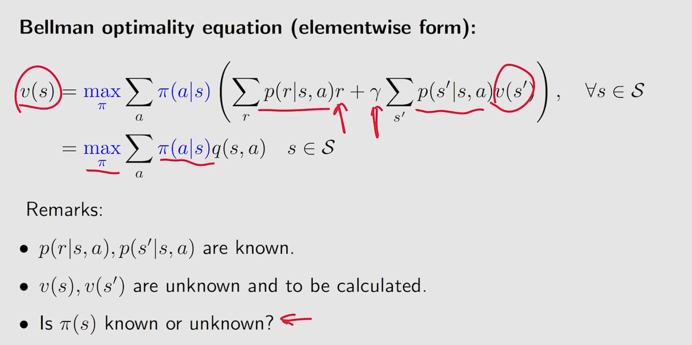

$\max_{\pi}$在数学上表示： 待求参数是$\pi$,  且要求是后面的表达式的值最大，返回值为后面的表达式的值


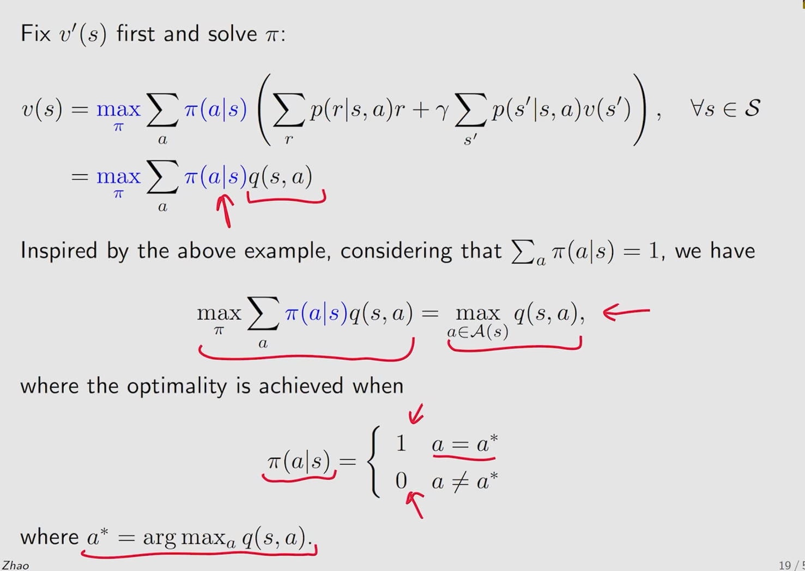

## 3. 公式求解


上图中的定理就是为什么在求解贝尔曼公式时可以迭代求解的原因


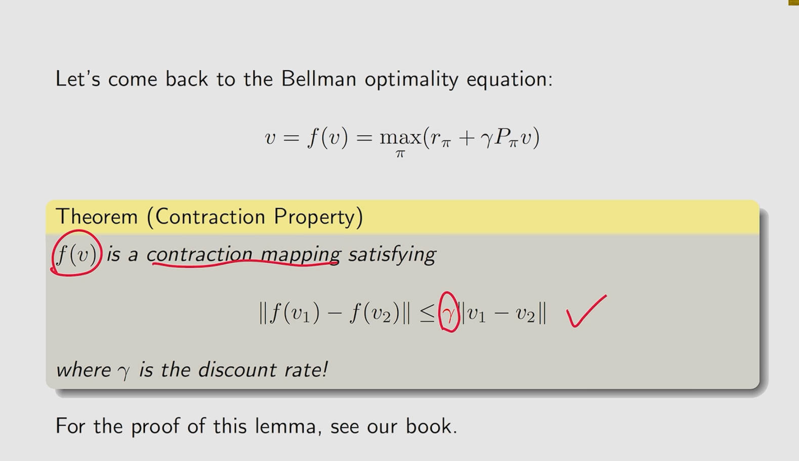


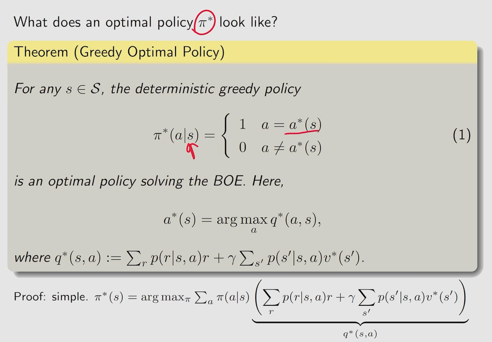

## 4. 分析贝尔曼最优公式一些性质

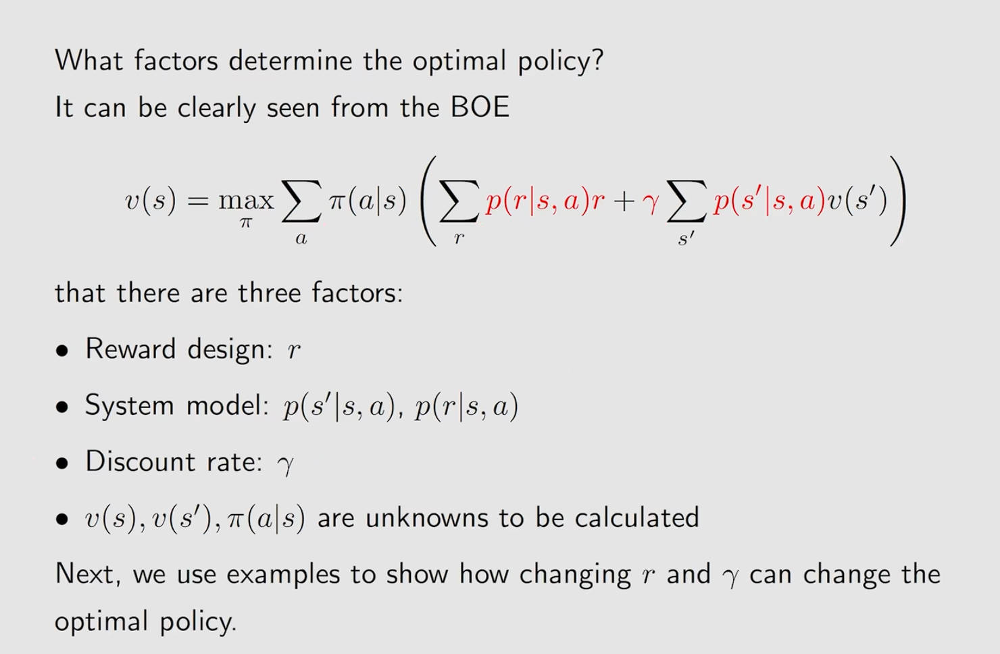


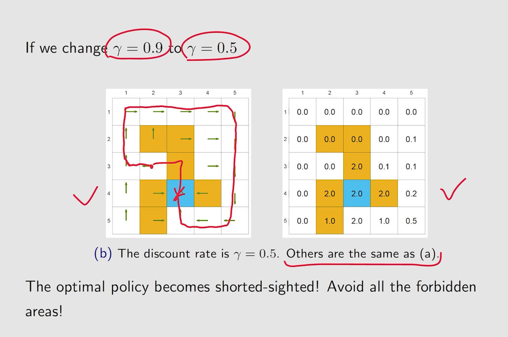


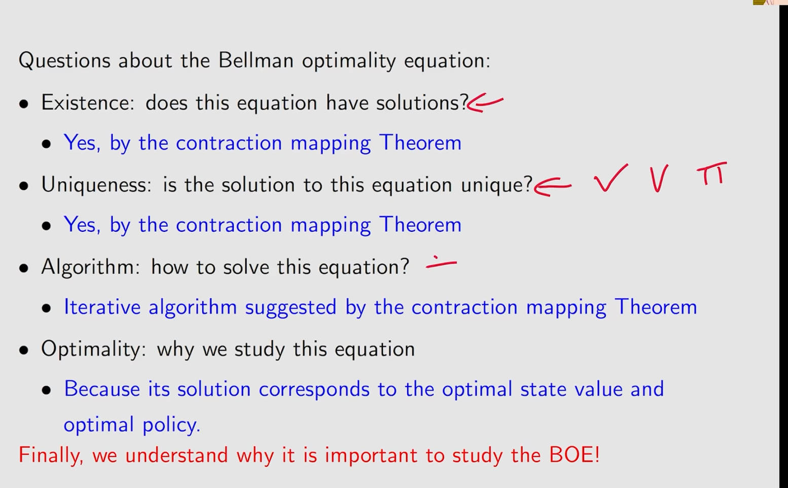

# 四、值迭代算法与策略迭代算法

## 1.值迭代算法求解贝尔曼最优公式策略 

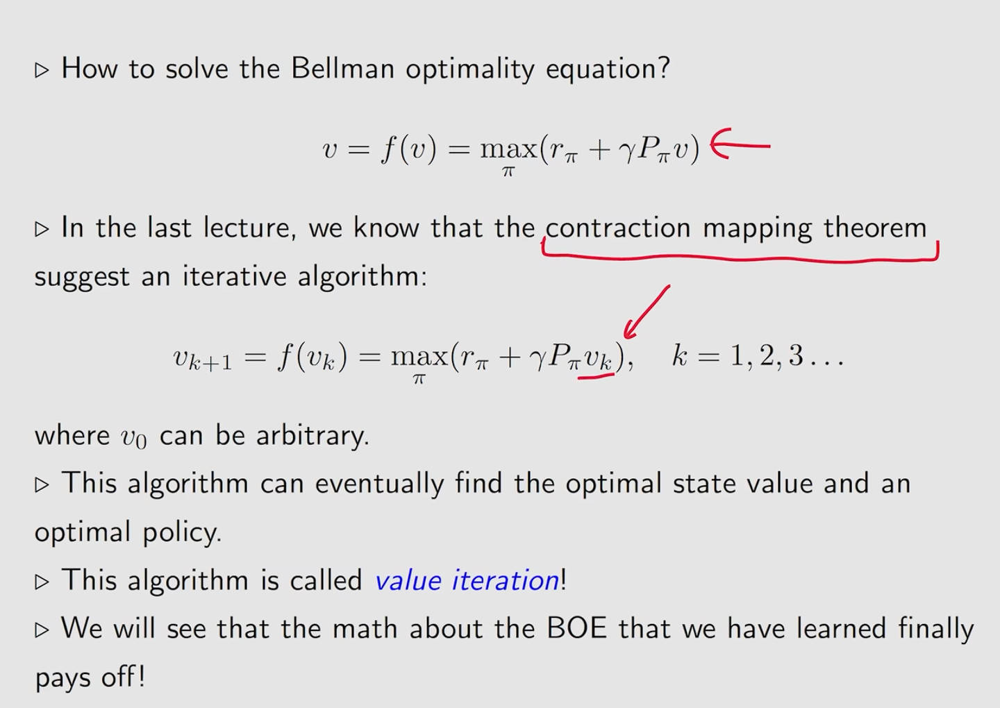


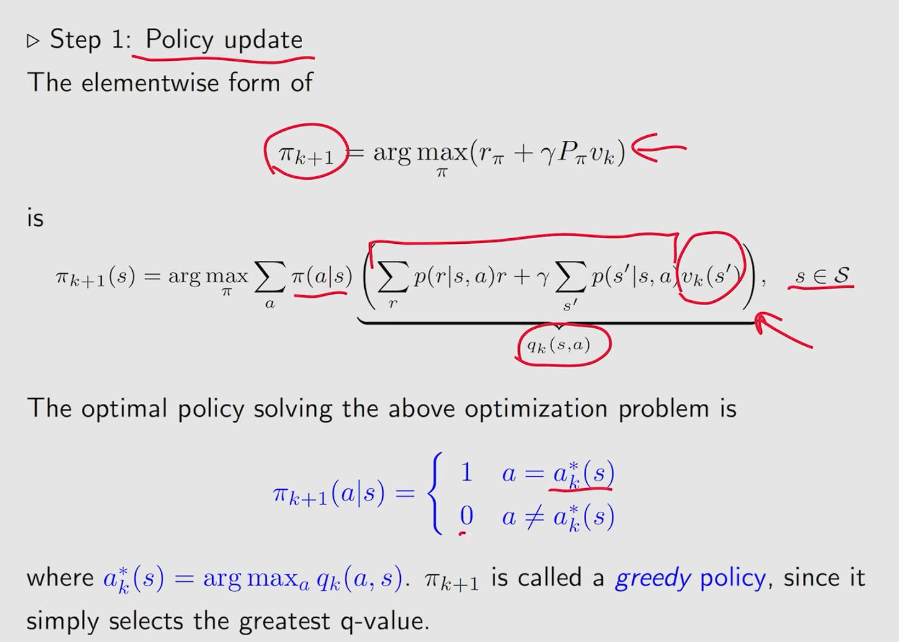

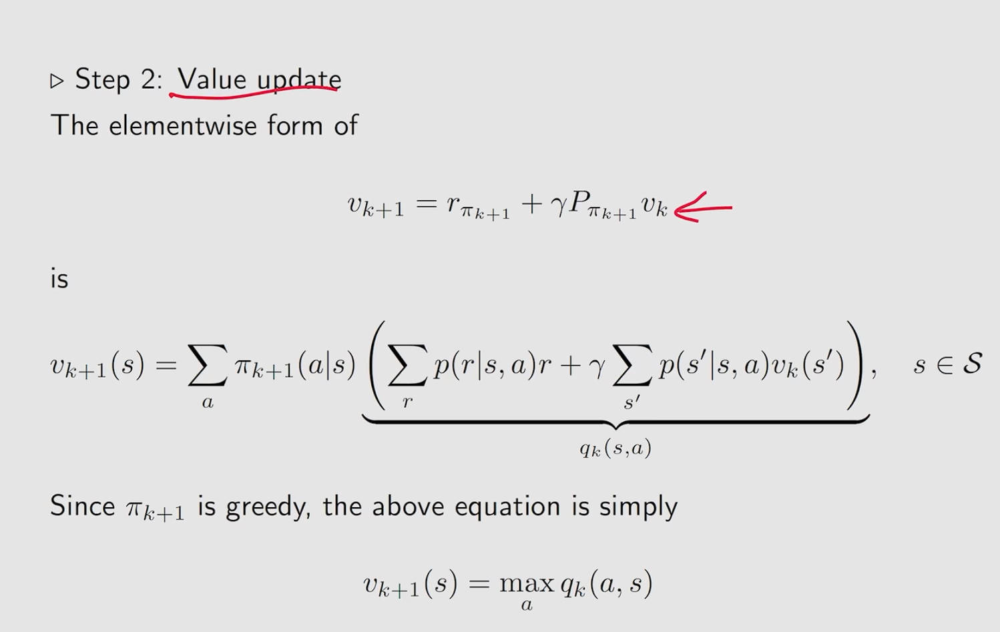


**值迭代算法流程：**

定义好进入到每个state的reward值---->初始化v_pi---->根据初始化好的v_0值计算每个state的action value值（公式1），记作q_table---->根据q_table中记录的action value值，选取每个state位置的最大action value值对应的action更新策略（公式2）---->更新v_pi，更新方式为将每个state位置的最大action value值赋值给v_pi（公式3）---->计算每个state的action value值......

公式1：$q_k(s,a) = \sum_r p(r|s,a)r + \gamma \sum_{s'} p(s'|s,a)v_k(s')$

公式2：$\pi_{k+1}(a|s)=\left\{\begin{array}{ll}1 & a=a_k^*(s) \\0 & a \neq a_k^*(s)\end{array}\right.$

公式3： $v_{k+1}(s) = \max_a q_k(a, s)$


代码实现（对应上图中的例子）：

```python
import numpy as np


def compute_q_table(gamma: float, v_pi: np.ndarray) -> np.ndarray:
    # 这里的-1, 0, 1对应着r_boundary、r_forbbiden，r_others和r_target
    q_table = [
        [-1 + gamma * v_pi[0], -1 + gamma * v_pi[1],  0 + gamma * v_pi[2], -1 + gamma * v_pi[0],  0 + gamma * v_pi[0]],
        [-1 + gamma * v_pi[1], -1 + gamma * v_pi[1],  1 + gamma * v_pi[3],  0 + gamma * v_pi[0], -1 + gamma * v_pi[1]],
        [ 0 + gamma * v_pi[0],  1 + gamma * v_pi[3], -1 + gamma * v_pi[2], -1 + gamma * v_pi[2],  0 + gamma * v_pi[2]],
        [-1 + gamma * v_pi[1], -1 + gamma * v_pi[3], -1 + gamma * v_pi[3],  0 + gamma * v_pi[2],  1 + gamma * v_pi[3]],
    ]
    
    return np.asarray(q_table)

def solver():
    r_boundary = -1         # 越界的reward为-1
    r_forbbiden = -1        # 进入禁区的reward为-1
    r_others = 0
    r_target = 1            # 进入目标的reward为1
    gamma = 0.9             # discounted rate为0.9（相对更加远视）
    
    v_pi = np.zeros(4)      # 初始的v_pi值全为0
    action = np.empty(4)    # 初始化action（这里相当于策略pi)
    
    threshold = 1           # ||v_k+1 - v_k||小于阈值会退出循环
    n_iters = 1000          # 循环次数，大于循环次数，即使||v_k+1 - v_k||没小于阈值也会退出循环
    
    for i in range(n_iters):
        q_table = compute_q_table(gamma, v_pi)      # 计算q_table表，也就是对于每个state，采取action以后得到的action value
        action = np.argmax(q_table, axis=1)         # 策略更新：获得action value最大位置的action作为新策略
        v_pi_next = q_table[range(4), action]       
        if (np.linalg.norm(v_pi - v_pi_next, ord=2)) < threshold:
            break
        v_pi = v_pi_next                            # 值更新：新的v_pi复制给旧的v_pi
        
    return action
        

if __name__ == '__main__':
    action = solver()
    print(f'The policy is:')
    for i in range(4):
        print(f'At state s{i + 1}, take action a{action[i] + 1}')
```


