原始视频: bilibili西湖大学赵世钰<<强化学习>>

# 一. 基本概念

## 1. grid-world example


网格分为: 可达、禁止、目标单元格，边界

## 2. State和State space


## 3. Action


Action space是和state有关的， 不同的state会有不同的Action space， 写作 $A(S_i)$

## 4. State transition


## 5. Forbidden area


## 6. Tabular respresentation

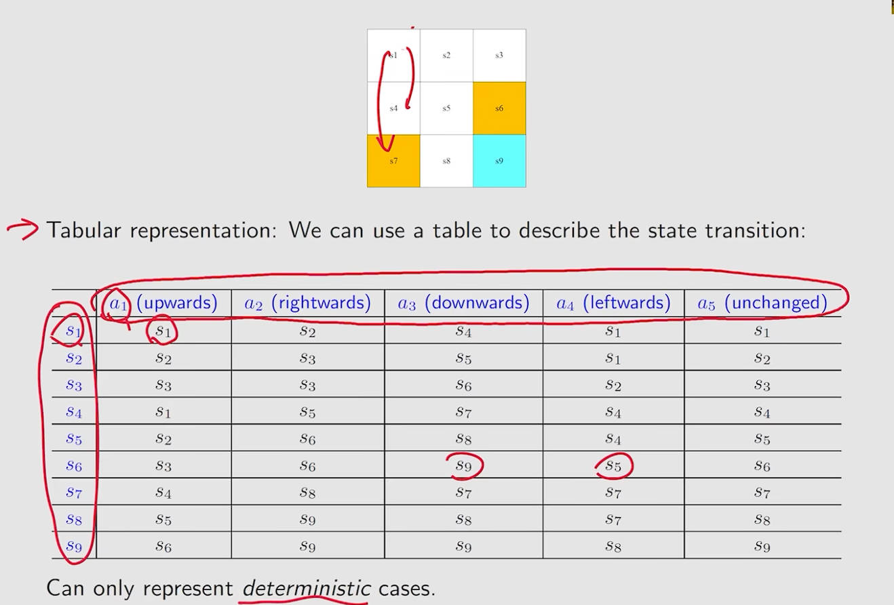

这种表示方式只能表示确定性（deterministic）的例子，一般不用

## 7. State transition probability


使用条件概率来表示状态转移： 

当前在s1状态，采取a2动作，下一步在s2状态的概率为1；

当前在s1状态，采取a2动作，下一步在si(i不等于2)状态的概率为0；

## 8. Policy


**在强化学习中，我们使用 $\pi$ 来表示策略。在从一个状态转移到另一个状态的时候，采取不同的动作的概率之和应为1。**


## 9. Reward


reward只依赖于当前状态和采取的动作，不取决于它下一刻处于什么状态

## 10. Trajectory and return


## 11. Discounted return


## 12. Episode


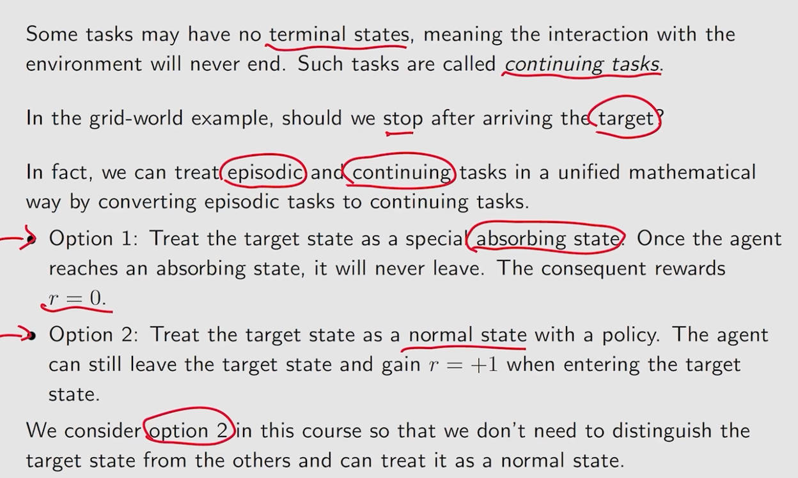

# 二. Markov decision process(MDP)


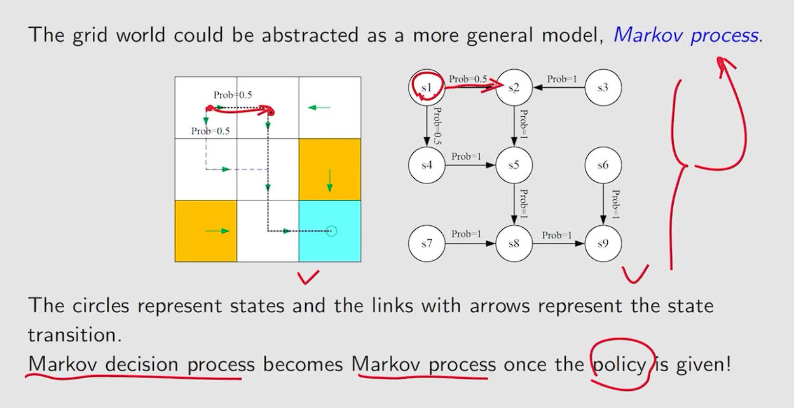

# 三. 贝尔曼公式

## 1. 引出

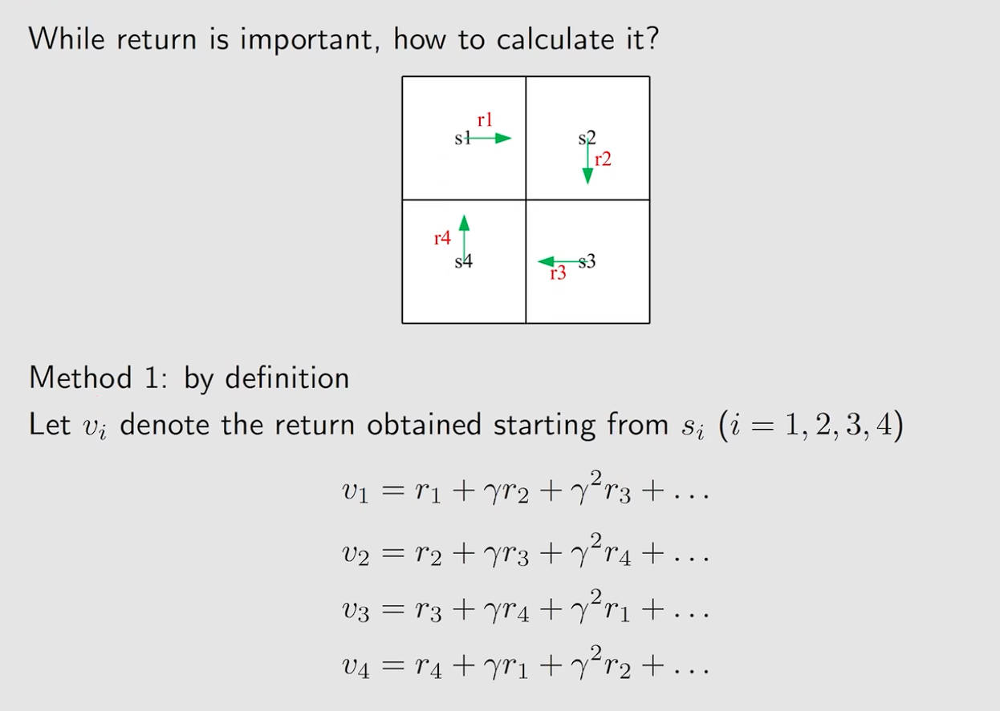


在上面的公式中， r已知、$\gamma$ 已知、P已知，则v可求

## 2. 公式推导


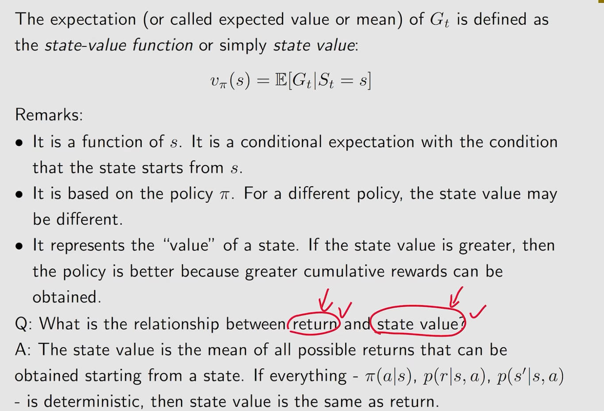


**注意： 这里的$\pi(a|s)$指的是当前状态为是s，采取动作a的概率**


这里求解的步骤略过

## 3. 公式的向量形式

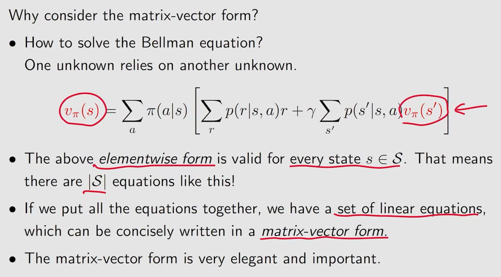


≜符号在数学上的含义为“等价于”


$p_{\pi}(s_j|s_i)$的含义为从状态$s_i$跳到状态$s_j$的概率，看下面的例子更清晰


## （插入）Policy evaluation概念


注意这里的$v_k$是向量，先假设一个$v_0$向量值，然后可以一直递归的求解$v_2 v_3 v_4$......，当k趋近于无穷大的时候，求得的序列$\{v_k\}$向量就等价于原始的$v_\pi$（证明略）

自己写的例子：


对应的求解代码：

```python
import numpy as np

gamma = 0.9
iters = 100000

v_pi = np.array(
    [0, 0, 0, 0], dtype=np.float32
)

r_pi = np.array(
    [-1, 1, 1, 1], dtype=np.float32
)

p_pi = np.array(
    [
        [0, 1, 0, 0],
        [0, 0, 0, 1],
        [0, 0, 0, 1],
        [0, 0, 0, 1],
    ], dtype=np.float32
)

for i in range(iters):
    v_pi = r_pi + gamma * (p_pi @ v_pi)
    
print(v_pi)
>>> [7.9999933 9.999993  9.999993  9.999993 ]
```

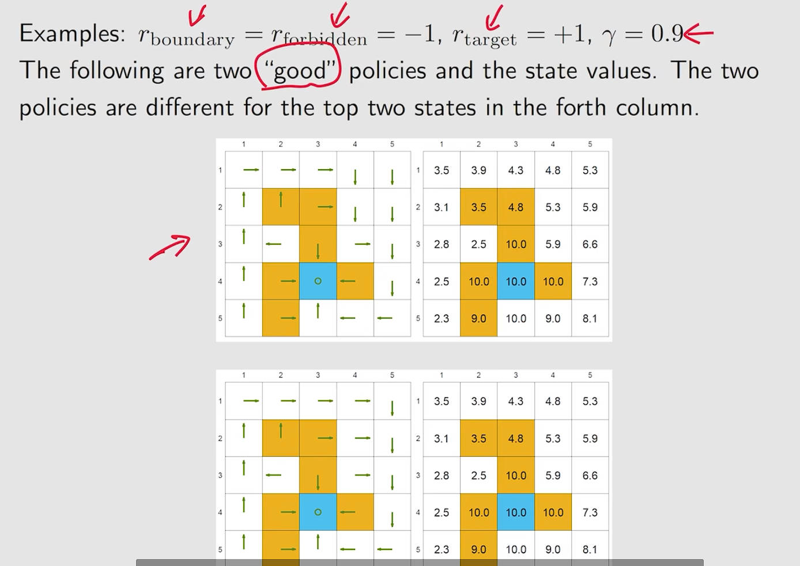


## 4. action value


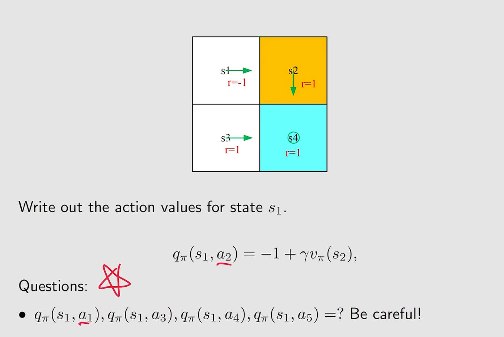


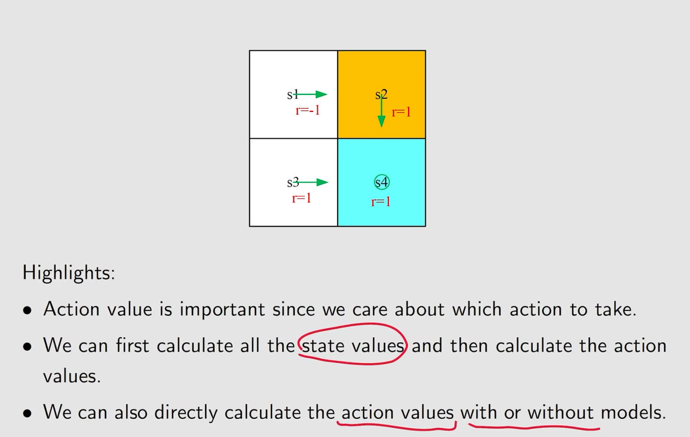

#  三. 贝尔曼最优公式

## 1. 引入


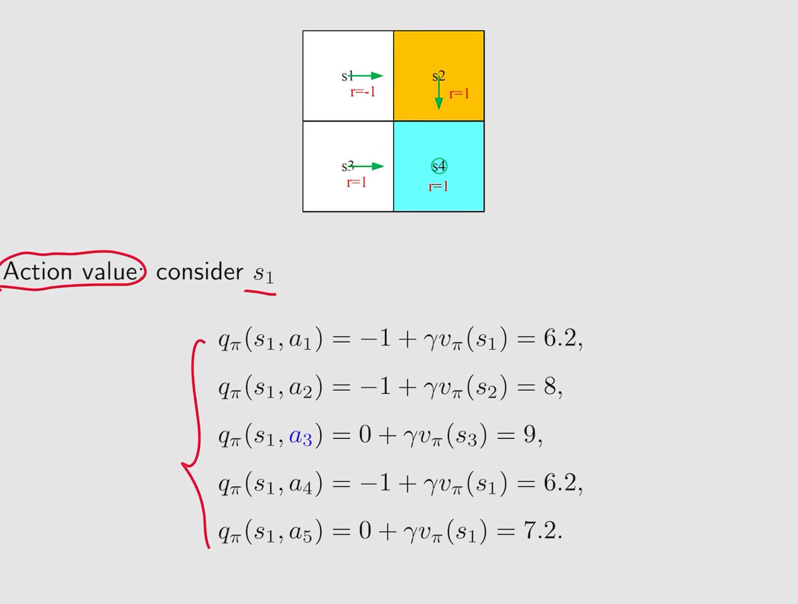


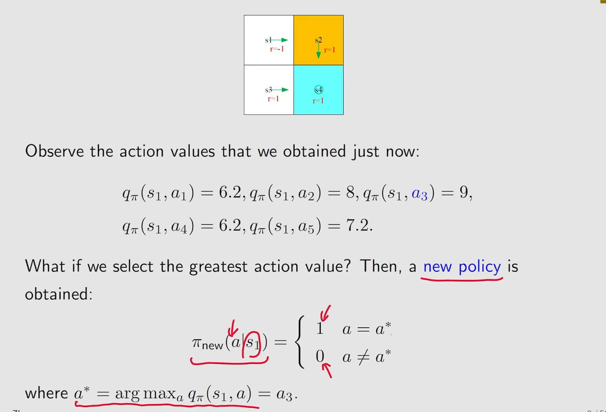

$argmax_a$在数学上表示： 待求参数是a,  且要求是后面的表达式的值最大，返回值为a


## 2. 公式定义与推导


$\max_{\pi}$在数学上表示： 待求参数是$\pi$,  且要求是后面的表达式的值最大，返回值为后面的表达式的值


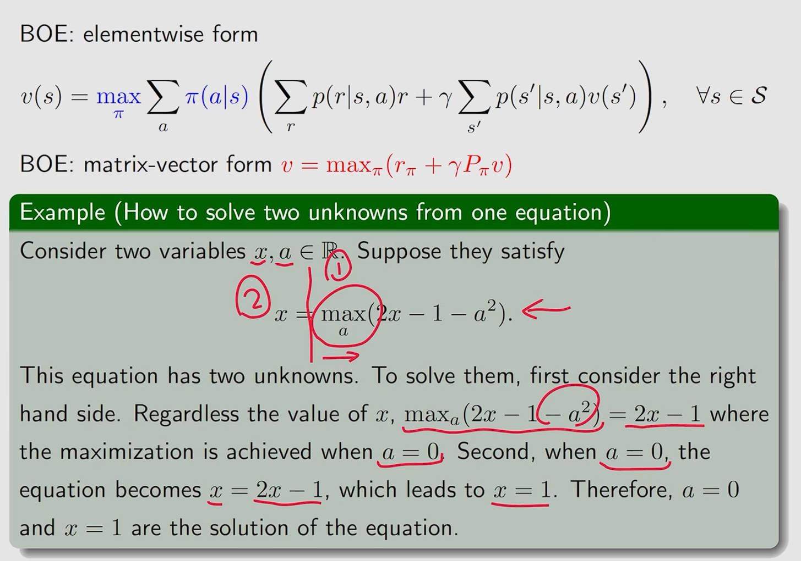

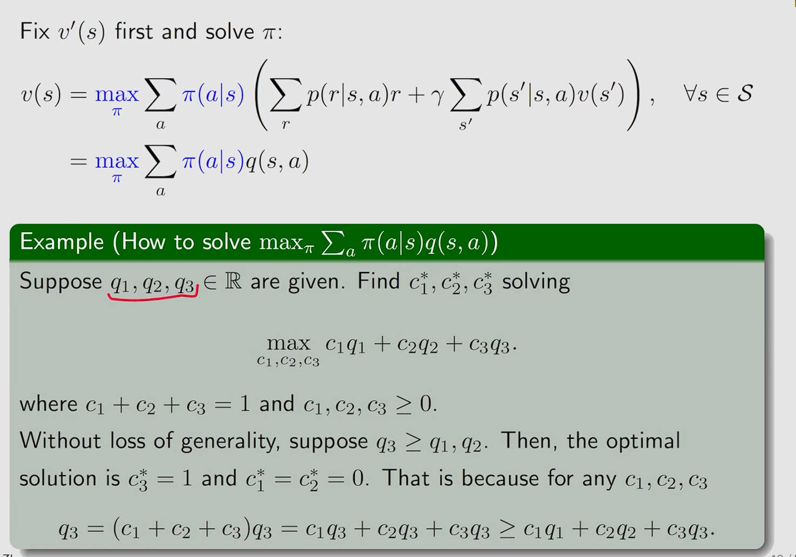


